# 352 PCS Dataset — Pitch-Class Sets Sorted by Roughness

**Francesco Scagliola**  
Coordinator of the PhD Programme in  
*“Composizione Musicale Elettroacustica Computazionale, Modelli Algoritmici Generativi e Complessità Computazionale”*  
Conservatorio di Musica “Niccolò Piccinni” di Bari

**Parameters:** `numArmonici = 32`; `notaBase = 60`  
**Number of elements:** 352  
**Source notebook:** `scrittura01 Associazioni Roughness Dataset.nb`

**Repository:**  
https://github.com/FrancescoScagliola/Repository/tree/main/352%20PCS%20Dataset

**DOI:**  
https://doi.org/10.5281/zenodo.23214708

The document preserves the dataset as a **Wolfram Association**. Each numerical key identifies an associative record containing the original fields (`integerNumber`, `chord`, `rough`, `numIntervalliChord`, `roughMedia`, interval-class vectors, and parent/child relations). The graphical outputs are preserved as static PNG images.

## Dataset

```wolfram
dataSet = <|
  0 -> <|
    "integerNumber" -> 0,
    "chord" -> {},
    "rough" -> 0,
    "numIntervalliChord" -> 0,
    "roughMedia" -> 0,
    "vettoreIntervallare" -> {0,0,0,0,0,0},
    "roughVI" -> 0.`,
    "vettoreIntervallareConUnisono" -> {0,0,0,0,0,0,0},
    "roughVIU" -> 0.`,
    "figliChord" -> {},
    "figliIntegerNumber" -> {},
    "padriIntegerNumber" -> {1},
    "padriChord" -> {{0}}
  |>,
  1 -> <|
    "integerNumber" -> 1,
    "chord" -> {0},
    "rough" -> 0.05256836199103543`,
    "numIntervalliChord" -> 1,
    "roughMedia" -> 0.05256836199103543`,
    "vettoreIntervallare" -> {0,0,0,0,0,0},
    "roughVI" -> 0.`,
    "vettoreIntervallareConUnisono" -> {1,0,0,0,0,0,0},
    "roughVIU" -> 0.21027344796414169`,
    "figliChord" -> {{}},
    "figliIntegerNumber" -> {0},
    "padriIntegerNumber" -> {3,5,9,17,33,65},
    "padriChord" -> {{0,1},{0,2},{0,3},{0,4},{0,5},{0,6}}
  |>,
  3 -> <|
    "integerNumber" -> 3,
    "chord" -> {0,1},
    "rough" -> 0.9678426552257116`,
    "numIntervalliChord" -> 3,
    "roughMedia" -> 0.3226142184085705`,
    "vettoreIntervallare" -> {1,0,0,0,0,0},
    "roughVI" -> 0.9678426552257116`,
    "vettoreIntervallareConUnisono" -> {2,1,0,0,0,0,0},
    "roughVIU" -> 1.388389551153995`,
    "figliChord" -> {{0}},
    "figliIntegerNumber" -> {1},
    "padriIntegerNumber" -> {7,11,13,19,25,35,49,67,97},
    "padriChord" -> {{0,1,2},{0,1,3},{0,2,3},{0,1,4},{0,3,4},{0,1,5},{0,4,5},{0,1,6},{0,5,6}}
  |>,
  5 -> <|
    "integerNumber" -> 5,
    "chord" -> {0,2},
    "rough" -> 0.7942896921571497`,
    "numIntervalliChord" -> 3,
    "roughMedia" -> 0.2647632307190499`,
    "vettoreIntervallare" -> {0,1,0,0,0,0},
    "roughVI" -> 0.7942896921571497`,
    "vettoreIntervallareConUnisono" -> {2,0,1,0,0,0,0},
    "roughVIU" -> 1.214836588085433`,
    "figliChord" -> {{0}},
    "figliIntegerNumber" -> {1},
    "padriIntegerNumber" -> {7,11,13,21,37,41,69,81,133},
    "padriChord" -> {{0,1,2},{0,1,3},{0,2,3},{0,2,4},{0,2,5},{0,3,5},{0,2,6},{0,4,6},{0,2,7}}
  |>,
  7 -> <|
    "integerNumber" -> 7,
    "chord" -> {0,1,2},
    "rough" -> 2.5646832137092295`,
    "numIntervalliChord" -> 6,
    "roughMedia" -> 0.42744720228487154`,
    "vettoreIntervallare" -> {2,1,0,0,0,0},
    "roughVI" -> 2.729975002608573`,
    "vettoreIntervallareConUnisono" -> {3,2,1,0,0,0,0},
    "roughVIU" -> 3.360795346500998`,
    "figliChord" -> {{0,1},{0,2}},
    "figliIntegerNumber" -> {3,5},
    "padriIntegerNumber" -> {15,23,29,39,57,71,113,135},
    "padriChord" -> {{0,1,2,3},{0,1,2,4},{0,2,3,4},{0,1,2,5},{0,3,4,5},{0,1,2,6},{0,4,5,6},{0,1,2,7}}
  |>,
  9 -> <|
    "integerNumber" -> 9,
    "chord" -> {0,3},
    "rough" -> 0.7137318346093271`,
    "numIntervalliChord" -> 3,
    "roughMedia" -> 0.23791061153644236`,
    "vettoreIntervallare" -> {0,0,1,0,0,0},
    "roughVI" -> 0.7137318346093271`,
    "vettoreIntervallareConUnisono" -> {2,0,0,1,0,0,0},
    "roughVIU" -> 1.1342787305376105`,
    "figliChord" -> {{0}},
    "figliIntegerNumber" -> {1},
    "padriIntegerNumber" -> {11,13,19,25,37,41,73,137,145},
    "padriChord" -> {{0,1,3},{0,2,3},{0,1,4},{0,3,4},{0,2,5},{0,3,5},{0,3,6},{0,3,7},{0,4,7}}
  |>,
  11 -> <|
    "integerNumber" -> 11,
    "chord" -> {0,1,3},
    "rough" -> 2.302786990583813`,
    "numIntervalliChord" -> 6,
    "roughMedia" -> 0.3837978317639688`,
    "vettoreIntervallare" -> {1,1,1,0,0,0},
    "roughVI" -> 2.4758641819921885`,
    "vettoreIntervallareConUnisono" -> {3,1,1,1,0,0,0},
    "roughVIU" -> 3.1066845258846136`,
    "figliChord" -> {{0,1},{0,2},{0,3}},
    "figliIntegerNumber" -> {3,5,9},
    "padriIntegerNumber" -> {15,23,27,43,45,75,89,139,177},
    "padriChord" -> {{0,1,2,3},{0,1,2,4},{0,1,3,4},{0,1,3,5},{0,2,3,5},{0,1,3,6},{0,3,4,6},{0,1,3,7},{0,4,5,7}}
  |>,
  13 -> <|
    "integerNumber" -> 13,
    "chord" -> {0,2,3},
    "rough" -> 2.3004452650486034`,
    "numIntervalliChord" -> 6,
    "roughMedia" -> 0.3834075441747672`,
    "vettoreIntervallare" -> {1,1,1,0,0,0},
    "roughVI" -> 2.4758641819921885`,
    "vettoreIntervallareConUnisono" -> {3,1,1,1,0,0,0},
    "roughVIU" -> 3.1066845258846136`,
    "figliChord" -> {{0,1},{0,2},{0,3}},
    "figliIntegerNumber" -> {3,5,9},
    "padriIntegerNumber" -> {15,27,29,45,53,77,105,141,209},
    "padriChord" -> {{0,1,2,3},{0,1,3,4},{0,2,3,4},{0,2,3,5},{0,2,4,5},{0,2,3,6},{0,3,5,6},{0,2,3,7},{0,4,6,7}}
  |>,
  15 -> <|
    "integerNumber" -> 15,
    "chord" -> {0,1,2,3},
    "rough" -> 4.744619649340493`,
    "numIntervalliChord" -> 10,
    "roughMedia" -> 0.4744619649340493`,
    "vettoreIntervallare" -> {3,2,1,0,0,0},
    "roughVI" -> 5.205839184600761`,
    "vettoreIntervallareConUnisono" -> {4,3,2,1,0,0,0},
    "roughVIU" -> 6.046932976457327`,
    "figliChord" -> {{0,1,2},{0,1,3},{0,2,3}},
    "figliIntegerNumber" -> {7,11,13},
    "padriIntegerNumber" -> {31,47,61,79,121,143,241},
    "padriChord" -> {{0,1,2,3,4},{0,1,2,3,5},{0,2,3,4,5},{0,1,2,3,6},{0,3,4,5,6},{0,1,2,3,7},{0,4,5,6,7}}
  |>,
  17 -> <|
    "integerNumber" -> 17,
    "chord" -> {0,4},
    "rough" -> 0.6659602442751815`,
    "numIntervalliChord" -> 3,
    "roughMedia" -> 0.22198674809172717`,
    "vettoreIntervallare" -> {0,0,0,1,0,0},
    "roughVI" -> 0.6659602442751815`,
    "vettoreIntervallareConUnisono" -> {2,0,0,0,1,0,0},
    "roughVIU" -> 1.086507140203465`,
    "figliChord" -> {{0}},
    "figliIntegerNumber" -> {1},
    "padriIntegerNumber" -> {19,21,25,35,49,69,81,137,145,273},
    "padriChord" -> {{0,1,4},{0,2,4},{0,3,4},{0,1,5},{0,4,5},{0,2,6},{0,4,6},{0,3,7},{0,4,7},{0,4,8}}
  |>,
  19 -> <|
    "integerNumber" -> 19,
    "chord" -> {0,1,4},
    "rough" -> 2.1768773686132072`,
    "numIntervalliChord" -> 6,
    "roughMedia" -> 0.36281289476886786`,
    "vettoreIntervallare" -> {1,0,1,1,0,0},
    "roughVI" -> 2.34753473411022`,
    "vettoreIntervallareConUnisono" -> {3,1,0,1,1,0,0},
    "roughVIU" -> 2.9783550780026453`,
    "figliChord" -> {{0,1},{0,3},{0,4}},
    "figliIntegerNumber" -> {3,9,17},
    "padriIntegerNumber" -> {23,27,39,51,77,83,147,153,275},
    "padriChord" -> {{0,1,2,4},{0,1,3,4},{0,1,2,5},{0,1,4,5},{0,2,3,6},{0,1,4,6},{0,1,4,7},{0,3,4,7},{0,1,4,8}}
  |>,
  21 -> <|
    "integerNumber" -> 21,
    "chord" -> {0,2,4},
    "rough" -> 2.0617034940558723`,
    "numIntervalliChord" -> 6,
    "roughMedia" -> 0.343617249009312`,
    "vettoreIntervallare" -> {0,2,0,1,0,0},
    "roughVI" -> 2.254539628589481`,
    "vettoreIntervallareConUnisono" -> {3,0,2,0,1,0,0},
    "roughVIU" -> 2.885359972481906`,
    "figliChord" -> {{0,2},{0,4}},
    "figliIntegerNumber" -> {5,17},
    "padriIntegerNumber" -> {23,29,43,53,85,149,169,277},
    "padriChord" -> {{0,1,2,4},{0,2,3,4},{0,1,3,5},{0,2,4,5},{0,2,4,6},{0,2,4,7},{0,3,5,7},{0,2,4,8}}
  |>,
  23 -> <|
    "integerNumber" -> 23,
    "chord" -> {0,1,2,4},
    "rough" -> 4.427739846711303`,
    "numIntervalliChord" -> 10,
    "roughMedia" -> 0.44277398467113027`,
    "vettoreIntervallare" -> {2,2,1,1,0,0},
    "roughVI" -> 4.903956773650231`,
    "vettoreIntervallareConUnisono" -> {4,2,2,1,1,0,0},
    "roughVIU" -> 5.745050565506798`,
    "figliChord" -> {{0,1,2},{0,1,3},{0,1,4},{0,2,4}},
    "figliIntegerNumber" -> {7,11,19,21},
    "padriIntegerNumber" -> {31,47,55,87,93,151,185,279},
    "padriChord" -> {{0,1,2,3,4},{0,1,2,3,5},{0,1,2,4,5},{0,1,2,4,6},{0,2,3,4,6},{0,1,2,4,7},{0,3,4,5,7},{0,1,2,4,8}}
  |>,
  25 -> <|
    "integerNumber" -> 25,
    "chord" -> {0,3,4},
    "rough" -> 2.1620060202867997`,
    "numIntervalliChord" -> 6,
    "roughMedia" -> 0.3603343367144666`,
    "vettoreIntervallare" -> {1,0,1,1,0,0},
    "roughVI" -> 2.34753473411022`,
    "vettoreIntervallareConUnisono" -> {3,1,0,1,1,0,0},
    "roughVIU" -> 2.9783550780026453`,
    "figliChord" -> {{0,1},{0,3},{0,4}},
    "figliIntegerNumber" -> {3,9,17},
    "padriIntegerNumber" -> {27,29,51,57,89,101,153,201,281},
    "padriChord" -> {{0,1,3,4},{0,2,3,4},{0,1,4,5},{0,3,4,5},{0,3,4,6},{0,2,5,6},{0,3,4,7},{0,3,6,7},{0,3,4,8}}
  |>,
  27 -> <|
    "integerNumber" -> 27,
    "chord" -> {0,1,3,4},
    "rough" -> 4.346704007364635`,
    "numIntervalliChord" -> 10,
    "roughMedia" -> 0.4346704007364635`,
    "vettoreIntervallare" -> {2,1,2,1,0,0},
    "roughVI" -> 4.823398916102409`,
    "vettoreIntervallareConUnisono" -> {4,2,1,2,1,0,0},
    "roughVIU" -> 5.664492707958976`,
    "figliChord" -> {{0,1,3},{0,1,4},{0,2,3},{0,3,4}},
    "figliIntegerNumber" -> {11,19,13,25},
    "padriIntegerNumber" -> {31,55,59,91,109,155,217,283},
    "padriChord" -> {{0,1,2,3,4},{0,1,2,4,5},{0,1,3,4,5},{0,1,3,4,6},{0,2,3,5,6},{0,1,3,4,7},{0,3,4,6,7},{0,1,3,4,8}}
  |>,
  29 -> <|
    "integerNumber" -> 29,
    "chord" -> {0,2,3,4},
    "rough" -> 4.402741370340652`,
    "numIntervalliChord" -> 10,
    "roughMedia" -> 0.44027413703406526`,
    "vettoreIntervallare" -> {2,2,1,1,0,0},
    "roughVI" -> 4.903956773650231`,
    "vettoreIntervallareConUnisono" -> {4,2,2,1,1,0,0},
    "roughVIU" -> 5.745050565506798`,
    "figliChord" -> {{0,1,2},{0,2,3},{0,2,4},{0,3,4}},
    "figliIntegerNumber" -> {7,13,21,25},
    "padriIntegerNumber" -> {31,59,61,93,117,157,233,285},
    "padriChord" -> {{0,1,2,3,4},{0,1,3,4,5},{0,2,3,4,5},{0,2,3,4,6},{0,2,4,5,6},{0,2,3,4,7},{0,3,5,6,7},{0,2,3,4,8}}
  |>,
  31 -> <|
    "integerNumber" -> 31,
    "chord" -> {0,1,2,3,4},
    "rough" -> 7.442558585735892`,
    "numIntervalliChord" -> 15,
    "roughMedia" -> 0.49617057238239276`,
    "vettoreIntervallare" -> {4,3,2,1,0,0},
    "roughVI" -> 8.347663610868132`,
    "vettoreIntervallareConUnisono" -> {5,4,3,2,1,0,0},
    "roughVIU" -> 9.39903085068884`,
    "figliChord" -> {{0,1,2,3},{0,1,2,4},{0,1,3,4},{0,2,3,4}},
    "figliIntegerNumber" -> {15,23,27,29},
    "padriIntegerNumber" -> {63,95,125,159,249,287},
    "padriChord" -> {{0,1,2,3,4,5},{0,1,2,3,4,6},{0,2,3,4,5,6},{0,1,2,3,4,7},{0,3,4,5,6,7},{0,1,2,3,4,8}}
  |>,
  33 -> <|
    "integerNumber" -> 33,
    "chord" -> {0,5},
    "rough" -> 0.5486243905813621`,
    "numIntervalliChord" -> 3,
    "roughMedia" -> 0.18287479686045405`,
    "vettoreIntervallare" -> {0,0,0,0,1,0},
    "roughVI" -> 0.5486243905813621`,
    "vettoreIntervallareConUnisono" -> {2,0,0,0,0,1,0},
    "roughVIU" -> 0.9691712865096456`,
    "figliChord" -> {{0}},
    "figliIntegerNumber" -> {1},
    "padriIntegerNumber" -> {35,37,41,49,67,97,133,137,145},
    "padriChord" -> {{0,1,5},{0,2,5},{0,3,5},{0,4,5},{0,1,6},{0,5,6},{0,2,7},{0,3,7},{0,4,7}}
  |>,
  35 -> <|
    "integerNumber" -> 35,
    "chord" -> {0,1,5},
    "rough" -> 2.0157919871001613`,
    "numIntervalliChord" -> 6,
    "roughMedia" -> 0.3359653311833602`,
    "vettoreIntervallare" -> {1,0,0,1,1,0},
    "roughVI" -> 2.1824272900822552`,
    "vettoreIntervallareConUnisono" -> {3,1,0,0,1,1,0},
    "roughVIU" -> 2.8132476339746804`,
    "figliChord" -> {{0,1},{0,4},{0,5}},
    "figliIntegerNumber" -> {3,17,33},
    "padriIntegerNumber" -> {39,43,51,71,99,141,163,281,291},
    "padriChord" -> {{0,1,2,5},{0,1,3,5},{0,1,4,5},{0,1,2,6},{0,1,5,6},{0,2,3,7},{0,1,5,7},{0,3,4,8},{0,1,5,8}}
  |>,
  37 -> <|
    "integerNumber" -> 37,
    "chord" -> {0,2,5},
    "rough" -> 1.8669532157498914`,
    "numIntervalliChord" -> 6,
    "roughMedia" -> 0.31115886929164854`,
    "vettoreIntervallare" -> {0,1,1,0,1,0},
    "roughVI" -> 2.056645917347839`,
    "vettoreIntervallareConUnisono" -> {3,0,1,1,0,1,0},
    "roughVIU" -> 2.687466261240264`,
    "figliChord" -> {{0,2},{0,3},{0,5}},
    "figliIntegerNumber" -> {5,9,33},
    "padriIntegerNumber" -> {39,45,53,75,101,149,165,293,297},
    "padriChord" -> {{0,1,2,5},{0,2,3,5},{0,2,4,5},{0,1,3,6},{0,2,5,6},{0,2,4,7},{0,2,5,7},{0,2,5,8},{0,3,5,8}}
  |>,
  39 -> <|
    "integerNumber" -> 39,
    "chord" -> {0,1,2,5},
    "rough" -> 4.189240040586094`,
    "numIntervalliChord" -> 10,
    "roughMedia" -> 0.41892400405860947`,
    "vettoreIntervallare" -> {2,1,1,1,1,0},
    "roughVI" -> 4.658291472074444`,
    "vettoreIntervallareConUnisono" -> {4,2,1,1,1,1,0},
    "roughVIU" -> 5.499385263931011`,
    "figliChord" -> {{0,1,2},{0,1,4},{0,1,5},{0,2,5}},
    "figliIntegerNumber" -> {7,19,35,37},
    "padriIntegerNumber" -> {47,55,79,103,157,167,295,313},
    "padriChord" -> {{0,1,2,3,5},{0,1,2,4,5},{0,1,2,3,6},{0,1,2,5,6},{0,2,3,4,7},{0,1,2,5,7},{0,1,2,5,8},{0,3,4,5,8}}
  |>,
  41 -> <|
    "integerNumber" -> 41,
    "chord" -> {0,3,5},
    "rough" -> 1.8445745697467286`,
    "numIntervalliChord" -> 6,
    "roughMedia" -> 0.3074290949577881`,
    "vettoreIntervallare" -> {0,1,1,0,1,0},
    "roughVI" -> 2.056645917347839`,
    "vettoreIntervallareConUnisono" -> {3,0,1,1,0,1,0},
    "roughVIU" -> 2.687466261240264`,
    "figliChord" -> {{0,2},{0,3},{0,5}},
    "figliIntegerNumber" -> {5,9,33},
    "padriIntegerNumber" -> {43,45,57,83,105,165,169,297,329},
    "padriChord" -> {{0,1,3,5},{0,2,3,5},{0,3,4,5},{0,1,4,6},{0,3,5,6},{0,2,5,7},{0,3,5,7},{0,3,5,8},{0,3,6,8}}
  |>,
  43 -> <|
    "integerNumber" -> 43,
    "chord" -> {0,1,3,5},
    "rough" -> 3.9855230290053374`,
    "numIntervalliChord" -> 10,
    "roughMedia" -> 0.3985523029005338`,
    "vettoreIntervallare" -> {1,2,1,1,1,0},
    "roughVI" -> 4.484738509005881`,
    "vettoreIntervallareConUnisono" -> {4,1,2,1,1,1,0},
    "roughVIU" -> 5.325832300862449`,
    "figliChord" -> {{0,1,3},{0,1,5},{0,2,4},{0,3,5}},
    "figliIntegerNumber" -> {11,35,21,41},
    "padriIntegerNumber" -> {47,59,87,107,171,173,299,345},
    "padriChord" -> {{0,1,2,3,5},{0,1,3,4,5},{0,1,2,4,6},{0,1,3,5,6},{0,1,3,5,7},{0,2,3,5,7},{0,1,3,5,8},{0,3,4,6,8}}
  |>,
  45 -> <|
    "integerNumber" -> 45,
    "chord" -> {0,2,3,5},
    "rough" -> 4.00789549518842`,
    "numIntervalliChord" -> 10,
    "roughMedia" -> 0.400789549518842`,
    "vettoreIntervallare" -> {1,2,2,0,1,0},
    "roughVI" -> 4.532510099340027`,
    "vettoreIntervallareConUnisono" -> {4,1,2,2,0,1,0},
    "roughVIU" -> 5.373603891196594`,
    "figliChord" -> {{0,1,3},{0,2,3},{0,2,5},{0,3,5}},
    "figliIntegerNumber" -> {11,13,37,41},
    "padriIntegerNumber" -> {47,61,91,109,173,181,301,361},
    "padriChord" -> {{0,1,2,3,5},{0,2,3,4,5},{0,1,3,4,6},{0,2,3,5,6},{0,2,3,5,7},{0,2,4,5,7},{0,2,3,5,8},{0,3,5,6,8}}
  |>,
  47 -> <|
    "integerNumber" -> 47,
    "chord" -> {0,1,2,3,5},
    "rough" -> 7.003963182764433`,
    "numIntervalliChord" -> 15,
    "roughMedia" -> 0.4669308788509622`,
    "vettoreIntervallare" -> {3,3,2,1,1,0},
    "roughVI" -> 7.928445346223782`,
    "vettoreIntervallareConUnisono" -> {5,3,3,2,1,1,0},
    "roughVIU" -> 8.97981258604449`,
    "figliChord" -> {{0,1,2,3},{0,1,2,4},{0,1,2,5},{0,1,3,5},{0,2,3,5}},
    "figliIntegerNumber" -> {15,23,39,43,45},
    "padriIntegerNumber" -> {63,95,111,175,189,303,377},
    "padriChord" -> {{0,1,2,3,4,5},{0,1,2,3,4,6},{0,1,2,3,5,6},{0,1,2,3,5,7},{0,2,3,4,5,7},{0,1,2,3,5,8},{0,3,4,5,6,8}}
  |>,
  49 -> <|
    "integerNumber" -> 49,
    "chord" -> {0,4,5},
    "rough" -> 1.9867874539361647`,
    "numIntervalliChord" -> 6,
    "roughMedia" -> 0.3311312423226941`,
    "vettoreIntervallare" -> {1,0,0,1,1,0},
    "roughVI" -> 2.1824272900822552`,
    "vettoreIntervallareConUnisono" -> {3,1,0,0,1,1,0},
    "roughVIU" -> 2.8132476339746804`,
    "figliChord" -> {{0,1},{0,4},{0,5}},
    "figliIntegerNumber" -> {3,17,33},
    "padriIntegerNumber" -> {51,53,57,99,113,177,197,275,291},
    "padriChord" -> {{0,1,4,5},{0,2,4,5},{0,3,4,5},{0,1,5,6},{0,4,5,6},{0,4,5,7},{0,2,6,7},{0,1,4,8},{0,1,5,8}}
  |>,
  51 -> <|
    "integerNumber" -> 51,
    "chord" -> {0,1,4,5},
    "rough" -> 4.049597881558314`,
    "numIntervalliChord" -> 10,
    "roughMedia" -> 0.4049597881558314`,
    "vettoreIntervallare" -> {2,0,1,2,1,0},
    "roughVI" -> 4.529962024192475`,
    "vettoreIntervallareConUnisono" -> {4,2,0,1,2,1,0},
    "roughVIU" -> 5.371055816049042`,
    "figliChord" -> {{0,1,4},{0,1,5},{0,3,4},{0,4,5}},
    "figliIntegerNumber" -> {19,35,25,49},
    "padriIntegerNumber" -> {55,59,103,115,179,205,307,409},
    "padriChord" -> {{0,1,2,4,5},{0,1,3,4,5},{0,1,2,5,6},{0,1,4,5,6},{0,1,4,5,7},{0,2,3,6,7},{0,1,4,5,8},{0,3,4,7,8}}
  |>,
  53 -> <|
    "integerNumber" -> 53,
    "chord" -> {0,2,4,5},
    "rough" -> 3.9591381987192706`,
    "numIntervalliChord" -> 10,
    "roughMedia" -> 0.3959138198719271`,
    "vettoreIntervallare" -> {1,2,1,1,1,0},
    "roughVI" -> 4.484738509005881`,
    "vettoreIntervallareConUnisono" -> {4,1,2,1,1,1,0},
    "roughVIU" -> 5.325832300862449`,
    "figliChord" -> {{0,2,3},{0,2,4},{0,2,5},{0,4,5}},
    "figliIntegerNumber" -> {13,21,37,49},
    "padriIntegerNumber" -> {55,61,107,117,181,213,309,425},
    "padriChord" -> {{0,1,2,4,5},{0,2,3,4,5},{0,1,3,5,6},{0,2,4,5,6},{0,2,4,5,7},{0,2,4,6,7},{0,2,4,5,8},{0,3,5,7,8}}
  |>,
  55 -> <|
    "integerNumber" -> 55,
    "chord" -> {0,1,2,4,5},
    "rough" -> 6.877067854658823`,
    "numIntervalliChord" -> 15,
    "roughMedia" -> 0.4584711903105882`,
    "vettoreIntervallare" -> {3,2,2,2,1,0},
    "roughVI" -> 7.800115898341813`,
    "vettoreIntervallareConUnisono" -> {5,3,2,2,2,1,0},
    "roughVIU" -> 8.851483138162521`,
    "figliChord" -> {{0,1,2,4},{0,1,2,5},{0,1,3,4},{0,1,4,5},{0,2,4,5}},
    "figliIntegerNumber" -> {23,39,27,51,53},
    "padriIntegerNumber" -> {63,111,119,183,221,311,441},
    "padriChord" -> {{0,1,2,3,4,5},{0,1,2,3,5,6},{0,1,2,4,5,6},{0,1,2,4,5,7},{0,2,3,4,6,7},{0,1,2,4,5,8},{0,3,4,5,7,8}}
  |>,
  57 -> <|
    "integerNumber" -> 57,
    "chord" -> {0,3,4,5},
    "rough" -> 4.117619936494858`,
    "numIntervalliChord" -> 10,
    "roughMedia" -> 0.41176199364948585`,
    "vettoreIntervallare" -> {2,1,1,1,1,0},
    "roughVI" -> 4.658291472074444`,
    "vettoreIntervallareConUnisono" -> {4,2,1,1,1,1,0},
    "roughVIU" -> 5.499385263931011`,
    "figliChord" -> {{0,1,2},{0,3,4},{0,3,5},{0,4,5}},
    "figliIntegerNumber" -> {7,25,41,49},
    "padriIntegerNumber" -> {59,61,115,121,185,229,313,457},
    "padriChord" -> {{0,1,3,4,5},{0,2,3,4,5},{0,1,4,5,6},{0,3,4,5,6},{0,3,4,5,7},{0,2,5,6,7},{0,3,4,5,8},{0,3,6,7,8}}
  |>,
  59 -> <|
    "integerNumber" -> 59,
    "chord" -> {0,1,3,4,5},
    "rough" -> 6.854211226856817`,
    "numIntervalliChord" -> 15,
    "roughMedia" -> 0.4569474151237878`,
    "vettoreIntervallare" -> {3,2,2,2,1,0},
    "roughVI" -> 7.800115898341813`,
    "vettoreIntervallareConUnisono" -> {5,3,2,2,2,1,0},
    "roughVIU" -> 8.851483138162521`,
    "figliChord" -> {{0,1,3,4},{0,1,3,5},{0,1,4,5},{0,2,3,4},{0,3,4,5}},
    "figliIntegerNumber" -> {27,43,51,29,57},
    "padriIntegerNumber" -> {63,119,123,187,237,315,473},
    "padriChord" -> {{0,1,2,3,4,5},{0,1,2,4,5,6},{0,1,3,4,5,6},{0,1,3,4,5,7},{0,2,3,5,6,7},{0,1,3,4,5,8},{0,3,4,6,7,8}}
  |>,
  61 -> <|
    "integerNumber" -> 61,
    "chord" -> {0,2,3,4,5},
    "rough" -> 6.934962781551125`,
    "numIntervalliChord" -> 15,
    "roughMedia" -> 0.4623308521034083`,
    "vettoreIntervallare" -> {3,3,2,1,1,0},
    "roughVI" -> 7.928445346223782`,
    "vettoreIntervallareConUnisono" -> {5,3,3,2,1,1,0},
    "roughVIU" -> 8.97981258604449`,
    "figliChord" -> {{0,1,2,3},{0,2,3,4},{0,2,3,5},{0,2,4,5},{0,3,4,5}},
    "figliIntegerNumber" -> {15,29,45,53,57},
    "padriIntegerNumber" -> {63,123,125,189,245,317,489},
    "padriChord" -> {{0,1,2,3,4,5},{0,1,3,4,5,6},{0,2,3,4,5,6},{0,2,3,4,5,7},{0,2,4,5,6,7},{0,2,3,4,5,8},{0,3,5,6,7,8}}
  |>,
  63 -> <|
    "integerNumber" -> 63,
    "chord" -> {0,1,2,3,4,5},
    "rough" -> 10.526673300230488`,
    "numIntervalliChord" -> 21,
    "roughMedia" -> 0.5012701571538327`,
    "vettoreIntervallare" -> {5,4,3,2,1,0},
    "roughVI" -> 12.038112427716865`,
    "vettoreIntervallareConUnisono" -> {6,5,4,3,2,1,0},
    "roughVIU" -> 13.299753115501712`,
    "figliChord" -> {{0,1,2,3,4},{0,1,2,3,5},{0,1,2,4,5},{0,1,3,4,5},{0,2,3,4,5}},
    "figliIntegerNumber" -> {31,47,55,59,61},
    "padriIntegerNumber" -> {127,191,253,319,505},
    "padriChord" -> {{0,1,2,3,4,5,6},{0,1,2,3,4,5,7},{0,2,3,4,5,6,7},{0,1,2,3,4,5,8},{0,3,4,5,6,7,8}}
  |>,
  65 -> <|
    "integerNumber" -> 65,
    "chord" -> {0,6},
    "rough" -> 0.6695808154925934`,
    "numIntervalliChord" -> 3,
    "roughMedia" -> 0.22319360516419778`,
    "vettoreIntervallare" -> {0,0,0,0,0,1},
    "roughVI" -> 0.6695808154925934`,
    "vettoreIntervallareConUnisono" -> {2,0,0,0,0,0,1},
    "roughVIU" -> 1.0901277114208767`,
    "figliChord" -> {{0}},
    "figliIntegerNumber" -> {1},
    "padriIntegerNumber" -> {67,69,73,81,97},
    "padriChord" -> {{0,1,6},{0,2,6},{0,3,6},{0,4,6},{0,5,6}}
  |>,
  67 -> <|
    "integerNumber" -> 67,
    "chord" -> {0,1,6},
    "rough" -> 2.022203197569073`,
    "numIntervalliChord" -> 6,
    "roughMedia" -> 0.3370338662615121`,
    "vettoreIntervallare" -> {1,0,0,0,1,1},
    "roughVI" -> 2.186047861299667`,
    "vettoreIntervallareConUnisono" -> {3,1,0,0,0,1,1},
    "roughVIU" -> 2.816868205192092`,
    "figliChord" -> {{0,1},{0,5},{0,6}},
    "figliIntegerNumber" -> {3,33,65},
    "padriIntegerNumber" -> {71,75,83,99,135,195,197,201,209},
    "padriChord" -> {{0,1,2,6},{0,1,3,6},{0,1,4,6},{0,1,5,6},{0,1,2,7},{0,1,6,7},{0,2,6,7},{0,3,6,7},{0,4,6,7}}
  |>,
  69 -> <|
    "integerNumber" -> 69,
    "chord" -> {0,2,6},
    "rough" -> 1.9464639772211032`,
    "numIntervalliChord" -> 6,
    "roughMedia" -> 0.32441066287018383`,
    "vettoreIntervallare" -> {0,1,0,1,0,1},
    "roughVI" -> 2.1298307519249247`,
    "vettoreIntervallareConUnisono" -> {3,0,1,0,1,0,1},
    "roughVIU" -> 2.76065109581735`,
    "figliChord" -> {{0,2},{0,4},{0,6}},
    "figliIntegerNumber" -> {5,17,65},
    "padriIntegerNumber" -> {71,77,85,101,139,197,277,325,329},
    "padriChord" -> {{0,1,2,6},{0,2,3,6},{0,2,4,6},{0,2,5,6},{0,1,3,7},{0,2,6,7},{0,2,4,8},{0,2,6,8},{0,3,6,8}}
  |>,
  71 -> <|
    "integerNumber" -> 71,
    "chord" -> {0,1,2,6},
    "rough" -> 4.154205587614987`,
    "numIntervalliChord" -> 10,
    "roughMedia" -> 0.41542055876149875`,
    "vettoreIntervallare" -> {2,1,0,1,1,1},
    "roughVI" -> 4.6141404529577095`,
    "vettoreIntervallareConUnisono" -> {4,2,1,0,1,1,1},
    "roughVIU" -> 5.455234244814276`,
    "figliChord" -> {{0,1,2},{0,1,5},{0,1,6},{0,2,6}},
    "figliIntegerNumber" -> {7,35,67,69},
    "padriIntegerNumber" -> {79,87,103,143,199,285,327,457},
    "padriChord" -> {{0,1,2,3,6},{0,1,2,4,6},{0,1,2,5,6},{0,1,2,3,7},{0,1,2,6,7},{0,2,3,4,8},{0,1,2,6,8},{0,3,6,7,8}}
  |>,
  73 -> <|
    "integerNumber" -> 73,
    "chord" -> {0,3,6},
    "rough" -> 1.8892317982866325`,
    "numIntervalliChord" -> 6,
    "roughMedia" -> 0.3148719663811054`,
    "vettoreIntervallare" -> {0,0,2,0,0,1},
    "roughVI" -> 2.0970444847112475`,
    "vettoreIntervallareConUnisono" -> {3,0,0,2,0,0,1},
    "roughVIU" -> 2.7278648286036726`,
    "figliChord" -> {{0,3},{0,6}},
    "figliIntegerNumber" -> {9,65},
    "padriIntegerNumber" -> {75,77,89,105,147,201,293,329,585},
    "padriChord" -> {{0,1,3,6},{0,2,3,6},{0,3,4,6},{0,3,5,6},{0,1,4,7},{0,3,6,7},{0,2,5,8},{0,3,6,8},{0,3,6,9}}
  |>,
  75 -> <|
    "integerNumber" -> 75,
    "chord" -> {0,1,3,6},
    "rough" -> 3.915635043102921`,
    "numIntervalliChord" -> 10,
    "roughMedia" -> 0.39156350431029213`,
    "vettoreIntervallare" -> {1,1,2,0,1,1},
    "roughVI" -> 4.407801222675471`,
    "vettoreIntervallareConUnisono" -> {4,1,1,2,0,1,1},
    "roughVIU" -> 5.248895014532038`,
    "figliChord" -> {{0,1,3},{0,1,6},{0,2,5},{0,3,6}},
    "figliIntegerNumber" -> {11,67,37,73},
    "padriIntegerNumber" -> {79,91,107,151,203,301,331,587},
    "padriChord" -> {{0,1,2,3,6},{0,1,3,4,6},{0,1,3,5,6},{0,1,2,4,7},{0,1,3,6,7},{0,2,3,5,8},{0,1,3,6,8},{0,1,3,6,9}}
  |>,
  77 -> <|
    "integerNumber" -> 77,
    "chord" -> {0,2,3,6},
    "rough" -> 4.011107060288303`,
    "numIntervalliChord" -> 10,
    "roughMedia" -> 0.40111070602883037`,
    "vettoreIntervallare" -> {1,1,2,1,0,1},
    "roughVI" -> 4.52513707636929`,
    "vettoreIntervallareConUnisono" -> {4,1,1,2,1,0,1},
    "roughVIU" -> 5.366230868225857`,
    "figliChord" -> {{0,1,4},{0,2,3},{0,2,6},{0,3,6}},
    "figliIntegerNumber" -> {19,13,69,73},
    "padriIntegerNumber" -> {79,93,109,155,205,309,333,589},
    "padriChord" -> {{0,1,2,3,6},{0,2,3,4,6},{0,2,3,5,6},{0,1,3,4,7},{0,2,3,6,7},{0,2,4,5,8},{0,2,3,6,8},{0,2,3,6,9}}
  |>,
  79 -> <|
    "integerNumber" -> 79,
    "chord" -> {0,1,2,3,6},
    "rough" -> 6.892629533421997`,
    "numIntervalliChord" -> 15,
    "roughMedia" -> 0.4595086355614664`,
    "vettoreIntervallare" -> {3,2,2,1,1,1},
    "roughVI" -> 7.803736469559225`,
    "vettoreIntervallareConUnisono" -> {5,3,2,2,1,1,1},
    "roughVIU" -> 8.855103709379934`,
    "figliChord" -> {{0,1,2,3},{0,1,2,5},{0,1,2,6},{0,1,3,6},{0,2,3,6}},
    "figliIntegerNumber" -> {15,39,71,75,77},
    "padriIntegerNumber" -> {95,111,159,207,317,335,591},
    "padriChord" -> {{0,1,2,3,4,6},{0,1,2,3,5,6},{0,1,2,3,4,7},{0,1,2,3,6,7},{0,2,3,4,5,8},{0,1,2,3,6,8},{0,1,2,3,6,9}}
  |>,
  81 -> <|
    "integerNumber" -> 81,
    "chord" -> {0,4,6},
    "rough" -> 1.8990520305213119`,
    "numIntervalliChord" -> 6,
    "roughMedia" -> 0.31650867175355196`,
    "vettoreIntervallare" -> {0,1,0,1,0,1},
    "roughVI" -> 2.1298307519249247`,
    "vettoreIntervallareConUnisono" -> {3,0,1,0,1,0,1},
    "roughVIU" -> 2.76065109581735`,
    "figliChord" -> {{0,2},{0,4},{0,6}},
    "figliIntegerNumber" -> {5,17,65},
    "padriIntegerNumber" -> {83,85,89,113,163,209,277,293,325},
    "padriChord" -> {{0,1,4,6},{0,2,4,6},{0,3,4,6},{0,4,5,6},{0,1,5,7},{0,4,6,7},{0,2,4,8},{0,2,5,8},{0,2,6,8}}
  |>,
  83 -> <|
    "integerNumber" -> 83,
    "chord" -> {0,1,4,6},
    "rough" -> 3.847317243701141`,
    "numIntervalliChord" -> 10,
    "roughMedia" -> 0.3847317243701141`,
    "vettoreIntervallare" -> {1,1,1,1,1,1},
    "roughVI" -> 4.360029632341325`,
    "vettoreIntervallareConUnisono" -> {4,1,1,1,1,1,1},
    "roughVIU" -> 5.201123424197892`,
    "figliChord" -> {{0,1,4},{0,1,6},{0,3,5},{0,4,6}},
    "figliIntegerNumber" -> {19,67,41,81},
    "padriIntegerNumber" -> {87,91,115,167,211,333,339,595},
    "padriChord" -> {{0,1,2,4,6},{0,1,3,4,6},{0,1,4,5,6},{0,1,2,5,7},{0,1,4,6,7},{0,2,3,6,8},{0,1,4,6,8},{0,1,4,6,9}}
  |>,
  85 -> <|
    "integerNumber" -> 85,
    "chord" -> {0,2,4,6},
    "rough" -> 3.829957111864398`,
    "numIntervalliChord" -> 10,
    "roughMedia" -> 0.3829957111864398`,
    "vettoreIntervallare" -> {0,3,0,2,0,1},
    "roughVI" -> 4.384370380514405`,
    "vettoreIntervallareConUnisono" -> {4,0,3,0,2,0,1},
    "roughVIU" -> 5.225464172370972`,
    "figliChord" -> {{0,2,4},{0,2,6},{0,4,6}},
    "figliIntegerNumber" -> {21,69,81},
    "padriIntegerNumber" -> {87,93,117,171,213,341,597},
    "padriChord" -> {{0,1,2,4,6},{0,2,3,4,6},{0,2,4,5,6},{0,1,3,5,7},{0,2,4,6,7},{0,2,4,6,8},{0,2,4,6,9}}
  |>,
  87 -> <|
    "integerNumber" -> 87,
    "chord" -> {0,1,2,4,6},
    "rough" -> 6.633341553361632`,
    "numIntervalliChord" -> 15,
    "roughMedia" -> 0.4422227702241088`,
    "vettoreIntervallare" -> {2,3,1,2,1,1},
    "roughVI" -> 7.582411916156518`,
    "vettoreIntervallareConUnisono" -> {5,2,3,1,2,1,1},
    "roughVIU" -> 8.633779155977226`,
    "figliChord" -> {{0,1,2,4},{0,1,2,6},{0,1,3,5},{0,1,4,6},{0,2,4,6}},
    "figliIntegerNumber" -> {23,71,43,83,85},
    "padriIntegerNumber" -> {95,119,175,215,343,349,599},
    "padriChord" -> {{0,1,2,3,4,6},{0,1,2,4,5,6},{0,1,2,3,5,7},{0,1,2,4,6,7},{0,1,2,4,6,8},{0,2,3,4,6,8},{0,1,2,4,6,9}}
  |>,
  89 -> <|
    "integerNumber" -> 89,
    "chord" -> {0,3,4,6},
    "rough" -> 3.9535853167086765`,
    "numIntervalliChord" -> 10,
    "roughMedia" -> 0.39535853167086765`,
    "vettoreIntervallare" -> {1,1,2,1,0,1},
    "roughVI" -> 4.52513707636929`,
    "vettoreIntervallareConUnisono" -> {4,1,1,2,1,0,1},
    "roughVIU" -> 5.366230868225857`,
    "figliChord" -> {{0,1,3},{0,3,4},{0,3,6},{0,4,6}},
    "figliIntegerNumber" -> {11,25,73,81},
    "padriIntegerNumber" -> {91,93,121,179,217,345,357,587},
    "padriChord" -> {{0,1,3,4,6},{0,2,3,4,6},{0,3,4,5,6},{0,1,4,5,7},{0,3,4,6,7},{0,3,4,6,8},{0,2,5,6,8},{0,1,3,6,9}}
  |>,
  91 -> <|
    "integerNumber" -> 91,
    "chord" -> {0,1,3,4,6},
    "rough" -> 6.575631392628316`,
    "numIntervalliChord" -> 15,
    "roughMedia" -> 0.4383754261752211`,
    "vettoreIntervallare" -> {2,2,3,1,1,1},
    "roughVI" -> 7.5496256489428415`,
    "vettoreIntervallareConUnisono" -> {5,2,2,3,1,1,1},
    "roughVIU" -> 8.60099288876355`,
    "figliChord" -> {{0,1,3,4},{0,1,3,6},{0,1,4,6},{0,2,3,5},{0,3,4,6}},
    "figliIntegerNumber" -> {27,75,83,45,89},
    "padriIntegerNumber" -> {95,123,183,219,347,365,603},
    "padriChord" -> {{0,1,2,3,4,6},{0,1,3,4,5,6},{0,1,2,4,5,7},{0,1,3,4,6,7},{0,1,3,4,6,8},{0,2,3,5,6,8},{0,1,3,4,6,9}}
  |>,
  93 -> <|
    "integerNumber" -> 93,
    "chord" -> {0,2,3,4,6},
    "rough" -> 6.729482498324925`,
    "numIntervalliChord" -> 15,
    "roughMedia" -> 0.448632166554995`,
    "vettoreIntervallare" -> {2,3,2,2,0,1},
    "roughVI" -> 7.747519360184483`,
    "vettoreIntervallareConUnisono" -> {5,2,3,2,2,0,1},
    "roughVIU" -> 8.79888660000519`,
    "figliChord" -> {{0,1,2,4},{0,2,3,4},{0,2,3,6},{0,2,4,6},{0,3,4,6}},
    "figliIntegerNumber" -> {23,29,77,85,89},
    "padriIntegerNumber" -> {95,125,187,221,349,373,605},
    "padriChord" -> {{0,1,2,3,4,6},{0,2,3,4,5,6},{0,1,3,4,5,7},{0,2,3,4,6,7},{0,2,3,4,6,8},{0,2,4,5,6,8},{0,2,3,4,6,9}}
  |>,
  95 -> <|
    "integerNumber" -> 95,
    "chord" -> {0,1,2,3,4,6},
    "rough" -> 10.20664780256197`,
    "numIntervalliChord" -> 21,
    "roughMedia" -> 0.4860308477410461`,
    "vettoreIntervallare" -> {4,4,3,2,1,1},
    "roughVI" -> 11.739850587983746`,
    "vettoreIntervallareConUnisono" -> {6,4,4,3,2,1,1},
    "roughVIU" -> 13.001491275768595`,
    "figliChord" -> {{0,1,2,3,4},{0,1,2,3,5},{0,1,2,3,6},{0,1,2,4,6},{0,1,3,4,6},{0,2,3,4,6}},
    "figliIntegerNumber" -> {31,47,79,87,91,93},
    "padriIntegerNumber" -> {127,191,223,351,381,607},
    "padriChord" -> {{0,1,2,3,4,5,6},{0,1,2,3,4,5,7},{0,1,2,3,4,6,7},{0,1,2,3,4,6,8},{0,2,3,4,5,6,8},{0,1,2,3,4,6,9}}
  |>,
  97 -> <|
    "integerNumber" -> 97,
    "chord" -> {0,5,6},
    "rough" -> 1.9802833075590356`,
    "numIntervalliChord" -> 6,
    "roughMedia" -> 0.33004721792650593`,
    "vettoreIntervallare" -> {1,0,0,0,1,1},
    "roughVI" -> 2.186047861299667`,
    "vettoreIntervallareConUnisono" -> {3,1,0,0,0,1,1},
    "roughVIU" -> 2.816868205192092`,
    "figliChord" -> {{0,1},{0,5},{0,6}},
    "figliIntegerNumber" -> {3,33,65},
    "padriIntegerNumber" -> {99,101,105,113,135,139,147,163,195},
    "padriChord" -> {{0,1,5,6},{0,2,5,6},{0,3,5,6},{0,4,5,6},{0,1,2,7},{0,1,3,7},{0,1,4,7},{0,1,5,7},{0,1,6,7}}
  |>,
  99 -> <|
    "integerNumber" -> 99,
    "chord" -> {0,1,5,6},
    "rough" -> 3.884798992919638`,
    "numIntervalliChord" -> 10,
    "roughMedia" -> 0.3884798992919638`,
    "vettoreIntervallare" -> {2,0,0,1,2,1},
    "roughVI" -> 4.368475151381922`,
    "vettoreIntervallareConUnisono" -> {4,2,0,0,1,2,1},
    "roughVIU" -> 5.209568943238489`,
    "figliChord" -> {{0,1,5},{0,1,6},{0,4,5},{0,5,6}},
    "figliIntegerNumber" -> {35,67,49,97},
    "padriIntegerNumber" -> {103,107,115,199,227,355,397,403},
    "padriChord" -> {{0,1,2,5,6},{0,1,3,5,6},{0,1,4,5,6},{0,1,2,6,7},{0,1,5,6,7},{0,1,5,6,8},{0,2,3,7,8},{0,1,4,7,8}}
  |>,
  101 -> <|
    "integerNumber" -> 101,
    "chord" -> {0,2,5,6},
    "rough" -> 3.83377396428996`,
    "numIntervalliChord" -> 10,
    "roughMedia" -> 0.38337739642899604`,
    "vettoreIntervallare" -> {1,1,1,1,1,1},
    "roughVI" -> 4.360029632341325`,
    "vettoreIntervallareConUnisono" -> {4,1,1,1,1,1,1},
    "roughVIU" -> 5.201123424197892`,
    "figliChord" -> {{0,2,5},{0,2,6},{0,3,4},{0,5,6}},
    "figliIntegerNumber" -> {37,69,25,97},
    "padriIntegerNumber" -> {103,109,117,203,229,357,405,613},
    "padriChord" -> {{0,1,2,5,6},{0,2,3,5,6},{0,2,4,5,6},{0,1,3,6,7},{0,2,5,6,7},{0,2,5,6,8},{0,2,4,7,8},{0,2,5,6,9}}
  |>,
  103 -> <|
    "integerNumber" -> 103,
    "chord" -> {0,1,2,5,6},
    "rough" -> 6.593408877967966`,
    "numIntervalliChord" -> 15,
    "roughMedia" -> 0.43956059186453106`,
    "vettoreIntervallare" -> {3,1,1,2,2,1},
    "roughVI" -> 7.510299577649293`,
    "vettoreIntervallareConUnisono" -> {5,3,1,1,2,2,1},
    "roughVIU" -> 8.561666817470002`,
    "figliChord" -> {{0,1,2,5},{0,1,2,6},{0,1,4,5},{0,1,5,6},{0,2,5,6}},
    "figliIntegerNumber" -> {39,71,51,99,101},
    "padriIntegerNumber" -> {111,119,207,231,359,413,615},
    "padriChord" -> {{0,1,2,3,5,6},{0,1,2,4,5,6},{0,1,2,3,6,7},{0,1,2,5,6,7},{0,1,2,5,6,8},{0,2,3,4,7,8},{0,1,2,5,6,9}}
  |>,
  105 -> <|
    "integerNumber" -> 105,
    "chord" -> {0,3,5,6},
    "rough" -> 3.83472099690015`,
    "numIntervalliChord" -> 10,
    "roughMedia" -> 0.383472099690015`,
    "vettoreIntervallare" -> {1,1,2,0,1,1},
    "roughVI" -> 4.407801222675471`,
    "vettoreIntervallareConUnisono" -> {4,1,1,2,0,1,1},
    "roughVIU" -> 5.248895014532038`,
    "figliChord" -> {{0,2,3},{0,3,5},{0,3,6},{0,5,6}},
    "figliIntegerNumber" -> {13,41,73,97},
    "padriIntegerNumber" -> {107,109,121,211,233,361,421,589},
    "padriChord" -> {{0,1,3,5,6},{0,2,3,5,6},{0,3,4,5,6},{0,1,4,6,7},{0,3,5,6,7},{0,3,5,6,8},{0,2,5,7,8},{0,2,3,6,9}}
  |>,
  107 -> <|
    "integerNumber" -> 107,
    "chord" -> {0,1,3,5,6},
    "rough" -> 6.413017545000562`,
    "numIntervalliChord" -> 15,
    "roughMedia" -> 0.4275345030000375`,
    "vettoreIntervallare" -> {2,2,2,1,2,1},
    "roughVI" -> 7.384518204914876`,
    "vettoreIntervallareConUnisono" -> {5,2,2,2,1,2,1},
    "roughVIU" -> 8.435885444735584`,
    "figliChord" -> {{0,1,3,5},{0,1,3,6},{0,1,5,6},{0,2,4,5},{0,3,5,6}},
    "figliIntegerNumber" -> {43,75,99,53,105},
    "padriIntegerNumber" -> {111,123,215,235,363,429,619},
    "padriChord" -> {{0,1,2,3,5,6},{0,1,3,4,5,6},{0,1,2,4,6,7},{0,1,3,5,6,7},{0,1,3,5,6,8},{0,2,3,5,7,8},{0,1,3,5,6,9}}
  |>,
  109 -> <|
    "integerNumber" -> 109,
    "chord" -> {0,2,3,5,6},
    "rough" -> 6.533203753904237`,
    "numIntervalliChord" -> 15,
    "roughMedia" -> 0.43554691692694913`,
    "vettoreIntervallare" -> {2,2,3,1,1,1},
    "roughVI" -> 7.5496256489428415`,
    "vettoreIntervallareConUnisono" -> {5,2,2,3,1,1,1},
    "roughVIU" -> 8.60099288876355`,
    "figliChord" -> {{0,1,3,4},{0,2,3,5},{0,2,3,6},{0,2,5,6},{0,3,5,6}},
    "figliIntegerNumber" -> {27,45,77,101,105},
    "padriIntegerNumber" -> {111,125,219,237,365,437,621},
    "padriChord" -> {{0,1,2,3,5,6},{0,2,3,4,5,6},{0,1,3,4,6,7},{0,2,3,5,6,7},{0,2,3,5,6,8},{0,2,4,5,7,8},{0,2,3,5,6,9}}
  |>,
  111 -> <|
    "integerNumber" -> 111,
    "chord" -> {0,1,2,3,5,6},
    "rough" -> 9.96661953032205`,
    "numIntervalliChord" -> 21,
    "roughMedia" -> 0.4746009300153357`,
    "vettoreIntervallare" -> {4,3,3,2,2,1},
    "roughVI" -> 11.494185286407959`,
    "vettoreIntervallareConUnisono" -> {6,4,3,3,2,2,1},
    "roughVIU" -> 12.755825974192806`,
    "figliChord" -> {{0,1,2,3,5},{0,1,2,3,6},{0,1,2,4,5},{0,1,2,5,6},{0,1,3,5,6},{0,2,3,5,6}},
    "figliIntegerNumber" -> {47,79,55,103,107,109},
    "padriIntegerNumber" -> {127,223,239,367,445,623},
    "padriChord" -> {{0,1,2,3,4,5,6},{0,1,2,3,4,6,7},{0,1,2,3,5,6,7},{0,1,2,3,5,6,8},{0,2,3,4,5,7,8},{0,1,2,3,5,6,9}}
  |>,
  113 -> <|
    "integerNumber" -> 113,
    "chord" -> {0,4,5,6},
    "rough" -> 4.034525703658411`,
    "numIntervalliChord" -> 10,
    "roughMedia" -> 0.40345257036584115`,
    "vettoreIntervallare" -> {2,1,0,1,1,1},
    "roughVI" -> 4.6141404529577095`,
    "vettoreIntervallareConUnisono" -> {4,2,1,0,1,1,1},
    "roughVIU" -> 5.455234244814276`,
    "figliChord" -> {{0,1,2},{0,4,5},{0,4,6},{0,5,6}},
    "figliIntegerNumber" -> {7,49,81,97},
    "padriIntegerNumber" -> {115,117,121,227,241,279,295,327},
    "padriChord" -> {{0,1,4,5,6},{0,2,4,5,6},{0,3,4,5,6},{0,1,5,6,7},{0,4,5,6,7},{0,1,2,4,8},{0,1,2,5,8},{0,1,2,6,8}}
  |>,
  115 -> <|
    "integerNumber" -> 115,
    "chord" -> {0,1,4,5,6},
    "rough" -> 6.534684220122363`,
    "numIntervalliChord" -> 15,
    "roughMedia" -> 0.4356456146748242`,
    "vettoreIntervallare" -> {3,1,1,2,2,1},
    "roughVI" -> 7.510299577649293`,
    "vettoreIntervallareConUnisono" -> {5,3,1,1,2,2,1},
    "roughVIU" -> 8.561666817470002`,
    "figliChord" -> {{0,1,4,5},{0,1,4,6},{0,1,5,6},{0,3,4,5},{0,4,5,6}},
    "figliIntegerNumber" -> {51,83,99,57,113},
    "padriIntegerNumber" -> {119,123,231,243,371,461,627},
    "padriChord" -> {{0,1,2,4,5,6},{0,1,3,4,5,6},{0,1,2,5,6,7},{0,1,4,5,6,7},{0,1,4,5,6,8},{0,2,3,6,7,8},{0,1,4,5,6,9}}
  |>,
  117 -> <|
    "integerNumber" -> 117,
    "chord" -> {0,2,4,5,6},
    "rough" -> 6.542038280003911`,
    "numIntervalliChord" -> 15,
    "roughMedia" -> 0.4361358853335941`,
    "vettoreIntervallare" -> {2,3,1,2,1,1},
    "roughVI" -> 7.582411916156518`,
    "vettoreIntervallareConUnisono" -> {5,2,3,1,2,1,1},
    "roughVIU" -> 8.633779155977226`,
    "figliChord" -> {{0,2,3,4},{0,2,4,5},{0,2,4,6},{0,2,5,6},{0,4,5,6}},
    "figliIntegerNumber" -> {29,53,85,101,113},
    "padriIntegerNumber" -> {119,125,235,245,373,469,629},
    "padriChord" -> {{0,1,2,4,5,6},{0,2,3,4,5,6},{0,1,3,5,6,7},{0,2,4,5,6,7},{0,2,4,5,6,8},{0,2,4,6,7,8},{0,2,4,5,6,9}}
  |>,
  119 -> <|
    "integerNumber" -> 119,
    "chord" -> {0,1,2,4,5,6},
    "rough" -> 9.897316024785269`,
    "numIntervalliChord" -> 21,
    "roughMedia" -> 0.4713007630850128`,
    "vettoreIntervallare" -> {4,3,2,3,2,1},
    "roughVI" -> 11.446413696073812`,
    "vettoreIntervallareConUnisono" -> {6,4,3,2,3,2,1},
    "roughVIU" -> 12.708054383858663`,
    "figliChord" -> {{0,1,2,4,5},{0,1,2,4,6},{0,1,2,5,6},{0,1,3,4,5},{0,1,4,5,6},{0,2,4,5,6}},
    "figliIntegerNumber" -> {55,87,103,59,115,117},
    "padriIntegerNumber" -> {127,239,247,375,477,631},
    "padriChord" -> {{0,1,2,3,4,5,6},{0,1,2,3,5,6,7},{0,1,2,4,5,6,7},{0,1,2,4,5,6,8},{0,2,3,4,6,7,8},{0,1,2,4,5,6,9}}
  |>,
  121 -> <|
    "integerNumber" -> 121,
    "chord" -> {0,3,4,5,6},
    "rough" -> 6.723845696392851`,
    "numIntervalliChord" -> 15,
    "roughMedia" -> 0.44825637975952337`,
    "vettoreIntervallare" -> {3,2,2,1,1,1},
    "roughVI" -> 7.803736469559225`,
    "vettoreIntervallareConUnisono" -> {5,3,2,2,1,1,1},
    "roughVIU" -> 8.855103709379934`,
    "figliChord" -> {{0,1,2,3},{0,3,4,5},{0,3,4,6},{0,3,5,6},{0,4,5,6}},
    "figliIntegerNumber" -> {15,57,89,105,113},
    "padriIntegerNumber" -> {123,125,243,249,377,485,591},
    "padriChord" -> {{0,1,3,4,5,6},{0,2,3,4,5,6},{0,1,4,5,6,7},{0,3,4,5,6,7},{0,3,4,5,6,8},{0,2,5,6,7,8},{0,1,2,3,6,9}}
  |>,
  123 -> <|
    "integerNumber" -> 123,
    "chord" -> {0,1,3,4,5,6},
    "rough" -> 9.897785075596614`,
    "numIntervalliChord" -> 21,
    "roughMedia" -> 0.471323098837934`,
    "vettoreIntervallare" -> {4,3,3,2,2,1},
    "roughVI" -> 11.494185286407959`,
    "vettoreIntervallareConUnisono" -> {6,4,3,3,2,2,1},
    "roughVIU" -> 12.755825974192806`,
    "figliChord" -> {{0,1,3,4,5},{0,1,3,4,6},{0,1,3,5,6},{0,1,4,5,6},{0,2,3,4,5},{0,3,4,5,6}},
    "figliIntegerNumber" -> {59,91,107,115,61,121},
    "padriIntegerNumber" -> {127,247,251,379,493,635},
    "padriChord" -> {{0,1,2,3,4,5,6},{0,1,2,4,5,6,7},{0,1,3,4,5,6,7},{0,1,3,4,5,6,8},{0,2,3,5,6,7,8},{0,1,3,4,5,6,9}}
  |>,
  125 -> <|
    "integerNumber" -> 125,
    "chord" -> {0,2,3,4,5,6},
    "rough" -> 10.076350373011513`,
    "numIntervalliChord" -> 21,
    "roughMedia" -> 0.47982620823864347`,
    "vettoreIntervallare" -> {4,4,3,2,1,1},
    "roughVI" -> 11.739850587983746`,
    "vettoreIntervallareConUnisono" -> {6,4,4,3,2,1,1},
    "roughVIU" -> 13.001491275768595`,
    "figliChord" -> {{0,1,2,3,4},{0,2,3,4,5},{0,2,3,4,6},{0,2,3,5,6},{0,2,4,5,6},{0,3,4,5,6}},
    "figliIntegerNumber" -> {31,61,93,109,117,121},
    "padriIntegerNumber" -> {127,251,253,381,501,637},
    "padriChord" -> {{0,1,2,3,4,5,6},{0,1,3,4,5,6,7},{0,2,3,4,5,6,7},{0,2,3,4,5,6,8},{0,2,4,5,6,7,8},{0,2,3,4,5,6,9}}
  |>,
  127 -> <|
    "integerNumber" -> 127,
    "chord" -> {0,1,2,3,4,5,6},
    "rough" -> 14.10540898053268`,
    "numIntervalliChord" -> 28,
    "roughMedia" -> 0.5037646064475957`,
    "vettoreIntervallare" -> {6,5,4,3,2,1},
    "roughVI" -> 16.398142060058188`,
    "vettoreIntervallareConUnisono" -> {7,6,5,4,3,2,1},
    "roughVIU" -> 17.87005619580718`,
    "figliChord" -> {{0,1,2,3,4,5},{0,1,2,3,4,6},{0,1,2,3,5,6},{0,1,2,4,5,6},{0,1,3,4,5,6},{0,2,3,4,5,6}},
    "figliIntegerNumber" -> {63,95,111,119,123,125},
    "padriIntegerNumber" -> {255,383,509,639},
    "padriChord" -> {{0,1,2,3,4,5,6,7},{0,1,2,3,4,5,6,8},{0,2,3,4,5,6,7,8},{0,1,2,3,4,5,6,9}}
  |>,
  133 -> <|
    "integerNumber" -> 133,
    "chord" -> {0,2,7},
    "rough" -> 1.5915495409316769`,
    "numIntervalliChord" -> 6,
    "roughMedia" -> 0.26525825682194615`,
    "vettoreIntervallare" -> {0,1,0,0,2,0},
    "roughVI" -> 1.8915384733198741`,
    "vettoreIntervallareConUnisono" -> {3,0,1,0,0,2,0},
    "roughVIU" -> 2.5223588172122993`,
    "figliChord" -> {{0,2},{0,5}},
    "figliIntegerNumber" -> {5,33},
    "padriIntegerNumber" -> {135,141,149,163,165,169,177,197},
    "padriChord" -> {{0,1,2,7},{0,2,3,7},{0,2,4,7},{0,1,5,7},{0,2,5,7},{0,3,5,7},{0,4,5,7},{0,2,6,7}}
  |>,
  135 -> <|
    "integerNumber" -> 135,
    "chord" -> {0,1,2,7},
    "rough" -> 3.9245025244976537`,
    "numIntervalliChord" -> 10,
    "roughMedia" -> 0.3924502524497654`,
    "vettoreIntervallare" -> {2,1,0,0,2,1},
    "roughVI" -> 4.496804599263891`,
    "vettoreIntervallareConUnisono" -> {4,2,1,0,0,2,1},
    "roughVIU" -> 5.337898391120458`,
    "figliChord" -> {{0,1,2},{0,1,6},{0,2,7},{0,5,6}},
    "figliIntegerNumber" -> {7,67,133,97},
    "padriIntegerNumber" -> {143,151,167,199,227,229,233,241},
    "padriChord" -> {{0,1,2,3,7},{0,1,2,4,7},{0,1,2,5,7},{0,1,2,6,7},{0,1,5,6,7},{0,2,5,6,7},{0,3,5,6,7},{0,4,5,6,7}}
  |>,
  137 -> <|
    "integerNumber" -> 137,
    "chord" -> {0,3,7},
    "rough" -> 1.608723821104498`,
    "numIntervalliChord" -> 6,
    "roughMedia" -> 0.26812063685074966`,
    "vettoreIntervallare" -> {0,0,1,1,1,0},
    "roughVI" -> 1.9283164694658708`,
    "vettoreIntervallareConUnisono" -> {3,0,0,1,1,1,0},
    "roughVIU" -> 2.559136813358296`,
    "figliChord" -> {{0,3},{0,4},{0,5}},
    "figliIntegerNumber" -> {9,17,33},
    "padriIntegerNumber" -> {139,141,153,169,201,275,291,293,297},
    "padriChord" -> {{0,1,3,7},{0,2,3,7},{0,3,4,7},{0,3,5,7},{0,3,6,7},{0,1,4,8},{0,1,5,8},{0,2,5,8},{0,3,5,8}}
  |>,
  139 -> <|
    "integerNumber" -> 139,
    "chord" -> {0,1,3,7},
    "rough" -> 3.7603384390928816`,
    "numIntervalliChord" -> 10,
    "roughMedia" -> 0.3760338439092882`,
    "vettoreIntervallare" -> {1,1,1,1,1,1},
    "roughVI" -> 4.360029632341325`,
    "vettoreIntervallareConUnisono" -> {4,1,1,1,1,1,1},
    "roughVIU" -> 5.201123424197892`,
    "figliChord" -> {{0,1,3},{0,2,6},{0,3,7},{0,5,6}},
    "figliIntegerNumber" -> {11,69,137,97},
    "padriIntegerNumber" -> {143,155,171,203,279,355,357,361},
    "padriChord" -> {{0,1,2,3,7},{0,1,3,4,7},{0,1,3,5,7},{0,1,3,6,7},{0,1,2,4,8},{0,1,5,6,8},{0,2,5,6,8},{0,3,5,6,8}}
  |>,
  141 -> <|
    "integerNumber" -> 141,
    "chord" -> {0,2,3,7},
    "rough" -> 3.617205862037222`,
    "numIntervalliChord" -> 10,
    "roughMedia" -> 0.3617205862037222`,
    "vettoreIntervallare" -> {1,1,1,1,2,0},
    "roughVI" -> 4.239073207430094`,
    "vettoreIntervallareConUnisono" -> {4,1,1,1,1,2,0},
    "roughVIU" -> 5.080166999286661`,
    "figliChord" -> {{0,1,5},{0,2,3},{0,2,7},{0,3,7}},
    "figliIntegerNumber" -> {35,13,133,137},
    "padriIntegerNumber" -> {143,157,173,205,283,397,421,425},
    "padriChord" -> {{0,1,2,3,7},{0,2,3,4,7},{0,2,3,5,7},{0,2,3,6,7},{0,1,3,4,8},{0,2,3,7,8},{0,2,5,7,8},{0,3,5,7,8}}
  |>,
  143 -> <|
    "integerNumber" -> 143,
    "chord" -> {0,1,2,3,7},
    "rough" -> 6.623939708343009`,
    "numIntervalliChord" -> 15,
    "roughMedia" -> 0.4415959805562006`,
    "vettoreIntervallare" -> {3,2,1,1,2,1},
    "roughVI" -> 7.63862902553126`,
    "vettoreIntervallareConUnisono" -> {5,3,2,1,1,2,1},
    "roughVIU" -> 8.689996265351969`,
    "figliChord" -> {{0,1,2,3},{0,1,2,6},{0,1,2,7},{0,1,3,7},{0,2,3,7}},
    "figliIntegerNumber" -> {15,71,135,139,141},
    "padriIntegerNumber" -> {159,175,207,287,399,485,489},
    "padriChord" -> {{0,1,2,3,4,7},{0,1,2,3,5,7},{0,1,2,3,6,7},{0,1,2,3,4,8},{0,1,2,3,7,8},{0,2,5,6,7,8},{0,3,5,6,7,8}}
  |>,
  145 -> <|
    "integerNumber" -> 145,
    "chord" -> {0,4,7},
    "rough" -> 1.5827242927984333`,
    "numIntervalliChord" -> 6,
    "roughMedia" -> 0.2637873821330722`,
    "vettoreIntervallare" -> {0,0,1,1,1,0},
    "roughVI" -> 1.9283164694658708`,
    "vettoreIntervallareConUnisono" -> {3,0,0,1,1,1,0},
    "roughVIU" -> 2.559136813358296`,
    "figliChord" -> {{0,3},{0,4},{0,5}},
    "figliIntegerNumber" -> {9,17,33},
    "padriIntegerNumber" -> {147,149,153,177,209,281,291,297,329},
    "padriChord" -> {{0,1,4,7},{0,2,4,7},{0,3,4,7},{0,4,5,7},{0,4,6,7},{0,3,4,8},{0,1,5,8},{0,3,5,8},{0,3,6,8}}
  |>,
  147 -> <|
    "integerNumber" -> 147,
    "chord" -> {0,1,4,7},
    "rough" -> 3.6562008791503566`,
    "numIntervalliChord" -> 10,
    "roughMedia" -> 0.3656200879150357`,
    "vettoreIntervallare" -> {1,0,2,1,1,1},
    "roughVI" -> 4.279471774793503`,
    "vettoreIntervallareConUnisono" -> {4,1,0,2,1,1,1},
    "roughVIU" -> 5.12056556665007`,
    "figliChord" -> {{0,1,4},{0,3,6},{0,4,7},{0,5,6}},
    "figliIntegerNumber" -> {19,73,145,97},
    "padriIntegerNumber" -> {151,155,179,211,295,403,589,613},
    "padriChord" -> {{0,1,2,4,7},{0,1,3,4,7},{0,1,4,5,7},{0,1,4,6,7},{0,1,2,5,8},{0,1,4,7,8},{0,2,3,6,9},{0,2,5,6,9}}
  |>,
  149 -> <|
    "integerNumber" -> 149,
    "chord" -> {0,2,4,7},
    "rough" -> 3.400236153072572`,
    "numIntervalliChord" -> 10,
    "roughMedia" -> 0.3400236153072572`,
    "vettoreIntervallare" -> {0,2,1,1,2,0},
    "roughVI" -> 4.065520244361532`,
    "vettoreIntervallareConUnisono" -> {4,0,2,1,1,2,0},
    "roughVIU" -> 4.906614036218099`,
    "figliChord" -> {{0,2,4},{0,2,5},{0,2,7},{0,4,7}},
    "figliIntegerNumber" -> {21,37,133,145},
    "padriIntegerNumber" -> {151,157,181,213,299,405,597,661},
    "padriChord" -> {{0,1,2,4,7},{0,2,3,4,7},{0,2,4,5,7},{0,2,4,6,7},{0,1,3,5,8},{0,2,4,7,8},{0,2,4,6,9},{0,2,4,7,9}}
  |>,
  151 -> <|
    "integerNumber" -> 151,
    "chord" -> {0,1,2,4,7},
    "rough" -> 6.3288319677419`,
    "numIntervalliChord" -> 15,
    "roughMedia" -> 0.4219221311827933`,
    "vettoreIntervallare" -> {2,2,2,1,2,1},
    "roughVI" -> 7.384518204914876`,
    "vettoreIntervallareConUnisono" -> {5,2,2,2,1,2,1},
    "roughVIU" -> 8.435885444735584`,
    "figliChord" -> {{0,1,2,4},{0,1,2,7},{0,1,3,6},{0,1,4,7},{0,2,4,7}},
    "figliIntegerNumber" -> {23,135,75,147,149},
    "padriIntegerNumber" -> {159,183,215,303,407,605,663},
    "padriChord" -> {{0,1,2,3,4,7},{0,1,2,4,5,7},{0,1,2,4,6,7},{0,1,2,3,5,8},{0,1,2,4,7,8},{0,2,3,4,6,9},{0,1,2,4,7,9}}
  |>,
  153 -> <|
    "integerNumber" -> 153,
    "chord" -> {0,3,4,7},
    "rough" -> 3.598270817024143`,
    "numIntervalliChord" -> 10,
    "roughMedia" -> 0.3598270817024143`,
    "vettoreIntervallare" -> {1,0,2,2,1,0},
    "roughVI" -> 4.2758512035760905`,
    "vettoreIntervallareConUnisono" -> {4,1,0,2,2,1,0},
    "roughVIU" -> 5.116944995432657`,
    "figliChord" -> {{0,1,4},{0,3,4},{0,3,7},{0,4,7}},
    "figliIntegerNumber" -> {19,25,137,145},
    "padriIntegerNumber" -> {155,157,185,217,307,409,595,613},
    "padriChord" -> {{0,1,3,4,7},{0,2,3,4,7},{0,3,4,5,7},{0,3,4,6,7},{0,1,4,5,8},{0,3,4,7,8},{0,1,4,6,9},{0,2,5,6,9}}
  |>,
  155 -> <|
    "integerNumber" -> 155,
    "chord" -> {0,1,3,4,7},
    "rough" -> 6.345528266115876`,
    "numIntervalliChord" -> 15,
    "roughMedia" -> 0.4230352177410584`,
    "vettoreIntervallare" -> {2,1,3,2,1,1},
    "roughVI" -> 7.421296201060873`,
    "vettoreIntervallareConUnisono" -> {5,2,1,3,2,1,1},
    "roughVIU" -> 8.47266344088158`,
    "figliChord" -> {{0,1,3,4},{0,1,3,7},{0,1,4,7},{0,2,3,6},{0,3,4,7}},
    "figliIntegerNumber" -> {27,139,147,77,153},
    "padriIntegerNumber" -> {159,187,219,311,411,621,667},
    "padriChord" -> {{0,1,2,3,4,7},{0,1,3,4,5,7},{0,1,3,4,6,7},{0,1,2,4,5,8},{0,1,3,4,7,8},{0,2,3,5,6,9},{0,1,3,4,7,9}}
  |>,
  157 -> <|
    "integerNumber" -> 157,
    "chord" -> {0,2,3,4,7},
    "rough" -> 6.260774777571443`,
    "numIntervalliChord" -> 15,
    "roughMedia" -> 0.4173849851714295`,
    "vettoreIntervallare" -> {2,2,2,2,2,0},
    "roughVI" -> 7.380897633697464`,
    "vettoreIntervallareConUnisono" -> {5,2,2,2,2,2,0},
    "roughVIU" -> 8.432264873518172`,
    "figliChord" -> {{0,1,2,5},{0,2,3,4},{0,2,3,7},{0,2,4,7},{0,3,4,7}},
    "figliIntegerNumber" -> {39,29,141,149,153},
    "padriIntegerNumber" -> {159,189,221,315,413,629,669},
    "padriChord" -> {{0,1,2,3,4,7},{0,2,3,4,5,7},{0,2,3,4,6,7},{0,1,3,4,5,8},{0,2,3,4,7,8},{0,2,4,5,6,9},{0,2,3,4,7,9}}
  |>,
  159 -> <|
    "integerNumber" -> 159,
    "chord" -> {0,1,2,3,4,7},
    "rough" -> 9.863151454980581`,
    "numIntervalliChord" -> 21,
    "roughMedia" -> 0.46967387880859907`,
    "vettoreIntervallare" -> {4,3,3,2,2,1},
    "roughVI" -> 11.494185286407959`,
    "vettoreIntervallareConUnisono" -> {6,4,3,3,2,2,1},
    "roughVIU" -> 12.755825974192806`,
    "figliChord" -> {{0,1,2,3,4},{0,1,2,3,6},{0,1,2,3,7},{0,1,2,4,7},{0,1,3,4,7},{0,2,3,4,7}},
    "figliIntegerNumber" -> {31,79,143,151,155,157},
    "padriIntegerNumber" -> {191,223,319,415,637,671},
    "padriChord" -> {{0,1,2,3,4,5,7},{0,1,2,3,4,6,7},{0,1,2,3,4,5,8},{0,1,2,3,4,7,8},{0,2,3,4,5,6,9},{0,1,2,3,4,7,9}}
  |>,
  163 -> <|
    "integerNumber" -> 163,
    "chord" -> {0,1,5,7},
    "rough" -> 3.55174872074356`,
    "numIntervalliChord" -> 10,
    "roughMedia" -> 0.355174872074356`,
    "vettoreIntervallare" -> {1,1,0,1,2,1},
    "roughVI" -> 4.1949221883133605`,
    "vettoreIntervallareConUnisono" -> {4,1,1,0,1,2,1},
    "roughVIU" -> 5.036015980169927`,
    "figliChord" -> {{0,1,5},{0,2,7},{0,4,6},{0,5,6}},
    "figliIntegerNumber" -> {35,133,81,97},
    "padriIntegerNumber" -> {167,171,179,227,327,397,405,421},
    "padriChord" -> {{0,1,2,5,7},{0,1,3,5,7},{0,1,4,5,7},{0,1,5,6,7},{0,1,2,6,8},{0,2,3,7,8},{0,2,4,7,8},{0,2,5,7,8}}
  |>,
  165 -> <|
    "integerNumber" -> 165,
    "chord" -> {0,2,5,7},
    "rough" -> 3.2621190978728407`,
    "numIntervalliChord" -> 10,
    "roughMedia" -> 0.3262119097872841`,
    "vettoreIntervallare" -> {0,2,1,0,3,0},
    "roughVI" -> 3.9481843906677128`,
    "vettoreIntervallareConUnisono" -> {4,0,2,1,0,3,0},
    "roughVIU" -> 4.78927818252428`,
    "figliChord" -> {{0,2,5},{0,2,7},{0,3,5}},
    "figliIntegerNumber" -> {37,133,41},
    "padriIntegerNumber" -> {167,173,181,229,331,421,661},
    "padriChord" -> {{0,1,2,5,7},{0,2,3,5,7},{0,2,4,5,7},{0,2,5,6,7},{0,1,3,6,8},{0,2,5,7,8},{0,2,4,7,9}}
  |>,
  167 -> <|
    "integerNumber" -> 167,
    "chord" -> {0,1,2,5,7},
    "rough" -> 6.146965384722941`,
    "numIntervalliChord" -> 15,
    "roughMedia" -> 0.40979769231486274`,
    "vettoreIntervallare" -> {2,2,1,1,3,1},
    "roughVI" -> 7.219410760886911`,
    "vettoreIntervallareConUnisono" -> {5,2,2,1,1,3,1},
    "roughVIU" -> 8.270778000707619`,
    "figliChord" -> {{0,1,2,5},{0,1,2,7},{0,1,4,6},{0,1,5,7},{0,2,5,7}},
    "figliIntegerNumber" -> {39,135,83,163,165},
    "padriIntegerNumber" -> {175,183,231,335,423,669,679},
    "padriChord" -> {{0,1,2,3,5,7},{0,1,2,4,5,7},{0,1,2,5,6,7},{0,1,2,3,6,8},{0,1,2,5,7,8},{0,2,3,4,7,9},{0,1,2,5,7,9}}
  |>,
  169 -> <|
    "integerNumber" -> 169,
    "chord" -> {0,3,5,7},
    "rough" -> 3.337472589590322`,
    "numIntervalliChord" -> 10,
    "roughMedia" -> 0.33374725895903223`,
    "vettoreIntervallare" -> {0,2,1,1,2,0},
    "roughVI" -> 4.065520244361532`,
    "vettoreIntervallareConUnisono" -> {4,0,2,1,1,2,0},
    "roughVIU" -> 4.906614036218099`,
    "figliChord" -> {{0,2,4},{0,2,7},{0,3,5},{0,3,7}},
    "figliIntegerNumber" -> {21,133,41,137},
    "padriIntegerNumber" -> {171,173,185,233,339,425,597,661},
    "padriChord" -> {{0,1,3,5,7},{0,2,3,5,7},{0,3,4,5,7},{0,3,5,6,7},{0,1,4,6,8},{0,3,5,7,8},{0,2,4,6,9},{0,2,4,7,9}}
  |>,
  171 -> <|
    "integerNumber" -> 171,
    "chord" -> {0,1,3,5,7},
    "rough" -> 6.040980510862828`,
    "numIntervalliChord" -> 15,
    "roughMedia" -> 0.40273203405752184`,
    "vettoreIntervallare" -> {1,3,1,2,2,1},
    "roughVI" -> 7.163193651512168`,
    "vettoreIntervallareConUnisono" -> {5,1,3,1,2,2,1},
    "roughVIU" -> 8.214560891332876`,
    "figliChord" -> {{0,1,3,5},{0,1,3,7},{0,1,5,7},{0,2,4,6},{0,3,5,7}},
    "figliIntegerNumber" -> {43,139,163,85,169},
    "padriIntegerNumber" -> {175,187,235,343,427,683,685},
    "padriChord" -> {{0,1,2,3,5,7},{0,1,3,4,5,7},{0,1,3,5,6,7},{0,1,2,4,6,8},{0,1,3,5,7,8},{0,1,3,5,7,9},{0,2,3,5,7,9}}
  |>,
  173 -> <|
    "integerNumber" -> 173,
    "chord" -> {0,2,3,5,7},
    "rough" -> 5.922562125525461`,
    "numIntervalliChord" -> 15,
    "roughMedia" -> 0.39483747503503075`,
    "vettoreIntervallare" -> {1,3,2,1,3,0},
    "roughVI" -> 7.090008816935083`,
    "vettoreIntervallareConUnisono" -> {5,1,3,2,1,3,0},
    "roughVIU" -> 8.141376056755792`,
    "figliChord" -> {{0,1,3,5},{0,2,3,5},{0,2,3,7},{0,2,5,7},{0,3,5,7}},
    "figliIntegerNumber" -> {43,45,141,165,169},
    "padriIntegerNumber" -> {175,189,237,347,429,685,693},
    "padriChord" -> {{0,1,2,3,5,7},{0,2,3,4,5,7},{0,2,3,5,6,7},{0,1,3,4,6,8},{0,2,3,5,7,8},{0,2,3,5,7,9},{0,2,4,5,7,9}}
  |>,
  175 -> <|
    "integerNumber" -> 175,
    "chord" -> {0,1,2,3,5,7},
    "rough" -> 9.481189275115371`,
    "numIntervalliChord" -> 21,
    "roughMedia" -> 0.4514852035769224`,
    "vettoreIntervallare" -> {3,4,2,2,3,1},
    "roughVI" -> 11.15552487931143`,
    "vettoreIntervallareConUnisono" -> {6,3,4,2,2,3,1},
    "roughVIU" -> 12.41716556709628`,
    "figliChord" -> {{0,1,2,3,5},{0,1,2,3,7},{0,1,2,4,6},{0,1,2,5,7},{0,1,3,5,7},{0,2,3,5,7}},
    "figliIntegerNumber" -> {47,143,87,167,171,173},
    "padriIntegerNumber" -> {191,239,351,431,687,701},
    "padriChord" -> {{0,1,2,3,4,5,7},{0,1,2,3,5,6,7},{0,1,2,3,4,6,8},{0,1,2,3,5,7,8},{0,1,2,3,5,7,9},{0,2,3,4,5,7,9}}
  |>,
  177 -> <|
    "integerNumber" -> 177,
    "chord" -> {0,4,5,7},
    "rough" -> 3.501457535807839`,
    "numIntervalliChord" -> 10,
    "roughMedia" -> 0.3501457535807839`,
    "vettoreIntervallare" -> {1,1,1,1,2,0},
    "roughVI" -> 4.239073207430094`,
    "vettoreIntervallareConUnisono" -> {4,1,1,1,1,2,0},
    "roughVIU" -> 5.080166999286661`,
    "figliChord" -> {{0,1,3},{0,2,7},{0,4,5},{0,4,7}},
    "figliIntegerNumber" -> {11,133,49,145},
    "padriIntegerNumber" -> {179,181,185,241,283,299,331,355},
    "padriChord" -> {{0,1,4,5,7},{0,2,4,5,7},{0,3,4,5,7},{0,4,5,6,7},{0,1,3,4,8},{0,1,3,5,8},{0,1,3,6,8},{0,1,5,6,8}}
  |>,
  179 -> <|
    "integerNumber" -> 179,
    "chord" -> {0,1,4,5,7},
    "rough" -> 6.126827425443885`,
    "numIntervalliChord" -> 15,
    "roughMedia" -> 0.408455161696259`,
    "vettoreIntervallare" -> {2,1,2,2,2,1},
    "roughVI" -> 7.256188757032908`,
    "vettoreIntervallareConUnisono" -> {5,2,1,2,2,2,1},
    "roughVIU" -> 8.307555996853615`,
    "figliChord" -> {{0,1,4,5},{0,1,4,7},{0,1,5,7},{0,3,4,6},{0,4,5,7}},
    "figliIntegerNumber" -> {51,147,163,89,177},
    "padriIntegerNumber" -> {183,187,243,359,435,691,717},
    "padriChord" -> {{0,1,2,4,5,7},{0,1,3,4,5,7},{0,1,4,5,6,7},{0,1,2,5,6,8},{0,1,4,5,7,8},{0,1,4,5,7,9},{0,2,3,6,7,9}}
  |>,
  181 -> <|
    "integerNumber" -> 181,
    "chord" -> {0,2,4,5,7},
    "rough" -> 5.895576891084392`,
    "numIntervalliChord" -> 15,
    "roughMedia" -> 0.39303845940562615`,
    "vettoreIntervallare" -> {1,3,2,1,3,0},
    "roughVI" -> 7.090008816935083`,
    "vettoreIntervallareConUnisono" -> {5,1,3,2,1,3,0},
    "roughVIU" -> 8.141376056755792`,
    "figliChord" -> {{0,2,3,5},{0,2,4,5},{0,2,4,7},{0,2,5,7},{0,4,5,7}},
    "figliIntegerNumber" -> {45,53,149,165,177},
    "padriIntegerNumber" -> {183,189,245,363,437,693,725},
    "padriChord" -> {{0,1,2,4,5,7},{0,2,3,4,5,7},{0,2,4,5,6,7},{0,1,3,5,6,8},{0,2,4,5,7,8},{0,2,4,5,7,9},{0,2,4,6,7,9}}
  |>,
  183 -> <|
    "integerNumber" -> 183,
    "chord" -> {0,1,2,4,5,7},
    "rough" -> 9.376066009037844`,
    "numIntervalliChord" -> 21,
    "roughMedia" -> 0.44647933376370685`,
    "vettoreIntervallare" -> {3,3,3,2,3,1},
    "roughVI" -> 11.074967021763609`,
    "vettoreIntervallareConUnisono" -> {6,3,3,3,2,3,1},
    "roughVIU" -> 12.336607709548458`,
    "figliChord" -> {{0,1,2,4,5},{0,1,2,4,7},{0,1,2,5,7},{0,1,3,4,6},{0,1,4,5,7},{0,2,4,5,7}},
    "figliIntegerNumber" -> {55,151,167,91,179,181},
    "padriIntegerNumber" -> {191,247,367,439,695,733},
    "padriChord" -> {{0,1,2,3,4,5,7},{0,1,2,4,5,6,7},{0,1,2,3,5,6,8},{0,1,2,4,5,7,8},{0,1,2,4,5,7,9},{0,2,3,4,6,7,9}}
  |>,
  185 -> <|
    "integerNumber" -> 185,
    "chord" -> {0,3,4,5,7},
    "rough" -> 6.151790766580623`,
    "numIntervalliChord" -> 15,
    "roughMedia" -> 0.4101193844387082`,
    "vettoreIntervallare" -> {2,2,2,2,2,0},
    "roughVI" -> 7.380897633697464`,
    "vettoreIntervallareConUnisono" -> {5,2,2,2,2,2,0},
    "roughVIU" -> 8.432264873518172`,
    "figliChord" -> {{0,1,2,4},{0,3,4,5},{0,3,4,7},{0,3,5,7},{0,4,5,7}},
    "figliIntegerNumber" -> {23,57,153,169,177},
    "padriIntegerNumber" -> {187,189,249,371,441,599,663},
    "padriChord" -> {{0,1,3,4,5,7},{0,2,3,4,5,7},{0,3,4,5,6,7},{0,1,4,5,6,8},{0,3,4,5,7,8},{0,1,2,4,6,9},{0,1,2,4,7,9}}
  |>,
  187 -> <|
    "integerNumber" -> 187,
    "chord" -> {0,1,3,4,5,7},
    "rough" -> 9.45094151895648`,
    "numIntervalliChord" -> 21,
    "roughMedia" -> 0.4500448342360228`,
    "vettoreIntervallare" -> {3,3,3,3,2,1},
    "roughVI" -> 11.192302875457429`,
    "vettoreIntervallareConUnisono" -> {6,3,3,3,3,2,1},
    "roughVIU" -> 12.453943563242277`,
    "figliChord" -> {{0,1,3,4,5},{0,1,3,4,7},{0,1,3,5,7},{0,1,4,5,7},{0,2,3,4,6},{0,3,4,5,7}},
    "figliIntegerNumber" -> {59,155,171,179,93,185},
    "padriIntegerNumber" -> {191,251,375,443,699,749},
    "padriChord" -> {{0,1,2,3,4,5,7},{0,1,3,4,5,6,7},{0,1,2,4,5,6,8},{0,1,3,4,5,7,8},{0,1,3,4,5,7,9},{0,2,3,5,6,7,9}}
  |>,
  189 -> <|
    "integerNumber" -> 189,
    "chord" -> {0,2,3,4,5,7},
    "rough" -> 9.390902222130338`,
    "numIntervalliChord" -> 21,
    "roughMedia" -> 0.44718582010144464`,
    "vettoreIntervallare" -> {3,4,3,2,3,0},
    "roughVI" -> 11.199675898428165`,
    "vettoreIntervallareConUnisono" -> {6,3,4,3,2,3,0},
    "roughVIU" -> 12.461316586213012`,
    "figliChord" -> {{0,1,2,3,5},{0,2,3,4,5},{0,2,3,4,7},{0,2,3,5,7},{0,2,4,5,7},{0,3,4,5,7}},
    "figliIntegerNumber" -> {47,61,157,173,181,185},
    "padriIntegerNumber" -> {191,253,379,445,701,757},
    "padriChord" -> {{0,1,2,3,4,5,7},{0,2,3,4,5,6,7},{0,1,3,4,5,6,8},{0,2,3,4,5,7,8},{0,2,3,4,5,7,9},{0,2,4,5,6,7,9}}
  |>,
  191 -> <|
    "integerNumber" -> 191,
    "chord" -> {0,1,2,3,4,5,7},
    "rough" -> 13.545172202823599`,
    "numIntervalliChord" -> 28,
    "roughMedia" -> 0.4837561501008428`,
    "vettoreIntervallare" -> {5,5,4,3,3,1},
    "roughVI" -> 15.978923795413838`,
    "vettoreIntervallareConUnisono" -> {7,5,5,4,3,3,1},
    "roughVIU" -> 17.45083793116283`,
    "figliChord" -> {{0,1,2,3,4,5},{0,1,2,3,4,6},{0,1,2,3,4,7},{0,1,2,3,5,7},{0,1,2,4,5,7},{0,1,3,4,5,7},{0,2,3,4,5,7}},
    "figliIntegerNumber" -> {63,95,159,175,183,187,189},
    "padriIntegerNumber" -> {255,383,447,703,765},
    "padriChord" -> {{0,1,2,3,4,5,6,7},{0,1,2,3,4,5,6,8},{0,1,2,3,4,5,7,8},{0,1,2,3,4,5,7,9},{0,2,3,4,5,6,7,9}}
  |>,
  195 -> <|
    "integerNumber" -> 195,
    "chord" -> {0,1,6,7},
    "rough" -> 3.7647553149637685`,
    "numIntervalliChord" -> 10,
    "roughMedia" -> 0.37647553149637686`,
    "vettoreIntervallare" -> {2,0,0,0,2,2},
    "roughVI" -> 4.372095722599334`,
    "vettoreIntervallareConUnisono" -> {4,2,0,0,0,2,2},
    "roughVIU" -> 5.213189514455901`,
    "figliChord" -> {{0,1,6},{0,5,6}},
    "figliIntegerNumber" -> {67,97},
    "padriIntegerNumber" -> {199,203,211,227},
    "padriChord" -> {{0,1,2,6,7},{0,1,3,6,7},{0,1,4,6,7},{0,1,5,6,7}}
  |>,
  197 -> <|
    "integerNumber" -> 197,
    "chord" -> {0,2,6,7},
    "rough" -> 3.5482252430953496`,
    "numIntervalliChord" -> 10,
    "roughMedia" -> 0.354822524309535`,
    "vettoreIntervallare" -> {1,1,0,1,2,1},
    "roughVI" -> 4.1949221883133605`,
    "vettoreIntervallareConUnisono" -> {4,1,1,0,1,2,1},
    "roughVIU" -> 5.036015980169927`,
    "figliChord" -> {{0,1,6},{0,2,6},{0,2,7},{0,4,5}},
    "figliIntegerNumber" -> {67,69,133,49},
    "padriIntegerNumber" -> {199,205,213,229,327,331,339,355},
    "padriChord" -> {{0,1,2,6,7},{0,2,3,6,7},{0,2,4,6,7},{0,2,5,6,7},{0,1,2,6,8},{0,1,3,6,8},{0,1,4,6,8},{0,1,5,6,8}}
  |>,
  199 -> <|
    "integerNumber" -> 199,
    "chord" -> {0,1,2,6,7},
    "rough" -> 6.31852631550313`,
    "numIntervalliChord" -> 15,
    "roughMedia" -> 0.4212350877002086`,
    "vettoreIntervallare" -> {3,1,0,1,3,2},
    "roughVI" -> 7.348812704838739`,
    "vettoreIntervallareConUnisono" -> {5,3,1,0,1,3,2},
    "roughVIU" -> 8.400179944659447`,
    "figliChord" -> {{0,1,2,6},{0,1,2,7},{0,1,5,6},{0,1,6,7},{0,2,6,7}},
    "figliIntegerNumber" -> {71,135,99,195,197},
    "padriIntegerNumber" -> {207,215,231,399,455,459,467},
    "padriChord" -> {{0,1,2,3,6,7},{0,1,2,4,6,7},{0,1,2,5,6,7},{0,1,2,3,7,8},{0,1,2,6,7,8},{0,1,3,6,7,8},{0,1,4,6,7,8}}
  |>,
  201 -> <|
    "integerNumber" -> 201,
    "chord" -> {0,3,6,7},
    "rough" -> 3.5887252018815228`,
    "numIntervalliChord" -> 10,
    "roughMedia" -> 0.3588725201881523`,
    "vettoreIntervallare" -> {1,0,2,1,1,1},
    "roughVI" -> 4.279471774793503`,
    "vettoreIntervallareConUnisono" -> {4,1,0,2,1,1,1},
    "roughVIU" -> 5.12056556665007`,
    "figliChord" -> {{0,1,6},{0,3,4},{0,3,6},{0,3,7}},
    "figliIntegerNumber" -> {67,25,73,137},
    "padriIntegerNumber" -> {203,205,217,233,403,457,587,595},
    "padriChord" -> {{0,1,3,6,7},{0,2,3,6,7},{0,3,4,6,7},{0,3,5,6,7},{0,1,4,7,8},{0,3,6,7,8},{0,1,3,6,9},{0,1,4,6,9}}
  |>,
  203 -> <|
    "integerNumber" -> 203,
    "chord" -> {0,1,3,6,7},
    "rough" -> 6.177687908711709`,
    "numIntervalliChord" -> 15,
    "roughMedia" -> 0.4118458605807806`,
    "vettoreIntervallare" -> {2,1,2,1,2,2},
    "roughVI" -> 7.25980932825032`,
    "vettoreIntervallareConUnisono" -> {5,2,1,2,1,2,2},
    "roughVIU" -> 8.311176568071028`,
    "figliChord" -> {{0,1,3,6},{0,1,3,7},{0,1,6,7},{0,2,5,6},{0,3,6,7}},
    "figliIntegerNumber" -> {75,139,195,101,201},
    "padriIntegerNumber" -> {207,219,235,407,459,715,723},
    "padriChord" -> {{0,1,2,3,6,7},{0,1,3,4,6,7},{0,1,3,5,6,7},{0,1,2,4,7,8},{0,1,3,6,7,8},{0,1,3,6,7,9},{0,1,4,6,7,9}}
  |>,
  205 -> <|
    "integerNumber" -> 205,
    "chord" -> {0,2,3,6,7},
    "rough" -> 6.1323690743766415`,
    "numIntervalliChord" -> 15,
    "roughMedia" -> 0.40882460495844275`,
    "vettoreIntervallare" -> {2,1,2,2,2,1},
    "roughVI" -> 7.256188757032908`,
    "vettoreIntervallareConUnisono" -> {5,2,1,2,2,2,1},
    "roughVIU" -> 8.307555996853615`,
    "figliChord" -> {{0,1,4,5},{0,2,3,6},{0,2,3,7},{0,2,6,7},{0,3,6,7}},
    "figliIntegerNumber" -> {51,77,141,197,201},
    "padriIntegerNumber" -> {207,221,237,411,461,717,821},
    "padriChord" -> {{0,1,2,3,6,7},{0,2,3,4,6,7},{0,2,3,5,6,7},{0,1,3,4,7,8},{0,2,3,6,7,8},{0,2,3,6,7,9},{0,2,4,5,8,9}}
  |>,
  207 -> <|
    "integerNumber" -> 207,
    "chord" -> {0,1,2,3,6,7},
    "rough" -> 9.576451009524233`,
    "numIntervalliChord" -> 21,
    "roughMedia" -> 0.45602147664401105`,
    "vettoreIntervallare" -> {4,2,2,2,3,2},
    "roughVI" -> 11.204368965715435`,
    "vettoreIntervallareConUnisono" -> {6,4,2,2,2,3,2},
    "roughVIU" -> 12.466009653500286`,
    "figliChord" -> {{0,1,2,3,6},{0,1,2,3,7},{0,1,2,5,6},{0,1,2,6,7},{0,1,3,6,7},{0,2,3,6,7}},
    "figliIntegerNumber" -> {79,143,103,199,203,205},
    "padriIntegerNumber" -> {223,239,415,463,719,829},
    "padriChord" -> {{0,1,2,3,4,6,7},{0,1,2,3,5,6,7},{0,1,2,3,4,7,8},{0,1,2,3,6,7,8},{0,1,2,3,6,7,9},{0,2,3,4,5,8,9}}
  |>,
  209 -> <|
    "integerNumber" -> 209,
    "chord" -> {0,4,6,7},
    "rough" -> 3.620317496144283`,
    "numIntervalliChord" -> 10,
    "roughMedia" -> 0.3620317496144283`,
    "vettoreIntervallare" -> {1,1,1,1,1,1},
    "roughVI" -> 4.360029632341325`,
    "vettoreIntervallareConUnisono" -> {4,1,1,1,1,1,1},
    "roughVIU" -> 5.201123424197892`,
    "figliChord" -> {{0,1,6},{0,2,3},{0,4,6},{0,4,7}},
    "figliIntegerNumber" -> {67,13,81,145},
    "padriIntegerNumber" -> {211,213,217,241,285,301,333,397},
    "padriChord" -> {{0,1,4,6,7},{0,2,4,6,7},{0,3,4,6,7},{0,4,5,6,7},{0,2,3,4,8},{0,2,3,5,8},{0,2,3,6,8},{0,2,3,7,8}}
  |>,
  211 -> <|
    "integerNumber" -> 211,
    "chord" -> {0,1,4,6,7},
    "rough" -> 6.131142171338009`,
    "numIntervalliChord" -> 15,
    "roughMedia" -> 0.40874281142253394`,
    "vettoreIntervallare" -> {2,1,2,1,2,2},
    "roughVI" -> 7.25980932825032`,
    "vettoreIntervallareConUnisono" -> {5,2,1,2,1,2,2},
    "roughVIU" -> 8.311176568071028`,
    "figliChord" -> {{0,1,4,6},{0,1,4,7},{0,1,6,7},{0,3,5,6},{0,4,6,7}},
    "figliIntegerNumber" -> {83,147,195,105,209},
    "padriIntegerNumber" -> {215,219,243,423,467,723,845},
    "padriChord" -> {{0,1,2,4,6,7},{0,1,3,4,6,7},{0,1,4,5,6,7},{0,1,2,5,7,8},{0,1,4,6,7,8},{0,1,4,6,7,9},{0,2,3,6,8,9}}
  |>,
  213 -> <|
    "integerNumber" -> 213,
    "chord" -> {0,2,4,6,7},
    "rough" -> 5.972991187980817`,
    "numIntervalliChord" -> 15,
    "roughMedia" -> 0.3981994125320545`,
    "vettoreIntervallare" -> {1,3,1,2,2,1},
    "roughVI" -> 7.163193651512168`,
    "vettoreIntervallareConUnisono" -> {5,1,3,1,2,2,1},
    "roughVIU" -> 8.214560891332876`,
    "figliChord" -> {{0,2,4,5},{0,2,4,6},{0,2,4,7},{0,2,6,7},{0,4,6,7}},
    "figliIntegerNumber" -> {53,85,149,197,209},
    "padriIntegerNumber" -> {215,221,245,427,469,725,853},
    "padriChord" -> {{0,1,2,4,6,7},{0,2,3,4,6,7},{0,2,4,5,6,7},{0,1,3,5,7,8},{0,2,4,6,7,8},{0,2,4,6,7,9},{0,2,4,6,8,9}}
  |>,
  215 -> <|
    "integerNumber" -> 215,
    "chord" -> {0,1,2,4,6,7},
    "rough" -> 9.338935091491946`,
    "numIntervalliChord" -> 21,
    "roughMedia" -> 0.4447111948329498`,
    "vettoreIntervallare" -> {3,3,2,2,3,2},
    "roughVI" -> 11.030816002646874`,
    "vettoreIntervallareConUnisono" -> {6,3,3,2,2,3,2},
    "roughVIU" -> 12.292456690431724`,
    "figliChord" -> {{0,1,2,4,6},{0,1,2,4,7},{0,1,2,6,7},{0,1,3,5,6},{0,1,4,6,7},{0,2,4,6,7}},
    "figliIntegerNumber" -> {87,151,199,107,211,213},
    "padriIntegerNumber" -> {223,247,431,471,727,861},
    "padriChord" -> {{0,1,2,3,4,6,7},{0,1,2,4,5,6,7},{0,1,2,3,5,7,8},{0,1,2,4,6,7,8},{0,1,2,4,6,7,9},{0,2,3,4,6,8,9}}
  |>,
  217 -> <|
    "integerNumber" -> 217,
    "chord" -> {0,3,4,6,7},
    "rough" -> 6.19435153054574`,
    "numIntervalliChord" -> 15,
    "roughMedia" -> 0.4129567687030493`,
    "vettoreIntervallare" -> {2,1,3,2,1,1},
    "roughVI" -> 7.421296201060873`,
    "vettoreIntervallareConUnisono" -> {5,2,1,3,2,1,1},
    "roughVIU" -> 8.47266344088158`,
    "figliChord" -> {{0,1,3,4},{0,3,4,6},{0,3,4,7},{0,3,6,7},{0,4,6,7}},
    "figliIntegerNumber" -> {27,89,153,201,209},
    "padriIntegerNumber" -> {219,221,249,435,473,603,667},
    "padriChord" -> {{0,1,3,4,6,7},{0,2,3,4,6,7},{0,3,4,5,6,7},{0,1,4,5,7,8},{0,3,4,6,7,8},{0,1,3,4,6,9},{0,1,3,4,7,9}}
  |>,
  219 -> <|
    "integerNumber" -> 219,
    "chord" -> {0,1,3,4,6,7},
    "rough" -> 9.378957068479275`,
    "numIntervalliChord" -> 21,
    "roughMedia" -> 0.44661700326091786`,
    "vettoreIntervallare" -> {3,2,4,2,2,2},
    "roughVI" -> 11.115365589127016`,
    "vettoreIntervallareConUnisono" -> {6,3,2,4,2,2,2},
    "roughVIU" -> 12.377006276911867`,
    "figliChord" -> {{0,1,3,4,6},{0,1,3,4,7},{0,1,3,6,7},{0,1,4,6,7},{0,2,3,5,6},{0,3,4,6,7}},
    "figliIntegerNumber" -> {91,155,203,211,109,217},
    "padriIntegerNumber" -> {223,251,439,475,731,877},
    "padriChord" -> {{0,1,2,3,4,6,7},{0,1,3,4,5,6,7},{0,1,2,4,5,7,8},{0,1,3,4,6,7,8},{0,1,3,4,6,7,9},{0,2,3,5,6,8,9}}
  |>,
  221 -> <|
    "integerNumber" -> 221,
    "chord" -> {0,2,3,4,6,7},
    "rough" -> 9.392017322655436`,
    "numIntervalliChord" -> 21,
    "roughMedia" -> 0.4472389201264493`,
    "vettoreIntervallare" -> {3,3,3,3,2,1},
    "roughVI" -> 11.192302875457429`,
    "vettoreIntervallareConUnisono" -> {6,3,3,3,3,2,1},
    "roughVIU" -> 12.453943563242277`,
    "figliChord" -> {{0,1,2,4,5},{0,2,3,4,6},{0,2,3,4,7},{0,2,3,6,7},{0,2,4,6,7},{0,3,4,6,7}},
    "figliIntegerNumber" -> {55,93,157,205,213,217},
    "padriIntegerNumber" -> {223,253,443,477,733,885},
    "padriChord" -> {{0,1,2,3,4,6,7},{0,2,3,4,5,6,7},{0,1,3,4,5,7,8},{0,2,3,4,6,7,8},{0,2,3,4,6,7,9},{0,2,4,5,6,8,9}}
  |>,
  223 -> <|
    "integerNumber" -> 223,
    "chord" -> {0,1,2,3,4,6,7},
    "rough" -> 13.431742088906375`,
    "numIntervalliChord" -> 28,
    "roughMedia" -> 0.4797050746037991`,
    "vettoreIntervallare" -> {5,4,4,3,3,2},
    "roughVI" -> 15.854214918749282`,
    "vettoreIntervallareConUnisono" -> {7,5,4,4,3,3,2},
    "roughVIU" -> 17.326129054498274`,
    "figliChord" -> {{0,1,2,3,4,6},{0,1,2,3,4,7},{0,1,2,3,5,6},{0,1,2,3,6,7},{0,1,2,4,6,7},{0,1,3,4,6,7},{0,2,3,4,6,7}},
    "figliIntegerNumber" -> {95,159,111,207,215,219,221},
    "padriIntegerNumber" -> {255,447,479,735,893},
    "padriChord" -> {{0,1,2,3,4,5,6,7},{0,1,2,3,4,5,7,8},{0,1,2,3,4,6,7,8},{0,1,2,3,4,6,7,9},{0,2,3,4,5,6,8,9}}
  |>,
  227 -> <|
    "integerNumber" -> 227,
    "chord" -> {0,1,5,6,7},
    "rough" -> 6.2252571436627555`,
    "numIntervalliChord" -> 15,
    "roughMedia" -> 0.41501714291085035`,
    "vettoreIntervallare" -> {3,1,0,1,3,2},
    "roughVI" -> 7.348812704838739`,
    "vettoreIntervallareConUnisono" -> {5,3,1,0,1,3,2},
    "roughVIU" -> 8.400179944659447`,
    "figliChord" -> {{0,1,2,7},{0,1,5,6},{0,1,5,7},{0,1,6,7},{0,4,5,6}},
    "figliIntegerNumber" -> {135,99,163,195,113},
    "padriIntegerNumber" -> {231,235,243,399,407,423,455},
    "padriChord" -> {{0,1,2,5,6,7},{0,1,3,5,6,7},{0,1,4,5,6,7},{0,1,2,3,7,8},{0,1,2,4,7,8},{0,1,2,5,7,8},{0,1,2,6,7,8}}
  |>,
  229 -> <|
    "integerNumber" -> 229,
    "chord" -> {0,2,5,6,7},
    "rough" -> 6.033441263512629`,
    "numIntervalliChord" -> 15,
    "roughMedia" -> 0.40222941756750863`,
    "vettoreIntervallare" -> {2,2,1,1,3,1},
    "roughVI" -> 7.219410760886911`,
    "vettoreIntervallareConUnisono" -> {5,2,2,1,1,3,1},
    "roughVIU" -> 8.270778000707619`,
    "figliChord" -> {{0,1,2,7},{0,2,5,6},{0,2,5,7},{0,2,6,7},{0,3,4,5}},
    "figliIntegerNumber" -> {135,101,165,197,57},
    "padriIntegerNumber" -> {231,237,245,459,485,663,679},
    "padriChord" -> {{0,1,2,5,6,7},{0,2,3,5,6,7},{0,2,4,5,6,7},{0,1,3,6,7,8},{0,2,5,6,7,8},{0,1,2,4,7,9},{0,1,2,5,7,9}}
  |>,
  231 -> <|
    "integerNumber" -> 231,
    "chord" -> {0,1,2,5,6,7},
    "rough" -> 9.355635639204532`,
    "numIntervalliChord" -> 21,
    "roughMedia" -> 0.4455064590097396`,
    "vettoreIntervallare" -> {4,2,1,2,4,2},
    "roughVI" -> 11.039261521687472`,
    "vettoreIntervallareConUnisono" -> {6,4,2,1,2,4,2},
    "roughVIU" -> 12.300902209472321`,
    "figliChord" -> {{0,1,2,5,6},{0,1,2,5,7},{0,1,2,6,7},{0,1,4,5,6},{0,1,5,6,7},{0,2,5,6,7}},
    "figliIntegerNumber" -> {103,167,199,115,227,229},
    "padriIntegerNumber" -> {239,247,463,487,743,925},
    "padriChord" -> {{0,1,2,3,5,6,7},{0,1,2,4,5,6,7},{0,1,2,3,6,7,8},{0,1,2,5,6,7,8},{0,1,2,5,6,7,9},{0,2,3,4,7,8,9}}
  |>,
  233 -> <|
    "integerNumber" -> 233,
    "chord" -> {0,3,5,6,7},
    "rough" -> 6.132120433843462`,
    "numIntervalliChord" -> 15,
    "roughMedia" -> 0.40880802892289747`,
    "vettoreIntervallare" -> {2,2,2,1,2,1},
    "roughVI" -> 7.384518204914876`,
    "vettoreIntervallareConUnisono" -> {5,2,2,2,1,2,1},
    "roughVIU" -> 8.435885444735584`,
    "figliChord" -> {{0,1,2,7},{0,2,3,4},{0,3,5,6},{0,3,5,7},{0,3,6,7}},
    "figliIntegerNumber" -> {135,29,105,169,201},
    "padriIntegerNumber" -> {235,237,249,467,489,605,669},
    "padriChord" -> {{0,1,3,5,6,7},{0,2,3,5,6,7},{0,3,4,5,6,7},{0,1,4,6,7,8},{0,3,5,6,7,8},{0,2,3,4,6,9},{0,2,3,4,7,9}}
  |>,
  235 -> <|
    "integerNumber" -> 235,
    "chord" -> {0,1,3,5,6,7},
    "rough" -> 9.272976443957772`,
    "numIntervalliChord" -> 21,
    "roughMedia" -> 0.441570306855132`,
    "vettoreIntervallare" -> {3,3,2,2,3,2},
    "roughVI" -> 11.030816002646874`,
    "vettoreIntervallareConUnisono" -> {6,3,3,2,2,3,2},
    "roughVIU" -> 12.292456690431724`,
    "figliChord" -> {{0,1,3,5,6},{0,1,3,5,7},{0,1,3,6,7},{0,1,5,6,7},{0,2,4,5,6},{0,3,5,6,7}},
    "figliIntegerNumber" -> {107,171,203,227,117,233},
    "padriIntegerNumber" -> {239,251,471,491,747,941},
    "padriChord" -> {{0,1,2,3,5,6,7},{0,1,3,4,5,6,7},{0,1,2,4,6,7,8},{0,1,3,5,6,7,8},{0,1,3,5,6,7,9},{0,2,3,5,7,8,9}}
  |>,
  237 -> <|
    "integerNumber" -> 237,
    "chord" -> {0,2,3,5,6,7},
    "rough" -> 9.252371801340995`,
    "numIntervalliChord" -> 21,
    "roughMedia" -> 0.44058913339719025`,
    "vettoreIntervallare" -> {3,3,3,2,3,1},
    "roughVI" -> 11.074967021763609`,
    "vettoreIntervallareConUnisono" -> {6,3,3,3,2,3,1},
    "roughVIU" -> 12.336607709548458`,
    "figliChord" -> {{0,1,3,4,5},{0,2,3,5,6},{0,2,3,5,7},{0,2,3,6,7},{0,2,5,6,7},{0,3,5,6,7}},
    "figliIntegerNumber" -> {59,109,173,205,229,233},
    "padriIntegerNumber" -> {239,253,475,493,749,949},
    "padriChord" -> {{0,1,2,3,5,6,7},{0,2,3,4,5,6,7},{0,1,3,4,6,7,8},{0,2,3,5,6,7,8},{0,2,3,5,6,7,9},{0,2,4,5,7,8,9}}
  |>,
  239 -> <|
    "integerNumber" -> 239,
    "chord" -> {0,1,2,3,5,6,7},
    "rough" -> 13.24834703977271`,
    "numIntervalliChord" -> 28,
    "roughMedia" -> 0.4731552514204539`,
    "vettoreIntervallare" -> {5,4,3,3,4,2},
    "roughVI" -> 15.689107474721318`,
    "vettoreIntervallareConUnisono" -> {7,5,4,3,3,4,2},
    "roughVIU" -> 17.161021610470307`,
    "figliChord" -> {{0,1,2,3,5,6},{0,1,2,3,5,7},{0,1,2,3,6,7},{0,1,2,4,5,6},{0,1,2,5,6,7},{0,1,3,5,6,7},{0,2,3,5,6,7}},
    "figliIntegerNumber" -> {111,175,207,119,231,235,237},
    "padriIntegerNumber" -> {255,479,495,751,957},
    "padriChord" -> {{0,1,2,3,4,5,6,7},{0,1,2,3,4,6,7,8},{0,1,2,3,5,6,7,8},{0,1,2,3,5,6,7,9},{0,2,3,4,5,7,8,9}}
  |>,
  241 -> <|
    "integerNumber" -> 241,
    "chord" -> {0,4,5,6,7},
    "rough" -> 6.353697202629804`,
    "numIntervalliChord" -> 15,
    "roughMedia" -> 0.4235798135086536`,
    "vettoreIntervallare" -> {3,2,1,1,2,1},
    "roughVI" -> 7.63862902553126`,
    "vettoreIntervallareConUnisono" -> {5,3,2,1,1,2,1},
    "roughVIU" -> 8.689996265351969`,
    "figliChord" -> {{0,1,2,3},{0,1,2,7},{0,4,5,6},{0,4,5,7},{0,4,6,7}},
    "figliIntegerNumber" -> {15,135,113,177,209},
    "padriIntegerNumber" -> {243,245,249,287,303,335,399},
    "padriChord" -> {{0,1,4,5,6,7},{0,2,4,5,6,7},{0,3,4,5,6,7},{0,1,2,3,4,8},{0,1,2,3,5,8},{0,1,2,3,6,8},{0,1,2,3,7,8}}
  |>,
  243 -> <|
    "integerNumber" -> 243,
    "chord" -> {0,1,4,5,6,7},
    "rough" -> 9.416415181107654`,
    "numIntervalliChord" -> 21,
    "roughMedia" -> 0.44840072290988825`,
    "vettoreIntervallare" -> {4,2,2,2,3,2},
    "roughVI" -> 11.204368965715435`,
    "vettoreIntervallareConUnisono" -> {6,4,2,2,2,3,2},
    "roughVIU" -> 12.466009653500286`,
    "figliChord" -> {{0,1,4,5,6},{0,1,4,5,7},{0,1,4,6,7},{0,1,5,6,7},{0,3,4,5,6},{0,4,5,6,7}},
    "figliIntegerNumber" -> {115,179,211,227,121,241},
    "padriIntegerNumber" -> {247,251,487,499,755,847},
    "padriChord" -> {{0,1,2,4,5,6,7},{0,1,3,4,5,6,7},{0,1,2,5,6,7,8},{0,1,4,5,6,7,8},{0,1,4,5,6,7,9},{0,1,2,3,6,8,9}}
  |>,
  245 -> <|
    "integerNumber" -> 245,
    "chord" -> {0,2,4,5,6,7},
    "rough" -> 9.282978389468752`,
    "numIntervalliChord" -> 21,
    "roughMedia" -> 0.4420465899747025`,
    "vettoreIntervallare" -> {3,4,2,2,3,1},
    "roughVI" -> 11.15552487931143`,
    "vettoreIntervallareConUnisono" -> {6,3,4,2,2,3,1},
    "roughVIU" -> 12.41716556709628`,
    "figliChord" -> {{0,2,3,4,5},{0,2,4,5,6},{0,2,4,5,7},{0,2,4,6,7},{0,2,5,6,7},{0,4,5,6,7}},
    "figliIntegerNumber" -> {61,117,181,213,229,241},
    "padriIntegerNumber" -> {247,253,491,501,757,981},
    "padriChord" -> {{0,1,2,4,5,6,7},{0,2,3,4,5,6,7},{0,1,3,5,6,7,8},{0,2,4,5,6,7,8},{0,2,4,5,6,7,9},{0,2,4,6,7,8,9}}
  |>,
  247 -> <|
    "integerNumber" -> 247,
    "chord" -> {0,1,2,4,5,6,7},
    "rough" -> 13.200815596264007`,
    "numIntervalliChord" -> 28,
    "roughMedia" -> 0.47145769986657166`,
    "vettoreIntervallare" -> {5,4,3,3,4,2},
    "roughVI" -> 15.689107474721318`,
    "vettoreIntervallareConUnisono" -> {7,5,4,3,3,4,2},
    "roughVIU" -> 17.161021610470307`,
    "figliChord" -> {{0,1,2,4,5,6},{0,1,2,4,5,7},{0,1,2,4,6,7},{0,1,2,5,6,7},{0,1,3,4,5,6},{0,1,4,5,6,7},{0,2,4,5,6,7}},
    "figliIntegerNumber" -> {119,183,215,231,123,243,245},
    "padriIntegerNumber" -> {255,495,503,759,989},
    "padriChord" -> {{0,1,2,3,4,5,6,7},{0,1,2,3,5,6,7,8},{0,1,2,4,5,6,7,8},{0,1,2,4,5,6,7,9},{0,2,3,4,6,7,8,9}}
  |>,
  249 -> <|
    "integerNumber" -> 249,
    "chord" -> {0,3,4,5,6,7},
    "rough" -> 9.562517943578337`,
    "numIntervalliChord" -> 21,
    "roughMedia" -> 0.4553579973132541`,
    "vettoreIntervallare" -> {4,3,3,2,2,1},
    "roughVI" -> 11.494185286407959`,
    "vettoreIntervallareConUnisono" -> {6,4,3,3,2,2,1},
    "roughVIU" -> 12.755825974192806`,
    "figliChord" -> {{0,1,2,3,4},{0,3,4,5,6},{0,3,4,5,7},{0,3,4,6,7},{0,3,5,6,7},{0,4,5,6,7}},
    "figliIntegerNumber" -> {31,121,185,217,233,241},
    "padriIntegerNumber" -> {251,253,499,505,607,671},
    "padriChord" -> {{0,1,3,4,5,6,7},{0,2,3,4,5,6,7},{0,1,4,5,6,7,8},{0,3,4,5,6,7,8},{0,1,2,3,4,6,9},{0,1,2,3,4,7,9}}
  |>,
  251 -> <|
    "integerNumber" -> 251,
    "chord" -> {0,1,3,4,5,6,7},
    "rough" -> 13.299016784795995`,
    "numIntervalliChord" -> 28,
    "roughMedia" -> 0.47496488517128554`,
    "vettoreIntervallare" -> {5,4,4,3,3,2},
    "roughVI" -> 15.854214918749282`,
    "vettoreIntervallareConUnisono" -> {7,5,4,4,3,3,2},
    "roughVIU" -> 17.326129054498274`,
    "figliChord" -> {{0,1,3,4,5,6},{0,1,3,4,5,7},{0,1,3,4,6,7},{0,1,3,5,6,7},{0,1,4,5,6,7},{0,2,3,4,5,6},{0,3,4,5,6,7}},
    "figliIntegerNumber" -> {123,187,219,235,243,125,249},
    "padriIntegerNumber" -> {255,503,507,763,1005},
    "padriChord" -> {{0,1,2,3,4,5,6,7},{0,1,2,4,5,6,7,8},{0,1,3,4,5,6,7,8},{0,1,3,4,5,6,7,9},{0,2,3,5,6,7,8,9}}
  |>,
  253 -> <|
    "integerNumber" -> 253,
    "chord" -> {0,2,3,4,5,6,7},
    "rough" -> 13.336791230690446`,
    "numIntervalliChord" -> 28,
    "roughMedia" -> 0.4763139725246588`,
    "vettoreIntervallare" -> {5,5,4,3,3,1},
    "roughVI" -> 15.978923795413838`,
    "vettoreIntervallareConUnisono" -> {7,5,5,4,3,3,1},
    "roughVIU" -> 17.45083793116283`,
    "figliChord" -> {{0,1,2,3,4,5},{0,2,3,4,5,6},{0,2,3,4,5,7},{0,2,3,4,6,7},{0,2,3,5,6,7},{0,2,4,5,6,7},{0,3,4,5,6,7}},
    "figliIntegerNumber" -> {63,125,189,221,237,245,249},
    "padriIntegerNumber" -> {255,507,509,765,1013},
    "padriChord" -> {{0,1,2,3,4,5,6,7},{0,1,3,4,5,6,7,8},{0,2,3,4,5,6,7,8},{0,2,3,4,5,6,7,9},{0,2,4,5,6,7,8,9}}
  |>,
  255 -> <|
    "integerNumber" -> 255,
    "chord" -> {0,1,2,3,4,5,6,7},
    "rough" -> 17.92840930022551`,
    "numIntervalliChord" -> 36,
    "roughMedia" -> 0.4980113694507086`,
    "vettoreIntervallare" -> {7,6,5,4,4,2},
    "roughVI" -> 21.306796082980874`,
    "vettoreIntervallareConUnisono" -> {8,7,6,5,4,4,2},
    "roughVIU" -> 22.98898366669401`,
    "figliChord" -> {{0,1,2,3,4,5,6},{0,1,2,3,4,5,7},{0,1,2,3,4,6,7},{0,1,2,3,5,6,7},{0,1,2,4,5,6,7},{0,1,3,4,5,6,7},{0,2,3,4,5,6,7}},
    "figliIntegerNumber" -> {127,191,223,239,247,251,253},
    "padriIntegerNumber" -> {511,767,1021},
    "padriChord" -> {{0,1,2,3,4,5,6,7,8},{0,1,2,3,4,5,6,7,9},{0,2,3,4,5,6,7,8,9}}
  |>,
  273 -> <|
    "integerNumber" -> 273,
    "chord" -> {0,4,8},
    "rough" -> 1.7606467126572698`,
    "numIntervalliChord" -> 6,
    "roughMedia" -> 0.2934411187762116`,
    "vettoreIntervallare" -> {0,0,0,3,0,0},
    "roughVI" -> 1.9978807328255446`,
    "vettoreIntervallareConUnisono" -> {3,0,0,0,3,0,0},
    "roughVIU" -> 2.6287010767179697`,
    "figliChord" -> {{0,4}},
    "figliIntegerNumber" -> {17},
    "padriIntegerNumber" -> {275,277,281},
    "padriChord" -> {{0,1,4,8},{0,2,4,8},{0,3,4,8}}
  |>,
  275 -> <|
    "integerNumber" -> 275,
    "chord" -> {0,1,4,8},
    "rough" -> 3.595851456980043`,
    "numIntervalliChord" -> 10,
    "roughMedia" -> 0.3595851456980043`,
    "vettoreIntervallare" -> {1,0,1,3,1,0},
    "roughVI" -> 4.228079613241945`,
    "vettoreIntervallareConUnisono" -> {4,1,0,1,3,1,0},
    "roughVIU" -> 5.069173405098512`,
    "figliChord" -> {{0,1,4},{0,3,7},{0,4,5},{0,4,8}},
    "figliIntegerNumber" -> {19,137,49,273},
    "padriIntegerNumber" -> {279,283,307,309,313,339,403},
    "padriChord" -> {{0,1,2,4,8},{0,1,3,4,8},{0,1,4,5,8},{0,2,4,5,8},{0,3,4,5,8},{0,1,4,6,8},{0,1,4,7,8}}
  |>,
  277 -> <|
    "integerNumber" -> 277,
    "chord" -> {0,2,4,8},
    "rough" -> 3.7058145038745427`,
    "numIntervalliChord" -> 10,
    "roughMedia" -> 0.37058145038745427`,
    "vettoreIntervallare" -> {0,2,0,3,0,1},
    "roughVI" -> 4.2560409326324375`,
    "vettoreIntervallareConUnisono" -> {4,0,2,0,3,0,1},
    "roughVIU" -> 5.097134724489004`,
    "figliChord" -> {{0,2,4},{0,2,6},{0,4,6},{0,4,8}},
    "figliIntegerNumber" -> {21,69,81,273},
    "padriIntegerNumber" -> {279,285,309,339,341,345,405},
    "padriChord" -> {{0,1,2,4,8},{0,2,3,4,8},{0,2,4,5,8},{0,1,4,6,8},{0,2,4,6,8},{0,3,4,6,8},{0,2,4,7,8}}
  |>,
  279 -> <|
    "integerNumber" -> 279,
    "chord" -> {0,1,2,4,8},
    "rough" -> 6.396138476514719`,
    "numIntervalliChord" -> 15,
    "roughMedia" -> 0.42640923176764794`,
    "vettoreIntervallare" -> {2,2,1,3,1,1},
    "roughVI" -> 7.4540824682745495`,
    "vettoreIntervallareConUnisono" -> {5,2,2,1,3,1,1},
    "roughVIU" -> 8.505449708095258`,
    "figliChord" -> {{0,1,2,4},{0,1,3,7},{0,1,4,8},{0,2,4,8},{0,4,5,6}},
    "figliIntegerNumber" -> {23,139,275,277,113},
    "padriIntegerNumber" -> {287,311,343,371,373,377,407},
    "padriChord" -> {{0,1,2,3,4,8},{0,1,2,4,5,8},{0,1,2,4,6,8},{0,1,4,5,6,8},{0,2,4,5,6,8},{0,3,4,5,6,8},{0,1,2,4,7,8}}
  |>,
  281 -> <|
    "integerNumber" -> 281,
    "chord" -> {0,3,4,8},
    "rough" -> 3.664009925076326`,
    "numIntervalliChord" -> 10,
    "roughMedia" -> 0.3664009925076326`,
    "vettoreIntervallare" -> {1,0,1,3,1,0},
    "roughVI" -> 4.228079613241945`,
    "vettoreIntervallareConUnisono" -> {4,1,0,1,3,1,0},
    "roughVIU" -> 5.069173405098512`,
    "figliChord" -> {{0,1,5},{0,3,4},{0,4,7},{0,4,8}},
    "figliIntegerNumber" -> {35,25,145,273},
    "padriIntegerNumber" -> {283,285,313,345,403,405,409},
    "padriChord" -> {{0,1,3,4,8},{0,2,3,4,8},{0,3,4,5,8},{0,3,4,6,8},{0,1,4,7,8},{0,2,4,7,8},{0,3,4,7,8}}
  |>,
  283 -> <|
    "integerNumber" -> 283,
    "chord" -> {0,1,3,4,8},
    "rough" -> 6.172995532138909`,
    "numIntervalliChord" -> 15,
    "roughMedia" -> 0.4115330354759273`,
    "vettoreIntervallare" -> {2,1,2,3,2,0},
    "roughVI" -> 7.2525681858154964`,
    "vettoreIntervallareConUnisono" -> {5,2,1,2,3,2,0},
    "roughVIU" -> 8.303935425636205`,
    "figliChord" -> {{0,1,3,4},{0,1,4,8},{0,2,3,7},{0,3,4,8},{0,4,5,7}},
    "figliIntegerNumber" -> {27,275,141,281,177},
    "padriIntegerNumber" -> {287,315,347,411,435,437,441},
    "padriChord" -> {{0,1,2,3,4,8},{0,1,3,4,5,8},{0,1,3,4,6,8},{0,1,3,4,7,8},{0,1,4,5,7,8},{0,2,4,5,7,8},{0,3,4,5,7,8}}
  |>,
  285 -> <|
    "integerNumber" -> 285,
    "chord" -> {0,2,3,4,8},
    "rough" -> 6.45416981656676`,
    "numIntervalliChord" -> 15,
    "roughMedia" -> 0.43027798777111737`,
    "vettoreIntervallare" -> {2,2,1,3,1,1},
    "roughVI" -> 7.4540824682745495`,
    "vettoreIntervallareConUnisono" -> {5,2,2,1,3,1,1},
    "roughVIU" -> 8.505449708095258`,
    "figliChord" -> {{0,1,2,6},{0,2,3,4},{0,2,4,8},{0,3,4,8},{0,4,6,7}},
    "figliIntegerNumber" -> {71,29,277,281,209},
    "padriIntegerNumber" -> {287,317,349,413,467,469,473},
    "padriChord" -> {{0,1,2,3,4,8},{0,2,3,4,5,8},{0,2,3,4,6,8},{0,2,3,4,7,8},{0,1,4,6,7,8},{0,2,4,6,7,8},{0,3,4,6,7,8}}
  |>,
  287 -> <|
    "integerNumber" -> 287,
    "chord" -> {0,1,2,3,4,8},
    "rough" -> 9.818274651946746`,
    "numIntervalliChord" -> 21,
    "roughMedia" -> 0.46753688818794026`,
    "vettoreIntervallare" -> {4,3,2,3,2,1},
    "roughVI" -> 11.446413696073812`,
    "vettoreIntervallareConUnisono" -> {6,4,3,2,3,2,1},
    "roughVIU" -> 12.708054383858663`,
    "figliChord" -> {{0,1,2,3,4},{0,1,2,3,7},{0,1,2,4,8},{0,1,3,4,8},{0,2,3,4,8},{0,4,5,6,7}},
    "figliIntegerNumber" -> {31,143,279,283,285,241},
    "padriIntegerNumber" -> {319,351,415,499,501,505},
    "padriChord" -> {{0,1,2,3,4,5,8},{0,1,2,3,4,6,8},{0,1,2,3,4,7,8},{0,1,4,5,6,7,8},{0,2,4,5,6,7,8},{0,3,4,5,6,7,8}}
  |>,
  291 -> <|
    "integerNumber" -> 291,
    "chord" -> {0,1,5,8},
    "rough" -> 3.4548439570935856`,
    "numIntervalliChord" -> 10,
    "roughMedia" -> 0.34548439570935857`,
    "vettoreIntervallare" -> {1,0,1,2,2,0},
    "roughVI" -> 4.110743759548126`,
    "vettoreIntervallareConUnisono" -> {4,1,0,1,2,2,0},
    "roughVIU" -> 4.951837551404693`,
    "figliChord" -> {{0,1,5},{0,3,7},{0,4,5},{0,4,7}},
    "figliIntegerNumber" -> {35,137,49,145},
    "padriIntegerNumber" -> {295,299,307,355,397,409,425,457},
    "padriChord" -> {{0,1,2,5,8},{0,1,3,5,8},{0,1,4,5,8},{0,1,5,6,8},{0,2,3,7,8},{0,3,4,7,8},{0,3,5,7,8},{0,3,6,7,8}}
  |>,
  293 -> <|
    "integerNumber" -> 293,
    "chord" -> {0,2,5,8},
    "rough" -> 3.5311421071951505`,
    "numIntervalliChord" -> 10,
    "roughMedia" -> 0.3531142107195151`,
    "vettoreIntervallare" -> {0,1,2,1,1,1},
    "roughVI" -> 4.1059188117249406`,
    "vettoreIntervallareConUnisono" -> {4,0,1,2,1,1,1},
    "roughVIU" -> 4.947012603581507`,
    "figliChord" -> {{0,2,5},{0,3,6},{0,3,7},{0,4,6}},
    "figliIntegerNumber" -> {37,73,137,81},
    "padriIntegerNumber" -> {295,301,309,357,421,587,595,597},
    "padriChord" -> {{0,1,2,5,8},{0,2,3,5,8},{0,2,4,5,8},{0,2,5,6,8},{0,2,5,7,8},{0,1,3,6,9},{0,1,4,6,9},{0,2,4,6,9}}
  |>,
  295 -> <|
    "integerNumber" -> 295,
    "chord" -> {0,1,2,5,8},
    "rough" -> 6.177716552016101`,
    "numIntervalliChord" -> 15,
    "roughMedia" -> 0.4118477701344067`,
    "vettoreIntervallare" -> {2,1,2,2,2,1},
    "roughVI" -> 7.256188757032908`,
    "vettoreIntervallareConUnisono" -> {5,2,1,2,2,2,1},
    "roughVIU" -> 8.307555996853615`,
    "figliChord" -> {{0,1,2,5},{0,1,4,7},{0,1,5,8},{0,2,5,8},{0,4,5,6}},
    "figliIntegerNumber" -> {39,147,291,293,113},
    "padriIntegerNumber" -> {303,311,359,423,591,627,629},
    "padriChord" -> {{0,1,2,3,5,8},{0,1,2,4,5,8},{0,1,2,5,6,8},{0,1,2,5,7,8},{0,1,2,3,6,9},{0,1,4,5,6,9},{0,2,4,5,6,9}}
  |>,
  297 -> <|
    "integerNumber" -> 297,
    "chord" -> {0,3,5,8},
    "rough" -> 3.366656356162843`,
    "numIntervalliChord" -> 10,
    "roughMedia" -> 0.3366656356162843`,
    "vettoreIntervallare" -> {0,1,2,1,2,0},
    "roughVI" -> 3.98496238681371`,
    "vettoreIntervallareConUnisono" -> {4,0,1,2,1,2,0},
    "roughVIU" -> 4.826056178670276`,
    "figliChord" -> {{0,2,5},{0,3,5},{0,3,7},{0,4,7}},
    "figliIntegerNumber" -> {37,41,137,145},
    "padriIntegerNumber" -> {299,301,313,361,425,595,613,661},
    "padriChord" -> {{0,1,3,5,8},{0,2,3,5,8},{0,3,4,5,8},{0,3,5,6,8},{0,3,5,7,8},{0,1,4,6,9},{0,2,5,6,9},{0,2,4,7,9}}
  |>,
  299 -> <|
    "integerNumber" -> 299,
    "chord" -> {0,1,3,5,8},
    "rough" -> 5.8318924354062`,
    "numIntervalliChord" -> 15,
    "roughMedia" -> 0.38879282902708`,
    "vettoreIntervallare" -> {1,2,2,2,3,0},
    "roughVI" -> 6.9616793690531145`,
    "vettoreIntervallareConUnisono" -> {5,1,2,2,2,3,0},
    "roughVIU" -> 8.013046608873823`,
    "figliChord" -> {{0,1,3,5},{0,1,5,8},{0,2,4,7},{0,3,5,8},{0,4,5,7}},
    "figliIntegerNumber" -> {43,291,149,297,177},
    "padriIntegerNumber" -> {303,315,363,427,599,691,693},
    "padriChord" -> {{0,1,2,3,5,8},{0,1,3,4,5,8},{0,1,3,5,6,8},{0,1,3,5,7,8},{0,1,2,4,6,9},{0,1,4,5,7,9},{0,2,4,5,7,9}}
  |>,
  301 -> <|
    "integerNumber" -> 301,
    "chord" -> {0,2,3,5,8},
    "rough" -> 6.079401823041115`,
    "numIntervalliChord" -> 15,
    "roughMedia" -> 0.40529345486940765`,
    "vettoreIntervallare" -> {1,2,3,1,2,1},
    "roughVI" -> 7.130407384298491`,
    "vettoreIntervallareConUnisono" -> {5,1,2,3,1,2,1},
    "roughVIU" -> 8.1817746241192`,
    "figliChord" -> {{0,1,3,6},{0,2,3,5},{0,2,5,8},{0,3,5,8},{0,4,6,7}},
    "figliIntegerNumber" -> {75,45,293,297,209},
    "padriIntegerNumber" -> {303,317,365,429,603,723,725},
    "padriChord" -> {{0,1,2,3,5,8},{0,2,3,4,5,8},{0,2,3,5,6,8},{0,2,3,5,7,8},{0,1,3,4,6,9},{0,1,4,6,7,9},{0,2,4,6,7,9}}
  |>,
  303 -> <|
    "integerNumber" -> 303,
    "chord" -> {0,1,2,3,5,8},
    "rough" -> 9.399757130601875`,
    "numIntervalliChord" -> 21,
    "roughMedia" -> 0.44760748240961307`,
    "vettoreIntervallare" -> {3,3,3,2,3,1},
    "roughVI" -> 11.074967021763609`,
    "vettoreIntervallareConUnisono" -> {6,3,3,3,2,3,1},
    "roughVIU" -> 12.336607709548458`,
    "figliChord" -> {{0,1,2,3,5},{0,1,2,4,7},{0,1,2,5,8},{0,1,3,5,8},{0,2,3,5,8},{0,4,5,6,7}},
    "figliIntegerNumber" -> {47,151,295,299,301,241},
    "padriIntegerNumber" -> {319,367,431,607,755,757},
    "padriChord" -> {{0,1,2,3,4,5,8},{0,1,2,3,5,6,8},{0,1,2,3,5,7,8},{0,1,2,3,4,6,9},{0,1,4,5,6,7,9},{0,2,4,5,6,7,9}}
  |>,
  307 -> <|
    "integerNumber" -> 307,
    "chord" -> {0,1,4,5,8},
    "rough" -> 5.993523870552428`,
    "numIntervalliChord" -> 15,
    "roughMedia" -> 0.39956825803682855`,
    "vettoreIntervallare" -> {2,0,2,4,2,0},
    "roughVI" -> 7.124238737933528`,
    "vettoreIntervallareConUnisono" -> {5,2,0,2,4,2,0},
    "roughVIU" -> 8.175605977754236`,
    "figliChord" -> {{0,1,4,5},{0,1,4,8},{0,1,5,8},{0,3,4,7}},
    "figliIntegerNumber" -> {51,275,291,153},
    "padriIntegerNumber" -> {311,315,371,435,615,819,821},
    "padriChord" -> {{0,1,2,4,5,8},{0,1,3,4,5,8},{0,1,4,5,6,8},{0,1,4,5,7,8},{0,1,2,5,6,9},{0,1,4,5,8,9},{0,2,4,5,8,9}}
  |>,
  309 -> <|
    "integerNumber" -> 309,
    "chord" -> {0,2,4,5,8},
    "rough" -> 6.128201109165219`,
    "numIntervalliChord" -> 15,
    "roughMedia" -> 0.4085467406110146`,
    "vettoreIntervallare" -> {1,2,2,3,1,1},
    "roughVI" -> 7.199971647658165`,
    "vettoreIntervallareConUnisono" -> {5,1,2,2,3,1,1},
    "roughVIU" -> 8.251338887478873`,
    "figliChord" -> {{0,1,4,8},{0,2,3,6},{0,2,4,5},{0,2,4,8},{0,2,5,8}},
    "figliIntegerNumber" -> {275,77,53,277,293},
    "padriIntegerNumber" -> {311,317,373,437,619,821,853},
    "padriChord" -> {{0,1,2,4,5,8},{0,2,3,4,5,8},{0,2,4,5,6,8},{0,2,4,5,7,8},{0,1,3,5,6,9},{0,2,4,5,8,9},{0,2,4,6,8,9}}
  |>,
  311 -> <|
    "integerNumber" -> 311,
    "chord" -> {0,1,2,4,5,8},
    "rough" -> 9.37041838508952`,
    "numIntervalliChord" -> 21,
    "roughMedia" -> 0.44621039928997713`,
    "vettoreIntervallare" -> {3,2,3,4,2,1},
    "roughVI" -> 11.063973427575458`,
    "vettoreIntervallareConUnisono" -> {6,3,2,3,4,2,1},
    "roughVIU" -> 12.32561411536031`,
    "figliChord" -> {{0,1,2,4,5},{0,1,2,4,8},{0,1,2,5,8},{0,1,3,4,7},{0,1,4,5,8},{0,2,4,5,8}},
    "figliIntegerNumber" -> {55,279,295,155,307,309},
    "padriIntegerNumber" -> {319,375,439,623,823,885},
    "padriChord" -> {{0,1,2,3,4,5,8},{0,1,2,4,5,6,8},{0,1,2,4,5,7,8},{0,1,2,3,5,6,9},{0,1,2,4,5,8,9},{0,2,4,5,6,8,9}}
  |>,
  313 -> <|
    "integerNumber" -> 313,
    "chord" -> {0,3,4,5,8},
    "rough" -> 6.144575741911662`,
    "numIntervalliChord" -> 15,
    "roughMedia" -> 0.40963838279411074`,
    "vettoreIntervallare" -> {2,1,2,3,2,0},
    "roughVI" -> 7.2525681858154964`,
    "vettoreIntervallareConUnisono" -> {5,2,1,2,3,2,0},
    "roughVIU" -> 8.303935425636205`,
    "figliChord" -> {{0,1,2,5},{0,1,4,8},{0,3,4,5},{0,3,4,8},{0,3,5,8}},
    "figliIntegerNumber" -> {39,275,57,281,297},
    "padriIntegerNumber" -> {315,317,377,441,615,627,679},
    "padriChord" -> {{0,1,3,4,5,8},{0,2,3,4,5,8},{0,3,4,5,6,8},{0,3,4,5,7,8},{0,1,2,5,6,9},{0,1,4,5,6,9},{0,1,2,5,7,9}}
  |>,
  315 -> <|
    "integerNumber" -> 315,
    "chord" -> {0,1,3,4,5,8},
    "rough" -> 9.205454652258368`,
    "numIntervalliChord" -> 21,
    "roughMedia" -> 0.43835498344087465`,
    "vettoreIntervallare" -> {3,2,3,4,3,0},
    "roughVI" -> 10.943017002664227`,
    "vettoreIntervallareConUnisono" -> {6,3,2,3,4,3,0},
    "roughVIU" -> 12.204657690449078`,
    "figliChord" -> {{0,1,3,4,5},{0,1,3,4,8},{0,1,3,5,8},{0,1,4,5,8},{0,2,3,4,7},{0,3,4,5,8}},
    "figliIntegerNumber" -> {59,283,299,307,157,313},
    "padriIntegerNumber" -> {319,379,443,631,827,949},
    "padriChord" -> {{0,1,2,3,4,5,8},{0,1,3,4,5,6,8},{0,1,3,4,5,7,8},{0,1,2,4,5,6,9},{0,1,3,4,5,8,9},{0,2,4,5,7,8,9}}
  |>,
  317 -> <|
    "integerNumber" -> 317,
    "chord" -> {0,2,3,4,5,8},
    "rough" -> 9.511343128404512`,
    "numIntervalliChord" -> 21,
    "roughMedia" -> 0.4529211013525958`,
    "vettoreIntervallare" -> {3,3,3,3,2,1},
    "roughVI" -> 11.192302875457429`,
    "vettoreIntervallareConUnisono" -> {6,3,3,3,3,2,1},
    "roughVIU" -> 12.453943563242277`,
    "figliChord" -> {{0,1,2,3,6},{0,2,3,4,5},{0,2,3,4,8},{0,2,3,5,8},{0,2,4,5,8},{0,3,4,5,8}},
    "figliIntegerNumber" -> {79,61,285,301,309,313},
    "padriIntegerNumber" -> {319,381,445,635,829,981},
    "padriChord" -> {{0,1,2,3,4,5,8},{0,2,3,4,5,6,8},{0,2,3,4,5,7,8},{0,1,3,4,5,6,9},{0,2,3,4,5,8,9},{0,2,4,6,7,8,9}}
  |>,
  319 -> <|
    "integerNumber" -> 319,
    "chord" -> {0,1,2,3,4,5,8},
    "rough" -> 13.42734126706862`,
    "numIntervalliChord" -> 28,
    "roughMedia" -> 0.4795479023953078`,
    "vettoreIntervallare" -> {5,4,4,4,3,1},
    "roughVI" -> 15.850594347531871`,
    "vettoreIntervallareConUnisono" -> {7,5,4,4,4,3,1},
    "roughVIU" -> 17.322508483280863`,
    "figliChord" -> {{0,1,2,3,4,5},{0,1,2,3,4,7},{0,1,2,3,4,8},{0,1,2,3,5,8},{0,1,2,4,5,8},{0,1,3,4,5,8},{0,2,3,4,5,8}},
    "figliIntegerNumber" -> {63,159,287,303,311,315,317},
    "padriIntegerNumber" -> {383,447,639,831,1013},
    "padriChord" -> {{0,1,2,3,4,5,6,8},{0,1,2,3,4,5,7,8},{0,1,2,3,4,5,6,9},{0,1,2,3,4,5,8,9},{0,2,4,5,6,7,8,9}}
  |>,
  325 -> <|
    "integerNumber" -> 325,
    "chord" -> {0,2,6,8},
    "rough" -> 3.6659754429429396`,
    "numIntervalliChord" -> 10,
    "roughMedia" -> 0.366597544294294`,
    "vettoreIntervallare" -> {0,2,0,2,0,2},
    "roughVI" -> 4.259661503849849`,
    "vettoreIntervallareConUnisono" -> {4,0,2,0,2,0,2},
    "roughVIU" -> 5.100755295706415`,
    "figliChord" -> {{0,2,6},{0,4,6}},
    "figliIntegerNumber" -> {69,81},
    "padriIntegerNumber" -> {327,333,341,357},
    "padriChord" -> {{0,1,2,6,8},{0,2,3,6,8},{0,2,4,6,8},{0,2,5,6,8}}
  |>,
  327 -> <|
    "integerNumber" -> 327,
    "chord" -> {0,1,2,6,8},
    "rough" -> 6.198004673321569`,
    "numIntervalliChord" -> 15,
    "roughMedia" -> 0.41320031155477127`,
    "vettoreIntervallare" -> {2,2,0,2,2,2},
    "roughVI" -> 7.292595595463997`,
    "vettoreIntervallareConUnisono" -> {5,2,2,0,2,2,2},
    "roughVIU" -> 8.343962835284705`,
    "figliChord" -> {{0,1,2,6},{0,1,5,7},{0,2,6,7},{0,2,6,8},{0,4,5,6}},
    "figliIntegerNumber" -> {71,163,197,325,113},
    "padriIntegerNumber" -> {335,343,359,455,461,469,485},
    "padriChord" -> {{0,1,2,3,6,8},{0,1,2,4,6,8},{0,1,2,5,6,8},{0,1,2,6,7,8},{0,2,3,6,7,8},{0,2,4,6,7,8},{0,2,5,6,7,8}}
  |>,
  329 -> <|
    "integerNumber" -> 329,
    "chord" -> {0,3,6,8},
    "rough" -> 3.466636158979324`,
    "numIntervalliChord" -> 10,
    "roughMedia" -> 0.34666361589793243`,
    "vettoreIntervallare" -> {0,1,2,1,1,1},
    "roughVI" -> 4.1059188117249406`,
    "vettoreIntervallareConUnisono" -> {4,0,1,2,1,1,1},
    "roughVIU" -> 4.947012603581507`,
    "figliChord" -> {{0,2,6},{0,3,5},{0,3,6},{0,4,7}},
    "figliIntegerNumber" -> {69,41,73,145},
    "padriIntegerNumber" -> {331,333,345,361,457,589,597,613},
    "padriChord" -> {{0,1,3,6,8},{0,2,3,6,8},{0,3,4,6,8},{0,3,5,6,8},{0,3,6,7,8},{0,2,3,6,9},{0,2,4,6,9},{0,2,5,6,9}}
  |>,
  331 -> <|
    "integerNumber" -> 331,
    "chord" -> {0,1,3,6,8},
    "rough" -> 5.81732702378036`,
    "numIntervalliChord" -> 15,
    "roughMedia" -> 0.3878218015853573`,
    "vettoreIntervallare" -> {1,2,2,1,3,1},
    "roughVI" -> 6.965299940270526`,
    "vettoreIntervallareConUnisono" -> {5,1,2,2,1,3,1},
    "roughVIU" -> 8.016667180091236`,
    "figliChord" -> {{0,1,3,6},{0,2,5,7},{0,2,6,7},{0,3,6,8},{0,4,5,7}},
    "figliIntegerNumber" -> {75,165,197,329,177},
    "padriIntegerNumber" -> {335,347,363,459,663,717,725},
    "padriChord" -> {{0,1,2,3,6,8},{0,1,3,4,6,8},{0,1,3,5,6,8},{0,1,3,6,7,8},{0,1,2,4,7,9},{0,2,3,6,7,9},{0,2,4,6,7,9}}
  |>,
  333 -> <|
    "integerNumber" -> 333,
    "chord" -> {0,2,3,6,8},
    "rough" -> 6.137935962417578`,
    "numIntervalliChord" -> 15,
    "roughMedia" -> 0.40919573082783856`,
    "vettoreIntervallare" -> {1,2,2,2,1,2},
    "roughVI" -> 7.203592218875577`,
    "vettoreIntervallareConUnisono" -> {5,1,2,2,2,1,2},
    "roughVIU" -> 8.254959458696286`,
    "figliChord" -> {{0,1,4,6},{0,2,3,6},{0,2,6,8},{0,3,6,8},{0,4,6,7}},
    "figliIntegerNumber" -> {83,77,325,329,209},
    "padriIntegerNumber" -> {335,349,365,461,667,845,853},
    "padriChord" -> {{0,1,2,3,6,8},{0,2,3,4,6,8},{0,2,3,5,6,8},{0,2,3,6,7,8},{0,1,3,4,7,9},{0,2,3,6,8,9},{0,2,4,6,8,9}}
  |>,
  335 -> <|
    "integerNumber" -> 335,
    "chord" -> {0,1,2,3,6,8},
    "rough" -> 9.343746055536018`,
    "numIntervalliChord" -> 21,
    "roughMedia" -> 0.44494028835885796`,
    "vettoreIntervallare" -> {3,3,2,2,3,2},
    "roughVI" -> 11.030816002646874`,
    "vettoreIntervallareConUnisono" -> {6,3,3,2,2,3,2},
    "roughVIU" -> 12.292456690431724`,
    "figliChord" -> {{0,1,2,3,6},{0,1,2,5,7},{0,1,2,6,8},{0,1,3,6,8},{0,2,3,6,8},{0,4,5,6,7}},
    "figliIntegerNumber" -> {79,167,327,331,333,241},
    "padriIntegerNumber" -> {351,367,463,671,847,981},
    "padriChord" -> {{0,1,2,3,4,6,8},{0,1,2,3,5,6,8},{0,1,2,3,6,7,8},{0,1,2,3,4,7,9},{0,1,2,3,6,8,9},{0,2,4,6,7,8,9}}
  |>,
  339 -> <|
    "integerNumber" -> 339,
    "chord" -> {0,1,4,6,8},
    "rough" -> 5.8465658069718325`,
    "numIntervalliChord" -> 15,
    "roughMedia" -> 0.38977105379812216`,
    "vettoreIntervallare" -> {1,2,1,3,2,1},
    "roughVI" -> 7.0348642036302`,
    "vettoreIntervallareConUnisono" -> {5,1,2,1,3,2,1},
    "roughVIU" -> 8.08623144345091`,
    "figliChord" -> {{0,1,4,6},{0,1,4,8},{0,2,4,8},{0,2,6,7},{0,3,5,7}},
    "figliIntegerNumber" -> {83,275,277,197,169},
    "padriIntegerNumber" -> {343,347,371,467,679,821,853},
    "padriChord" -> {{0,1,2,4,6,8},{0,1,3,4,6,8},{0,1,4,5,6,8},{0,1,4,6,7,8},{0,1,2,5,7,9},{0,2,4,5,8,9},{0,2,4,6,8,9}}
  |>,
  341 -> <|
    "integerNumber" -> 341,
    "chord" -> {0,2,4,6,8},
    "rough" -> 6.054342596586925`,
    "numIntervalliChord" -> 15,
    "roughMedia" -> 0.40362283977246166`,
    "vettoreIntervallare" -> {0,4,0,4,0,2},
    "roughVI" -> 7.180161376714512`,
    "vettoreIntervallareConUnisono" -> {5,0,4,0,4,0,2},
    "roughVIU" -> 8.23152861653522`,
    "figliChord" -> {{0,2,4,6},{0,2,4,8},{0,2,6,8}},
    "figliIntegerNumber" -> {85,277,325},
    "padriIntegerNumber" -> {343,349,373,469,683,853,1365},
    "padriChord" -> {{0,1,2,4,6,8},{0,2,3,4,6,8},{0,2,4,5,6,8},{0,2,4,6,7,8},{0,1,3,5,7,9},{0,2,4,6,8,9},{0,2,4,6,8,10}}
  |>,
  343 -> <|
    "integerNumber" -> 343,
    "chord" -> {0,1,2,4,6,8},
    "rough" -> 9.182014658068905`,
    "numIntervalliChord" -> 21,
    "roughMedia" -> 0.4372387932413764`,
    "vettoreIntervallare" -> {2,4,1,4,2,2},
    "roughVI" -> 10.926827302937985`,
    "vettoreIntervallareConUnisono" -> {6,2,4,1,4,2,2},
    "roughVIU" -> 12.188467990722836`,
    "figliChord" -> {{0,1,2,4,6},{0,1,2,4,8},{0,1,2,6,8},{0,1,3,5,7},{0,1,4,6,8},{0,2,4,6,8}},
    "figliIntegerNumber" -> {87,279,327,171,339,341},
    "padriIntegerNumber" -> {351,375,471,687,855,1367},
    "padriChord" -> {{0,1,2,3,4,6,8},{0,1,2,4,5,6,8},{0,1,2,4,6,7,8},{0,1,2,3,5,7,9},{0,1,2,4,6,8,9},{0,1,2,4,6,8,10}}
  |>,
  345 -> <|
    "integerNumber" -> 345,
    "chord" -> {0,3,4,6,8},
    "rough" -> 6.0358636964020596`,
    "numIntervalliChord" -> 15,
    "roughMedia" -> 0.40239091309347064`,
    "vettoreIntervallare" -> {1,2,2,3,1,1},
    "roughVI" -> 7.199971647658165`,
    "vettoreIntervallareConUnisono" -> {5,1,2,2,3,1,1},
    "roughVIU" -> 8.251338887478873`,
    "figliChord" -> {{0,1,3,5},{0,2,4,8},{0,3,4,6},{0,3,4,8},{0,3,6,8}},
    "figliIntegerNumber" -> {43,277,89,281,329},
    "padriIntegerNumber" -> {347,349,377,473,619,683,691},
    "padriChord" -> {{0,1,3,4,6,8},{0,2,3,4,6,8},{0,3,4,5,6,8},{0,3,4,6,7,8},{0,1,3,5,6,9},{0,1,3,5,7,9},{0,1,4,5,7,9}}
  |>,
  347 -> <|
    "integerNumber" -> 347,
    "chord" -> {0,1,3,4,6,8},
    "rough" -> 8.982197392306444`,
    "numIntervalliChord" -> 21,
    "roughMedia" -> 0.4277236853479259`,
    "vettoreIntervallare" -> {2,3,3,3,3,1},
    "roughVI" -> 10.773084610813077`,
    "vettoreIntervallareConUnisono" -> {6,2,3,3,3,3,1},
    "roughVIU" -> 12.034725298597929`,
    "figliChord" -> {{0,1,3,4,6},{0,1,3,4,8},{0,1,3,6,8},{0,1,4,6,8},{0,2,3,5,7},{0,3,4,6,8}},
    "figliIntegerNumber" -> {91,283,331,339,173,345},
    "padriIntegerNumber" -> {351,379,475,695,859,1371},
    "padriChord" -> {{0,1,2,3,4,6,8},{0,1,3,4,5,6,8},{0,1,3,4,6,7,8},{0,1,2,4,5,7,9},{0,1,3,4,6,8,9},{0,1,3,4,6,8,10}}
  |>,
  349 -> <|
    "integerNumber" -> 349,
    "chord" -> {0,2,3,4,6,8},
    "rough" -> 9.36118541945489`,
    "numIntervalliChord" -> 21,
    "roughMedia" -> 0.4457707342597566`,
    "vettoreIntervallare" -> {2,4,2,4,1,2},
    "roughVI" -> 11.09193474696595`,
    "vettoreIntervallareConUnisono" -> {6,2,4,2,4,1,2},
    "roughVIU" -> 12.353575434750802`,
    "figliChord" -> {{0,1,2,4,6},{0,2,3,4,6},{0,2,3,4,8},{0,2,3,6,8},{0,2,4,6,8},{0,3,4,6,8}},
    "figliIntegerNumber" -> {87,93,285,333,341,345},
    "padriIntegerNumber" -> {351,381,477,699,861,1367},
    "padriChord" -> {{0,1,2,3,4,6,8},{0,2,3,4,5,6,8},{0,2,3,4,6,7,8},{0,1,3,4,5,7,9},{0,2,3,4,6,8,9},{0,1,2,4,6,8,10}}
  |>,
  351 -> <|
    "integerNumber" -> 351,
    "chord" -> {0,1,2,3,4,6,8},
    "rough" -> 13.16263834367668`,
    "numIntervalliChord" -> 28,
    "roughMedia" -> 0.47009422655988137`,
    "vettoreIntervallare" -> {4,5,3,4,3,2},
    "roughVI" -> 15.632890365346576`,
    "vettoreIntervallareConUnisono" -> {7,4,5,3,4,3,2},
    "roughVIU" -> 17.10480450109557`,
    "figliChord" -> {{0,1,2,3,4,6},{0,1,2,3,4,8},{0,1,2,3,5,7},{0,1,2,3,6,8},{0,1,2,4,6,8},{0,1,3,4,6,8},{0,2,3,4,6,8}},
    "figliIntegerNumber" -> {95,287,175,335,343,347,349},
    "padriIntegerNumber" -> {383,479,703,863,1375},
    "padriChord" -> {{0,1,2,3,4,5,6,8},{0,1,2,3,4,6,7,8},{0,1,2,3,4,5,7,9},{0,1,2,3,4,6,8,9},{0,1,2,3,4,6,8,10}}
  |>,
  355 -> <|
    "integerNumber" -> 355,
    "chord" -> {0,1,5,6,8},
    "rough" -> 5.9041254378169175`,
    "numIntervalliChord" -> 15,
    "roughMedia" -> 0.39360836252112785`,
    "vettoreIntervallare" -> {2,1,1,2,3,1},
    "roughVI" -> 7.091081313004943`,
    "vettoreIntervallareConUnisono" -> {5,2,1,1,2,3,1},
    "roughVIU" -> 8.142448552825652`,
    "figliChord" -> {{0,1,3,7},{0,1,5,6},{0,1,5,8},{0,2,6,7},{0,4,5,7}},
    "figliIntegerNumber" -> {139,99,291,197,177},
    "padriIntegerNumber" -> {359,363,371,399,411,427,459},
    "padriChord" -> {{0,1,2,5,6,8},{0,1,3,5,6,8},{0,1,4,5,6,8},{0,1,2,3,7,8},{0,1,3,4,7,8},{0,1,3,5,7,8},{0,1,3,6,7,8}}
  |>,
  357 -> <|
    "integerNumber" -> 357,
    "chord" -> {0,2,5,6,8},
    "rough" -> 6.078237330639075`,
    "numIntervalliChord" -> 15,
    "roughMedia" -> 0.405215822042605`,
    "vettoreIntervallare" -> {1,2,2,2,1,2},
    "roughVI" -> 7.203592218875577`,
    "vettoreIntervallareConUnisono" -> {5,1,2,2,2,1,2},
    "roughVIU" -> 8.254959458696286`,
    "figliChord" -> {{0,1,3,7},{0,2,5,6},{0,2,5,8},{0,2,6,8},{0,3,4,6}},
    "figliIntegerNumber" -> {139,101,293,325,89},
    "padriIntegerNumber" -> {359,365,373,485,667,683,715},
    "padriChord" -> {{0,1,2,5,6,8},{0,2,3,5,6,8},{0,2,4,5,6,8},{0,2,5,6,7,8},{0,1,3,4,7,9},{0,1,3,5,7,9},{0,1,3,6,7,9}}
  |>,
  359 -> <|
    "integerNumber" -> 359,
    "chord" -> {0,1,2,5,6,8},
    "rough" -> 9.162159864301827`,
    "numIntervalliChord" -> 21,
    "roughMedia" -> 0.43629332687151556`,
    "vettoreIntervallare" -> {3,2,2,3,3,2},
    "roughVI" -> 10.902486554764906`,
    "vettoreIntervallareConUnisono" -> {6,3,2,2,3,3,2},
    "roughVIU" -> 12.164127242549757`,
    "figliChord" -> {{0,1,2,5,6},{0,1,2,5,8},{0,1,2,6,8},{0,1,4,5,7},{0,1,5,6,8},{0,2,5,6,8}},
    "figliIntegerNumber" -> {103,295,327,179,355,357},
    "padriIntegerNumber" -> {367,375,487,719,871,939},
    "padriChord" -> {{0,1,2,3,5,6,8},{0,1,2,4,5,6,8},{0,1,2,5,6,7,8},{0,1,2,3,6,7,9},{0,1,2,5,6,8,9},{0,1,3,5,7,8,9}}
  |>,
  361 -> <|
    "integerNumber" -> 361,
    "chord" -> {0,3,5,6,8},
    "rough" -> 5.937077258220121`,
    "numIntervalliChord" -> 15,
    "roughMedia" -> 0.3958051505480081`,
    "vettoreIntervallare" -> {1,2,3,1,2,1},
    "roughVI" -> 7.130407384298491`,
    "vettoreIntervallareConUnisono" -> {5,1,2,3,1,2,1},
    "roughVIU" -> 8.1817746241192`,
    "figliChord" -> {{0,1,3,7},{0,2,3,5},{0,3,5,6},{0,3,5,8},{0,3,6,8}},
    "figliIntegerNumber" -> {139,45,105,297,329},
    "padriIntegerNumber" -> {363,365,377,489,621,685,723},
    "padriChord" -> {{0,1,3,5,6,8},{0,2,3,5,6,8},{0,3,4,5,6,8},{0,3,5,6,7,8},{0,2,3,5,6,9},{0,2,3,5,7,9},{0,1,4,6,7,9}}
  |>,
  363 -> <|
    "integerNumber" -> 363,
    "chord" -> {0,1,3,5,6,8},
    "rough" -> 8.83966142630528`,
    "numIntervalliChord" -> 21,
    "roughMedia" -> 0.42093625839548954`,
    "vettoreIntervallare" -> {2,3,3,2,4,1},
    "roughVI" -> 10.655748757119259`,
    "vettoreIntervallareConUnisono" -> {6,2,3,3,2,4,1},
    "roughVIU" -> 11.91738944490411`,
    "figliChord" -> {{0,1,3,5,6},{0,1,3,5,8},{0,1,3,6,8},{0,1,5,6,8},{0,2,4,5,7},{0,3,5,6,8}},
    "figliIntegerNumber" -> {107,299,331,355,181,361},
    "padriIntegerNumber" -> {367,379,491,727,875,1387},
    "padriChord" -> {{0,1,2,3,5,6,8},{0,1,3,4,5,6,8},{0,1,3,5,6,7,8},{0,1,2,4,6,7,9},{0,1,3,5,6,8,9},{0,1,3,5,6,8,10}}
  |>,
  365 -> <|
    "integerNumber" -> 365,
    "chord" -> {0,2,3,5,6,8},
    "rough" -> 9.184984556660789`,
    "numIntervalliChord" -> 21,
    "roughMedia" -> 0.43738021698384705`,
    "vettoreIntervallare" -> {2,3,4,2,2,2},
    "roughVI" -> 10.941812626058454`,
    "vettoreIntervallareConUnisono" -> {6,2,3,4,2,2,2},
    "roughVIU" -> 12.203453313843305`,
    "figliChord" -> {{0,1,3,4,6},{0,2,3,5,6},{0,2,3,5,8},{0,2,3,6,8},{0,2,5,6,8},{0,3,5,6,8}},
    "figliIntegerNumber" -> {91,109,301,333,357,361},
    "padriIntegerNumber" -> {367,381,493,731,877,1371},
    "padriChord" -> {{0,1,2,3,5,6,8},{0,2,3,4,5,6,8},{0,2,3,5,6,7,8},{0,1,3,4,6,7,9},{0,2,3,5,6,8,9},{0,1,3,4,6,8,10}}
  |>,
  367 -> <|
    "integerNumber" -> 367,
    "chord" -> {0,1,2,3,5,6,8},
    "rough" -> 12.942687953063352`,
    "numIntervalliChord" -> 28,
    "roughMedia" -> 0.46223885546654825`,
    "vettoreIntervallare" -> {4,4,4,3,4,2},
    "roughVI" -> 15.434996654104934`,
    "vettoreIntervallareConUnisono" -> {7,4,4,4,3,4,2},
    "roughVIU" -> 16.906910789853924`,
    "figliChord" -> {{0,1,2,3,5,6},{0,1,2,3,5,8},{0,1,2,3,6,8},{0,1,2,4,5,7},{0,1,2,5,6,8},{0,1,3,5,6,8},{0,2,3,5,6,8}},
    "figliIntegerNumber" -> {111,303,335,183,359,363,365},
    "padriIntegerNumber" -> {383,495,735,879,1391},
    "padriChord" -> {{0,1,2,3,4,5,6,8},{0,1,2,3,5,6,7,8},{0,1,2,3,4,6,7,9},{0,1,2,3,5,6,8,9},{0,1,2,3,5,6,8,10}}
  |>,
  371 -> <|
    "integerNumber" -> 371,
    "chord" -> {0,1,4,5,6,8},
    "rough" -> 9.058884684020333`,
    "numIntervalliChord" -> 21,
    "roughMedia" -> 0.43137546114382536`,
    "vettoreIntervallare" -> {3,2,2,4,3,1},
    "roughVI" -> 10.898865983547495`,
    "vettoreIntervallareConUnisono" -> {6,3,2,2,4,3,1},
    "roughVIU" -> 12.160506671332344`,
    "figliChord" -> {{0,1,2,4,8},{0,1,4,5,6},{0,1,4,5,8},{0,1,4,6,8},{0,1,5,6,8},{0,3,4,5,7}},
    "figliIntegerNumber" -> {279,115,307,339,355,185},
    "padriIntegerNumber" -> {375,379,499,743,823,855},
    "padriChord" -> {{0,1,2,4,5,6,8},{0,1,3,4,5,6,8},{0,1,4,5,6,7,8},{0,1,2,5,6,7,9},{0,1,2,4,5,8,9},{0,1,2,4,6,8,9}}
  |>,
  373 -> <|
    "integerNumber" -> 373,
    "chord" -> {0,2,4,5,6,8},
    "rough" -> 9.291375665353717`,
    "numIntervalliChord" -> 21,
    "roughMedia" -> 0.4424464602549389`,
    "vettoreIntervallare" -> {2,4,2,4,1,2},
    "roughVI" -> 11.09193474696595`,
    "vettoreIntervallareConUnisono" -> {6,2,4,2,4,1,2},
    "roughVIU" -> 12.353575434750802`,
    "figliChord" -> {{0,1,2,4,8},{0,2,3,4,6},{0,2,4,5,6},{0,2,4,5,8},{0,2,4,6,8},{0,2,5,6,8}},
    "figliIntegerNumber" -> {279,93,117,309,341,357},
    "padriIntegerNumber" -> {375,381,501,747,885,1367},
    "padriChord" -> {{0,1,2,4,5,6,8},{0,2,3,4,5,6,8},{0,2,4,5,6,7,8},{0,1,3,5,6,7,9},{0,2,4,5,6,8,9},{0,1,2,4,6,8,10}}
  |>,
  375 -> <|
    "integerNumber" -> 375,
    "chord" -> {0,1,2,4,5,6,8},
    "rough" -> 12.970941030119821`,
    "numIntervalliChord" -> 28,
    "roughMedia" -> 0.4632478939328507`,
    "vettoreIntervallare" -> {4,4,3,5,3,2},
    "roughVI" -> 15.504560917464609`,
    "vettoreIntervallareConUnisono" -> {7,4,4,3,5,3,2},
    "roughVIU" -> 16.976475053213598`,
    "figliChord" -> {{0,1,2,4,5,6},{0,1,2,4,5,8},{0,1,2,4,6,8},{0,1,2,5,6,8},{0,1,3,4,5,7},{0,1,4,5,6,8},{0,2,4,5,6,8}},
    "figliIntegerNumber" -> {119,311,343,359,187,371,373},
    "padriIntegerNumber" -> {383,503,751,887,1399},
    "padriChord" -> {{0,1,2,3,4,5,6,8},{0,1,2,4,5,6,7,8},{0,1,2,3,5,6,7,9},{0,1,2,4,5,6,8,9},{0,1,2,4,5,6,8,10}}
  |>,
  377 -> <|
    "integerNumber" -> 377,
    "chord" -> {0,3,4,5,6,8},
    "rough" -> 9.331075976713512`,
    "numIntervalliChord" -> 21,
    "roughMedia" -> 0.44433695127207196`,
    "vettoreIntervallare" -> {3,3,3,3,2,1},
    "roughVI" -> 11.192302875457429`,
    "vettoreIntervallareConUnisono" -> {6,3,3,3,3,2,1},
    "roughVIU" -> 12.453943563242277`,
    "figliChord" -> {{0,1,2,3,5},{0,1,2,4,8},{0,3,4,5,6},{0,3,4,5,8},{0,3,4,6,8},{0,3,5,6,8}},
    "figliIntegerNumber" -> {47,279,121,313,345,361},
    "padriIntegerNumber" -> {379,381,505,623,687,755},
    "padriChord" -> {{0,1,3,4,5,6,8},{0,2,3,4,5,6,8},{0,3,4,5,6,7,8},{0,1,2,3,5,6,9},{0,1,2,3,5,7,9},{0,1,4,5,6,7,9}}
  |>,
  379 -> <|
    "integerNumber" -> 379,
    "chord" -> {0,1,3,4,5,6,8},
    "rough" -> 12.82930297590202`,
    "numIntervalliChord" -> 28,
    "roughMedia" -> 0.4581893919965007`,
    "vettoreIntervallare" -> {4,4,4,4,4,1},
    "roughVI" -> 15.431376082887521`,
    "vettoreIntervallareConUnisono" -> {7,4,4,4,4,4,1},
    "roughVIU" -> 16.903290218636513`,
    "figliChord" -> {{0,1,3,4,5,6},{0,1,3,4,5,8},{0,1,3,4,6,8},{0,1,3,5,6,8},{0,1,4,5,6,8},{0,2,3,4,5,7},{0,3,4,5,6,8}},
    "figliIntegerNumber" -> {123,315,347,363,371,189,377},
    "padriIntegerNumber" -> {383,507,759,891,1403},
    "padriChord" -> {{0,1,2,3,4,5,6,8},{0,1,3,4,5,6,7,8},{0,1,2,4,5,6,7,9},{0,1,3,4,5,6,8,9},{0,1,3,4,5,6,8,10}}
  |>,
  381 -> <|
    "integerNumber" -> 381,
    "chord" -> {0,2,3,4,5,6,8},
    "rough" -> 13.233005194768758`,
    "numIntervalliChord" -> 28,
    "roughMedia" -> 0.47260732838459846`,
    "vettoreIntervallare" -> {4,5,4,4,2,2},
    "roughVI" -> 15.79799780937454`,
    "vettoreIntervallareConUnisono" -> {7,4,5,4,4,2,2},
    "roughVIU" -> 17.269911945123532`,
    "figliChord" -> {{0,1,2,3,4,6},{0,2,3,4,5,6},{0,2,3,4,5,8},{0,2,3,4,6,8},{0,2,3,5,6,8},{0,2,4,5,6,8},{0,3,4,5,6,8}},
    "figliIntegerNumber" -> {95,125,317,349,365,373,377},
    "padriIntegerNumber" -> {383,509,763,893,1375},
    "padriChord" -> {{0,1,2,3,4,5,6,8},{0,2,3,4,5,6,7,8},{0,1,3,4,5,6,7,9},{0,2,3,4,5,6,8,9},{0,1,2,3,4,6,8,10}}
  |>,
  383 -> <|
    "integerNumber" -> 383,
    "chord" -> {0,1,2,3,4,5,6,8},
    "rough" -> 17.58635142227467`,
    "numIntervalliChord" -> 36,
    "roughMedia" -> 0.48850976172985194`,
    "vettoreIntervallare" -> {6,6,5,5,4,2},
    "roughVI" -> 21.004913672030348`,
    "vettoreIntervallareConUnisono" -> {8,6,6,5,5,4,2},
    "roughVIU" -> 22.687101255743478`,
    "figliChord" -> {{0,1,2,3,4,5,6},{0,1,2,3,4,5,7},{0,1,2,3,4,5,8},{0,1,2,3,4,6,8},{0,1,2,3,5,6,8},{0,1,2,4,5,6,8},{0,1,3,4,5,6,8},{0,2,3,4,5,6,8}},
    "figliIntegerNumber" -> {127,191,319,351,367,375,379,381},
    "padriIntegerNumber" -> {511,767,895,1407},
    "padriChord" -> {{0,1,2,3,4,5,6,7,8},{0,1,2,3,4,5,6,7,9},{0,1,2,3,4,5,6,8,9},{0,1,2,3,4,5,6,8,10}}
  |>,
  397 -> <|
    "integerNumber" -> 397,
    "chord" -> {0,2,3,7,8},
    "rough" -> 5.958094367605429`,
    "numIntervalliChord" -> 15,
    "roughMedia" -> 0.39720629117369527`,
    "vettoreIntervallare" -> {2,1,1,2,3,1},
    "roughVI" -> 7.091081313004943`,
    "vettoreIntervallareConUnisono" -> {5,2,1,1,2,3,1},
    "roughVIU" -> 8.142448552825652`,
    "figliChord" -> {{0,1,5,6},{0,1,5,7},{0,1,5,8},{0,2,3,7},{0,4,6,7}},
    "figliIntegerNumber" -> {99,163,291,141,209},
    "padriIntegerNumber" -> {399,413,423,427,429,435,461},
    "padriChord" -> {{0,1,2,3,7,8},{0,2,3,4,7,8},{0,1,2,5,7,8},{0,1,3,5,7,8},{0,2,3,5,7,8},{0,1,4,5,7,8},{0,2,3,6,7,8}}
  |>,
  399 -> <|
    "integerNumber" -> 399,
    "chord" -> {0,1,2,3,7,8},
    "rough" -> 9.289115833895963`,
    "numIntervalliChord" -> 21,
    "roughMedia" -> 0.44233884923314104`,
    "vettoreIntervallare" -> {4,2,1,2,4,2},
    "roughVI" -> 11.039261521687472`,
    "vettoreIntervallareConUnisono" -> {6,4,2,1,2,4,2},
    "roughVIU" -> 12.300902209472321`,
    "figliChord" -> {{0,1,2,3,7},{0,1,2,6,7},{0,1,5,6,7},{0,1,5,6,8},{0,2,3,7,8},{0,4,5,6,7}},
    "figliIntegerNumber" -> {143,199,227,355,397,241},
    "padriIntegerNumber" -> {415,431,463,487,491,499},
    "padriChord" -> {{0,1,2,3,4,7,8},{0,1,2,3,5,7,8},{0,1,2,3,6,7,8},{0,1,2,5,6,7,8},{0,1,3,5,6,7,8},{0,1,4,5,6,7,8}}
  |>,
  403 -> <|
    "integerNumber" -> 403,
    "chord" -> {0,1,4,7,8},
    "rough" -> 5.8695090458599815`,
    "numIntervalliChord" -> 15,
    "roughMedia" -> 0.3913006030573321`,
    "vettoreIntervallare" -> {2,0,2,3,2,1},
    "roughVI" -> 7.1278593091509395`,
    "vettoreIntervallareConUnisono" -> {5,2,0,2,3,2,1},
    "roughVIU" -> 8.179226548971648`,
    "figliChord" -> {{0,1,4,7},{0,1,4,8},{0,1,5,6},{0,3,4,8},{0,3,6,7}},
    "figliIntegerNumber" -> {147,275,99,281,201},
    "padriIntegerNumber" -> {407,411,435,467,615,619,627},
    "padriChord" -> {{0,1,2,4,7,8},{0,1,3,4,7,8},{0,1,4,5,7,8},{0,1,4,6,7,8},{0,1,2,5,6,9},{0,1,3,5,6,9},{0,1,4,5,6,9}}
  |>,
  405 -> <|
    "integerNumber" -> 405,
    "chord" -> {0,2,4,7,8},
    "rough" -> 5.838681241234032`,
    "numIntervalliChord" -> 15,
    "roughMedia" -> 0.3892454160822688`,
    "vettoreIntervallare" -> {1,2,1,3,2,1},
    "roughVI" -> 7.0348642036302`,
    "vettoreIntervallareConUnisono" -> {5,1,2,1,3,2,1},
    "roughVIU" -> 8.08623144345091`,
    "figliChord" -> {{0,1,5,7},{0,2,4,7},{0,2,4,8},{0,2,5,6},{0,3,4,8}},
    "figliIntegerNumber" -> {163,149,277,101,281},
    "padriIntegerNumber" -> {407,413,437,469,679,683,691},
    "padriChord" -> {{0,1,2,4,7,8},{0,2,3,4,7,8},{0,2,4,5,7,8},{0,2,4,6,7,8},{0,1,2,5,7,9},{0,1,3,5,7,9},{0,1,4,5,7,9}}
  |>,
  407 -> <|
    "integerNumber" -> 407,
    "chord" -> {0,1,2,4,7,8},
    "rough" -> 9.091564675888106`,
    "numIntervalliChord" -> 21,
    "roughMedia" -> 0.43293165123276695`,
    "vettoreIntervallare" -> {3,2,2,3,3,2},
    "roughVI" -> 10.902486554764906`,
    "vettoreIntervallareConUnisono" -> {6,3,2,2,3,3,2},
    "roughVIU" -> 12.164127242549757`,
    "figliChord" -> {{0,1,2,4,7},{0,1,2,4,8},{0,1,3,6,7},{0,1,4,7,8},{0,1,5,6,7},{0,2,4,7,8}},
    "figliIntegerNumber" -> {151,279,203,403,227,405},
    "padriIntegerNumber" -> {415,439,471,743,747,755},
    "padriChord" -> {{0,1,2,3,4,7,8},{0,1,2,4,5,7,8},{0,1,2,4,6,7,8},{0,1,2,5,6,7,9},{0,1,3,5,6,7,9},{0,1,4,5,6,7,9}}
  |>,
  409 -> <|
    "integerNumber" -> 409,
    "chord" -> {0,3,4,7,8},
    "rough" -> 5.894608800156458`,
    "numIntervalliChord" -> 15,
    "roughMedia" -> 0.3929739200104305`,
    "vettoreIntervallare" -> {2,0,2,4,2,0},
    "roughVI" -> 7.124238737933528`,
    "vettoreIntervallareConUnisono" -> {5,2,0,2,4,2,0},
    "roughVIU" -> 8.175605977754236`,
    "figliChord" -> {{0,1,4,5},{0,1,5,8},{0,3,4,7},{0,3,4,8}},
    "figliIntegerNumber" -> {51,291,153,281},
    "padriIntegerNumber" -> {411,413,441,473,627,691,819},
    "padriChord" -> {{0,1,3,4,7,8},{0,2,3,4,7,8},{0,3,4,5,7,8},{0,3,4,6,7,8},{0,1,4,5,6,9},{0,1,4,5,7,9},{0,1,4,5,8,9}}
  |>,
  411 -> <|
    "integerNumber" -> 411,
    "chord" -> {0,1,3,4,7,8},
    "rough" -> 8.96615386923294`,
    "numIntervalliChord" -> 21,
    "roughMedia" -> 0.4269597080587114`,
    "vettoreIntervallare" -> {3,1,3,4,3,1},
    "roughVI" -> 10.818308125999671`,
    "vettoreIntervallareConUnisono" -> {6,3,1,3,4,3,1},
    "roughVIU" -> 12.079948813784522`,
    "figliChord" -> {{0,1,3,4,7},{0,1,3,4,8},{0,1,4,7,8},{0,1,5,6,8},{0,2,3,6,7},{0,3,4,7,8}},
    "figliIntegerNumber" -> {155,283,403,355,205,409},
    "padriIntegerNumber" -> {415,443,475,823,871,875},
    "padriChord" -> {{0,1,2,3,4,7,8},{0,1,3,4,5,7,8},{0,1,3,4,6,7,8},{0,1,2,4,5,8,9},{0,1,2,5,6,8,9},{0,1,3,5,6,8,9}}
  |>,
  413 -> <|
    "integerNumber" -> 413,
    "chord" -> {0,2,3,4,7,8},
    "rough" -> 9.10653730214034`,
    "numIntervalliChord" -> 21,
    "roughMedia" -> 0.4336446334352543`,
    "vettoreIntervallare" -> {3,2,2,4,3,1},
    "roughVI" -> 10.898865983547495`,
    "vettoreIntervallareConUnisono" -> {6,3,2,2,4,3,1},
    "roughVIU" -> 12.160506671332344`,
    "figliChord" -> {{0,1,2,5,6},{0,2,3,4,7},{0,2,3,4,8},{0,2,3,7,8},{0,2,4,7,8},{0,3,4,7,8}},
    "figliIntegerNumber" -> {103,157,285,397,405,409},
    "padriIntegerNumber" -> {415,445,477,827,925,939},
    "padriChord" -> {{0,1,2,3,4,7,8},{0,2,3,4,5,7,8},{0,2,3,4,6,7,8},{0,1,3,4,5,8,9},{0,2,3,4,7,8,9},{0,1,3,5,7,8,9}}
  |>,
  415 -> <|
    "integerNumber" -> 415,
    "chord" -> {0,1,2,3,4,7,8},
    "rough" -> 13.033201599534223`,
    "numIntervalliChord" -> 28,
    "roughMedia" -> 0.4654714856976508`,
    "vettoreIntervallare" -> {5,3,3,4,4,2},
    "roughVI" -> 15.56077802683935`,
    "vettoreIntervallareConUnisono" -> {7,5,3,3,4,4,2},
    "roughVIU" -> 17.03269216258834`,
    "figliChord" -> {{0,1,2,3,4,7},{0,1,2,3,4,8},{0,1,2,3,6,7},{0,1,2,3,7,8},{0,1,2,4,7,8},{0,1,3,4,7,8},{0,2,3,4,7,8}},
    "figliIntegerNumber" -> {159,287,207,399,407,411,413},
    "padriIntegerNumber" -> {447,479,831,927,1003},
    "padriChord" -> {{0,1,2,3,4,5,7,8},{0,1,2,3,4,6,7,8},{0,1,2,3,4,5,8,9},{0,1,2,3,4,7,8,9},{0,1,3,5,6,7,8,9}}
  |>,
  421 -> <|
    "integerNumber" -> 421,
    "chord" -> {0,2,5,7,8},
    "rough" -> 5.720642067660889`,
    "numIntervalliChord" -> 15,
    "roughMedia" -> 0.38137613784405927`,
    "vettoreIntervallare" -> {1,2,2,1,3,1},
    "roughVI" -> 6.965299940270526`,
    "vettoreIntervallareConUnisono" -> {5,1,2,2,1,3,1},
    "roughVIU" -> 8.016667180091236`,
    "figliChord" -> {{0,1,5,7},{0,2,3,7},{0,2,5,7},{0,2,5,8},{0,3,5,6}},
    "figliIntegerNumber" -> {163,141,165,293,105},
    "padriIntegerNumber" -> {423,429,437,485,669,685,717},
    "padriChord" -> {{0,1,2,5,7,8},{0,2,3,5,7,8},{0,2,4,5,7,8},{0,2,5,6,7,8},{0,2,3,4,7,9},{0,2,3,5,7,9},{0,2,3,6,7,9}}
  |>,
  423 -> <|
    "integerNumber" -> 423,
    "chord" -> {0,1,2,5,7,8},
    "rough" -> 8.929775974495737`,
    "numIntervalliChord" -> 21,
    "roughMedia" -> 0.4252274273569398`,
    "vettoreIntervallare" -> {3,2,2,2,4,2},
    "roughVI" -> 10.785150701071085`,
    "vettoreIntervallareConUnisono" -> {6,3,2,2,2,4,2},
    "roughVIU" -> 12.046791388855937`,
    "figliChord" -> {{0,1,2,5,7},{0,1,2,5,8},{0,1,4,6,7},{0,1,5,6,7},{0,2,3,7,8},{0,2,5,7,8}},
    "figliIntegerNumber" -> {167,295,211,227,397,421},
    "padriIntegerNumber" -> {431,439,487,847,925,941},
    "padriChord" -> {{0,1,2,3,5,7,8},{0,1,2,4,5,7,8},{0,1,2,5,6,7,8},{0,1,2,3,6,8,9},{0,2,3,4,7,8,9},{0,2,3,5,7,8,9}}
  |>,
  425 -> <|
    "integerNumber" -> 425,
    "chord" -> {0,3,5,7,8},
    "rough" -> 5.653888454349226`,
    "numIntervalliChord" -> 15,
    "roughMedia" -> 0.37692589695661505`,
    "vettoreIntervallare" -> {1,2,2,2,3,0},
    "roughVI" -> 6.9616793690531145`,
    "vettoreIntervallareConUnisono" -> {5,1,2,2,2,3,0},
    "roughVIU" -> 8.013046608873823`,
    "figliChord" -> {{0,1,5,8},{0,2,3,7},{0,2,4,5},{0,3,5,7},{0,3,5,8}},
    "figliIntegerNumber" -> {291,141,53,169,297},
    "padriIntegerNumber" -> {427,429,441,489,629,693,821},
    "padriChord" -> {{0,1,3,5,7,8},{0,2,3,5,7,8},{0,3,4,5,7,8},{0,3,5,6,7,8},{0,2,4,5,6,9},{0,2,4,5,7,9},{0,2,4,5,8,9}}
  |>,
  427 -> <|
    "integerNumber" -> 427,
    "chord" -> {0,1,3,5,7,8},
    "rough" -> 8.681683995606479`,
    "numIntervalliChord" -> 21,
    "roughMedia" -> 0.4134135236003085`,
    "vettoreIntervallare" -> {2,3,2,3,4,1},
    "roughVI" -> 10.607977166785112`,
    "vettoreIntervallareConUnisono" -> {6,2,3,2,3,4,1},
    "roughVIU" -> 11.869617854569963`,
    "figliChord" -> {{0,1,3,5,7},{0,1,3,5,8},{0,1,5,6,8},{0,2,3,7,8},{0,2,4,6,7},{0,3,5,7,8}},
    "figliIntegerNumber" -> {171,299,355,397,213,425},
    "padriIntegerNumber" -> {431,443,491,855,939,1387},
    "padriChord" -> {{0,1,2,3,5,7,8},{0,1,3,4,5,7,8},{0,1,3,5,6,7,8},{0,1,2,4,6,8,9},{0,1,3,5,7,8,9},{0,1,3,5,6,8,10}}
  |>,
  429 -> <|
    "integerNumber" -> 429,
    "chord" -> {0,2,3,5,7,8},
    "rough" -> 8.788402531720946`,
    "numIntervalliChord" -> 21,
    "roughMedia" -> 0.41849535865337834`,
    "vettoreIntervallare" -> {2,3,3,2,4,1},
    "roughVI" -> 10.655748757119259`,
    "vettoreIntervallareConUnisono" -> {6,2,3,3,2,4,1},
    "roughVIU" -> 11.91738944490411`,
    "figliChord" -> {{0,1,3,5,6},{0,2,3,5,7},{0,2,3,5,8},{0,2,3,7,8},{0,2,5,7,8},{0,3,5,7,8}},
    "figliIntegerNumber" -> {107,173,301,397,421,425},
    "padriIntegerNumber" -> {431,445,493,859,941,1387},
    "padriChord" -> {{0,1,2,3,5,7,8},{0,2,3,4,5,7,8},{0,2,3,5,6,7,8},{0,1,3,4,6,8,9},{0,2,3,5,7,8,9},{0,1,3,5,6,8,10}}
  |>,
  431 -> <|
    "integerNumber" -> 431,
    "chord" -> {0,1,2,3,5,7,8},
    "rough" -> 12.671317301295602`,
    "numIntervalliChord" -> 28,
    "roughMedia" -> 0.4525470464748429`,
    "vettoreIntervallare" -> {4,4,3,3,5,2},
    "roughVI" -> 15.269889210076968`,
    "vettoreIntervallareConUnisono" -> {7,4,4,3,3,5,2},
    "roughVIU" -> 16.74180334582596`,
    "figliChord" -> {{0,1,2,3,5,7},{0,1,2,3,5,8},{0,1,2,3,7,8},{0,1,2,4,6,7},{0,1,2,5,7,8},{0,1,3,5,7,8},{0,2,3,5,7,8}},
    "figliIntegerNumber" -> {175,303,399,215,423,427,429},
    "padriIntegerNumber" -> {447,495,863,943,1455},
    "padriChord" -> {{0,1,2,3,4,5,7,8},{0,1,2,3,5,6,7,8},{0,1,2,3,4,6,8,9},{0,1,2,3,5,7,8,9},{0,1,2,3,5,7,8,10}}
  |>,
  435 -> <|
    "integerNumber" -> 435,
    "chord" -> {0,1,4,5,7,8},
    "rough" -> 8.86508749278079`,
    "numIntervalliChord" -> 21,
    "roughMedia" -> 0.42214702346575184`,
    "vettoreIntervallare" -> {3,1,3,4,3,1},
    "roughVI" -> 10.818308125999671`,
    "vettoreIntervallareConUnisono" -> {6,3,1,3,4,3,1},
    "roughVIU" -> 12.079948813784522`,
    "figliChord" -> {{0,1,3,4,8},{0,1,4,5,7},{0,1,4,5,8},{0,1,4,7,8},{0,2,3,7,8},{0,3,4,6,7}},
    "figliIntegerNumber" -> {283,179,307,403,397,217},
    "padriIntegerNumber" -> {439,443,499,827,859,871},
    "padriChord" -> {{0,1,2,4,5,7,8},{0,1,3,4,5,7,8},{0,1,4,5,6,7,8},{0,1,3,4,5,8,9},{0,1,3,4,6,8,9},{0,1,2,5,6,8,9}}
  |>,
  437 -> <|
    "integerNumber" -> 437,
    "chord" -> {0,2,4,5,7,8},
    "rough" -> 8.858973879873131`,
    "numIntervalliChord" -> 21,
    "roughMedia" -> 0.42185589904157766`,
    "vettoreIntervallare" -> {2,3,3,3,3,1},
    "roughVI" -> 10.773084610813077`,
    "vettoreIntervallareConUnisono" -> {6,2,3,3,3,3,1},
    "roughVIU" -> 12.034725298597929`,
    "figliChord" -> {{0,1,3,4,8},{0,2,3,5,6},{0,2,4,5,7},{0,2,4,5,8},{0,2,4,7,8},{0,2,5,7,8}},
    "figliIntegerNumber" -> {283,109,181,309,405,421},
    "padriIntegerNumber" -> {439,445,501,875,949,1371},
    "padriChord" -> {{0,1,2,4,5,7,8},{0,2,3,4,5,7,8},{0,2,4,5,6,7,8},{0,1,3,5,6,8,9},{0,2,4,5,7,8,9},{0,1,3,4,6,8,10}}
  |>,
  439 -> <|
    "integerNumber" -> 439,
    "chord" -> {0,1,2,4,5,7,8},
    "rough" -> 12.663750617811328`,
    "numIntervalliChord" -> 28,
    "roughMedia" -> 0.45227680777897594`,
    "vettoreIntervallare" -> {4,3,4,4,4,2},
    "roughVI" -> 15.306667206222965`,
    "vettoreIntervallareConUnisono" -> {7,4,3,4,4,4,2},
    "roughVIU" -> 16.778581341971957`,
    "figliChord" -> {{0,1,2,4,5,7},{0,1,2,4,5,8},{0,1,2,4,7,8},{0,1,2,5,7,8},{0,1,3,4,6,7},{0,1,4,5,7,8},{0,2,4,5,7,8}},
    "figliIntegerNumber" -> {183,311,407,423,219,435,437},
    "padriIntegerNumber" -> {447,503,879,951,1463},
    "padriChord" -> {{0,1,2,3,4,5,7,8},{0,1,2,4,5,6,7,8},{0,1,2,3,5,6,8,9},{0,1,2,4,5,7,8,9},{0,1,2,4,5,7,8,10}}
  |>,
  441 -> <|
    "integerNumber" -> 441,
    "chord" -> {0,3,4,5,7,8},
    "rough" -> 8.973080650340217`,
    "numIntervalliChord" -> 21,
    "roughMedia" -> 0.42728955477810554`,
    "vettoreIntervallare" -> {3,2,3,4,3,0},
    "roughVI" -> 10.943017002664227`,
    "vettoreIntervallareConUnisono" -> {6,3,2,3,4,3,0},
    "roughVIU" -> 12.204657690449078`,
    "figliChord" -> {{0,1,2,4,5},{0,1,3,4,8},{0,3,4,5,7},{0,3,4,5,8},{0,3,4,7,8},{0,3,5,7,8}},
    "figliIntegerNumber" -> {55,283,185,313,409,425},
    "padriIntegerNumber" -> {443,445,505,631,695,823},
    "padriChord" -> {{0,1,3,4,5,7,8},{0,2,3,4,5,7,8},{0,3,4,5,6,7,8},{0,1,2,4,5,6,9},{0,1,2,4,5,7,9},{0,1,2,4,5,8,9}}
  |>,
  443 -> <|
    "integerNumber" -> 443,
    "chord" -> {0,1,3,4,5,7,8},
    "rough" -> 12.596519022700821`,
    "numIntervalliChord" -> 28,
    "roughMedia" -> 0.44987567938217216`,
    "vettoreIntervallare" -> {4,3,4,5,4,1},
    "roughVI" -> 15.303046635005554`,
    "vettoreIntervallareConUnisono" -> {7,4,3,4,5,4,1},
    "roughVIU" -> 16.774960770754543`,
    "figliChord" -> {{0,1,3,4,5,7},{0,1,3,4,5,8},{0,1,3,4,7,8},{0,1,3,5,7,8},{0,1,4,5,7,8},{0,2,3,4,6,7},{0,3,4,5,7,8}},
    "figliIntegerNumber" -> {187,315,411,427,435,221,441},
    "padriIntegerNumber" -> {447,507,887,955,1467},
    "padriChord" -> {{0,1,2,3,4,5,7,8},{0,1,3,4,5,6,7,8},{0,1,2,4,5,6,8,9},{0,1,3,4,5,7,8,9},{0,1,3,4,5,7,8,10}}
  |>,
  445 -> <|
    "integerNumber" -> 445,
    "chord" -> {0,2,3,4,5,7,8},
    "rough" -> 12.761616647326514`,
    "numIntervalliChord" -> 28,
    "roughMedia" -> 0.45577202311880405`,
    "vettoreIntervallare" -> {4,4,4,4,4,1},
    "roughVI" -> 15.431376082887521`,
    "vettoreIntervallareConUnisono" -> {7,4,4,4,4,4,1},
    "roughVIU" -> 16.903290218636513`,
    "figliChord" -> {{0,1,2,3,5,6},{0,2,3,4,5,7},{0,2,3,4,5,8},{0,2,3,4,7,8},{0,2,3,5,7,8},{0,2,4,5,7,8},{0,3,4,5,7,8}},
    "figliIntegerNumber" -> {111,189,317,413,429,437,441},
    "padriIntegerNumber" -> {447,509,891,957,1391},
    "padriChord" -> {{0,1,2,3,4,5,7,8},{0,2,3,4,5,6,7,8},{0,1,3,4,5,6,8,9},{0,2,3,4,5,7,8,9},{0,1,2,3,5,6,8,10}}
  |>,
  447 -> <|
    "integerNumber" -> 447,
    "chord" -> {0,1,2,3,4,5,7,8},
    "rough" -> 17.24017424800452`,
    "numIntervalliChord" -> 36,
    "roughMedia" -> 0.4788937291112367`,
    "vettoreIntervallare" -> {6,5,5,5,5,2},
    "roughVI" -> 20.759248370454557`,
    "vettoreIntervallareConUnisono" -> {8,6,5,5,5,5,2},
    "roughVIU" -> 22.441435954167694`,
    "figliChord" -> {{0,1,2,3,4,5,7},{0,1,2,3,4,5,8},{0,1,2,3,4,6,7},{0,1,2,3,4,7,8},{0,1,2,3,5,7,8},{0,1,2,4,5,7,8},{0,1,3,4,5,7,8},{0,2,3,4,5,7,8}},
    "figliIntegerNumber" -> {191,319,223,415,431,439,443,445},
    "padriIntegerNumber" -> {511,895,959,1471},
    "padriChord" -> {{0,1,2,3,4,5,6,7,8},{0,1,2,3,4,5,6,8,9},{0,1,2,3,4,5,7,8,9},{0,1,2,3,4,5,7,8,10}}
  |>,
  455 -> <|
    "integerNumber" -> 455,
    "chord" -> {0,1,2,6,7,8},
    "rough" -> 9.156659479552502`,
    "numIntervalliChord" -> 21,
    "roughMedia" -> 0.43603140378821437`,
    "vettoreIntervallare" -> {4,2,0,2,4,3},
    "roughVI" -> 10.99511050257074`,
    "vettoreIntervallareConUnisono" -> {6,4,2,0,2,4,3},
    "roughVIU" -> 12.256751190355589`,
    "figliChord" -> {{0,1,2,6,7},{0,1,2,6,8},{0,1,5,6,7}},
    "figliIntegerNumber" -> {199,327,227},
    "padriIntegerNumber" -> {463,471,487},
    "padriChord" -> {{0,1,2,3,6,7,8},{0,1,2,4,6,7,8},{0,1,2,5,6,7,8}}
  |>,
  457 -> <|
    "integerNumber" -> 457,
    "chord" -> {0,3,6,7,8},
    "rough" -> 5.960463640917005`,
    "numIntervalliChord" -> 15,
    "roughMedia" -> 0.3973642427278003`,
    "vettoreIntervallare" -> {2,1,2,2,2,1},
    "roughVI" -> 7.256188757032908`,
    "vettoreIntervallareConUnisono" -> {5,2,1,2,2,2,1},
    "roughVIU" -> 8.307555996853615`,
    "figliChord" -> {{0,1,2,6},{0,1,5,8},{0,3,4,5},{0,3,6,7},{0,3,6,8}},
    "figliIntegerNumber" -> {71,291,57,201,329},
    "padriIntegerNumber" -> {459,461,473,489,591,599,615},
    "padriChord" -> {{0,1,3,6,7,8},{0,2,3,6,7,8},{0,3,4,6,7,8},{0,3,5,6,7,8},{0,1,2,3,6,9},{0,1,2,4,6,9},{0,1,2,5,6,9}}
  |>,
  459 -> <|
    "integerNumber" -> 459,
    "chord" -> {0,1,3,6,7,8},
    "rough" -> 8.873713967731938`,
    "numIntervalliChord" -> 21,
    "roughMedia" -> 0.4225578079872351`,
    "vettoreIntervallare" -> {3,2,2,2,4,2},
    "roughVI" -> 10.785150701071085`,
    "vettoreIntervallareConUnisono" -> {6,3,2,2,2,4,2},
    "roughVIU" -> 12.046791388855937`,
    "figliChord" -> {{0,1,2,6,7},{0,1,3,6,7},{0,1,3,6,8},{0,1,5,6,8},{0,2,5,6,7},{0,3,6,7,8}},
    "figliIntegerNumber" -> {199,203,331,355,229,457},
    "padriIntegerNumber" -> {463,475,491,719,727,743},
    "padriChord" -> {{0,1,2,3,6,7,8},{0,1,3,4,6,7,8},{0,1,3,5,6,7,8},{0,1,2,3,6,7,9},{0,1,2,4,6,7,9},{0,1,2,5,6,7,9}}
  |>,
  461 -> <|
    "integerNumber" -> 461,
    "chord" -> {0,2,3,6,7,8},
    "rough" -> 9.053532054848706`,
    "numIntervalliChord" -> 21,
    "roughMedia" -> 0.43112057404041454`,
    "vettoreIntervallare" -> {3,2,2,3,3,2},
    "roughVI" -> 10.902486554764906`,
    "vettoreIntervallareConUnisono" -> {6,3,2,2,3,3,2},
    "roughVIU" -> 12.164127242549757`,
    "figliChord" -> {{0,1,2,6,8},{0,1,4,5,6},{0,2,3,6,7},{0,2,3,6,8},{0,2,3,7,8},{0,3,6,7,8}},
    "figliIntegerNumber" -> {327,115,205,333,397,457},
    "padriIntegerNumber" -> {463,477,493,847,855,871},
    "padriChord" -> {{0,1,2,3,6,7,8},{0,2,3,4,6,7,8},{0,2,3,5,6,7,8},{0,1,2,3,6,8,9},{0,1,2,4,6,8,9},{0,1,2,5,6,8,9}}
  |>,
  463 -> <|
    "integerNumber" -> 463,
    "chord" -> {0,1,2,3,6,7,8},
    "rough" -> 12.82190160998104`,
    "numIntervalliChord" -> 28,
    "roughMedia" -> 0.45792505749932283`,
    "vettoreIntervallare" -> {5,3,2,3,5,3},
    "roughVI" -> 15.399291154028797`,
    "vettoreIntervallareConUnisono" -> {7,5,3,2,3,5,3},
    "roughVIU" -> 16.871205289777787`,
    "figliChord" -> {{0,1,2,3,6,7},{0,1,2,3,6,8},{0,1,2,3,7,8},{0,1,2,5,6,7},{0,1,2,6,7,8},{0,1,3,6,7,8},{0,2,3,6,7,8}},
    "figliIntegerNumber" -> {207,335,399,231,455,459,461},
    "padriIntegerNumber" -> {479,495,927,975,983},
    "padriChord" -> {{0,1,2,3,4,6,7,8},{0,1,2,3,5,6,7,8},{0,1,2,3,4,7,8,9},{0,1,2,3,6,7,8,9},{0,1,2,4,6,7,8,9}}
  |>,
  467 -> <|
    "integerNumber" -> 467,
    "chord" -> {0,1,4,6,7,8},
    "rough" -> 8.92472481295149`,
    "numIntervalliChord" -> 21,
    "roughMedia" -> 0.42498689585483285`,
    "vettoreIntervallare" -> {3,2,2,3,3,2},
    "roughVI" -> 10.902486554764906`,
    "vettoreIntervallareConUnisono" -> {6,3,2,2,3,3,2},
    "roughVIU" -> 12.164127242549757`,
    "figliChord" -> {{0,1,2,6,7},{0,1,4,6,7},{0,1,4,6,8},{0,1,4,7,8},{0,2,3,4,8},{0,3,5,6,7}},
    "figliIntegerNumber" -> {199,211,339,403,285,233},
    "padriIntegerNumber" -> {471,475,499,829,861,925},
    "padriChord" -> {{0,1,2,4,6,7,8},{0,1,3,4,6,7,8},{0,1,4,5,6,7,8},{0,2,3,4,5,8,9},{0,2,3,4,6,8,9},{0,2,3,4,7,8,9}}
  |>,
  469 -> <|
    "integerNumber" -> 469,
    "chord" -> {0,2,4,6,7,8},
    "rough" -> 8.991710751046133`,
    "numIntervalliChord" -> 21,
    "roughMedia" -> 0.4281767024307682`,
    "vettoreIntervallare" -> {2,4,1,4,2,2},
    "roughVI" -> 10.926827302937985`,
    "vettoreIntervallareConUnisono" -> {6,2,4,1,4,2,2},
    "roughVIU" -> 12.188467990722836`,
    "figliChord" -> {{0,1,2,6,8},{0,2,3,4,8},{0,2,4,5,6},{0,2,4,6,7},{0,2,4,6,8},{0,2,4,7,8}},
    "figliIntegerNumber" -> {327,285,117,213,341,405},
    "padriIntegerNumber" -> {471,477,501,939,981,1367},
    "padriChord" -> {{0,1,2,4,6,7,8},{0,2,3,4,6,7,8},{0,2,4,5,6,7,8},{0,1,3,5,7,8,9},{0,2,4,6,7,8,9},{0,1,2,4,6,8,10}}
  |>,
  471 -> <|
    "integerNumber" -> 471,
    "chord" -> {0,1,2,4,6,7,8},
    "rough" -> 12.68194227454201`,
    "numIntervalliChord" -> 28,
    "roughMedia" -> 0.45292650980507176`,
    "vettoreIntervallare" -> {4,4,2,4,4,3},
    "roughVI" -> 15.343074044654054`,
    "vettoreIntervallareConUnisono" -> {7,4,4,2,4,4,3},
    "roughVIU" -> 16.81498818040305`,
    "figliChord" -> {{0,1,2,4,6,7},{0,1,2,4,6,8},{0,1,2,4,7,8},{0,1,2,6,7,8},{0,1,3,5,6,7},{0,1,4,6,7,8},{0,2,4,6,7,8}},
    "figliIntegerNumber" -> {215,343,407,455,235,467,469},
    "padriIntegerNumber" -> {479,503,943,983,1495},
    "padriChord" -> {{0,1,2,3,4,6,7,8},{0,1,2,4,5,6,7,8},{0,1,2,3,5,7,8,9},{0,1,2,4,6,7,8,9},{0,1,2,4,6,7,8,10}}
  |>,
  473 -> <|
    "integerNumber" -> 473,
    "chord" -> {0,3,4,6,7,8},
    "rough" -> 9.07096398858191`,
    "numIntervalliChord" -> 21,
    "roughMedia" -> 0.4319506661229481`,
    "vettoreIntervallare" -> {3,2,3,4,2,1},
    "roughVI" -> 11.063973427575458`,
    "vettoreIntervallareConUnisono" -> {6,3,2,3,4,2,1},
    "roughVIU" -> 12.32561411536031`,
    "figliChord" -> {{0,1,3,4,5},{0,2,3,4,8},{0,3,4,6,7},{0,3,4,6,8},{0,3,4,7,8},{0,3,6,7,8}},
    "figliIntegerNumber" -> {59,285,217,345,409,457},
    "padriIntegerNumber" -> {475,477,505,635,699,827},
    "padriChord" -> {{0,1,3,4,6,7,8},{0,2,3,4,6,7,8},{0,3,4,5,6,7,8},{0,1,3,4,5,6,9},{0,1,3,4,5,7,9},{0,1,3,4,5,8,9}}
  |>,
  475 -> <|
    "integerNumber" -> 475,
    "chord" -> {0,1,3,4,6,7,8},
    "rough" -> 12.579857146500196`,
    "numIntervalliChord" -> 28,
    "roughMedia" -> 0.44928061237500694`,
    "vettoreIntervallare" -> {4,3,4,4,4,2},
    "roughVI" -> 15.306667206222965`,
    "vettoreIntervallareConUnisono" -> {7,4,3,4,4,4,2},
    "roughVIU" -> 16.778581341971957`,
    "figliChord" -> {{0,1,3,4,6,7},{0,1,3,4,6,8},{0,1,3,4,7,8},{0,1,3,6,7,8},{0,1,4,6,7,8},{0,2,3,5,6,7},{0,3,4,6,7,8}},
    "figliIntegerNumber" -> {219,347,411,459,467,237,473},
    "padriIntegerNumber" -> {479,507,951,987,1499},
    "padriChord" -> {{0,1,2,3,4,6,7,8},{0,1,3,4,5,6,7,8},{0,1,2,4,5,7,8,9},{0,1,3,4,6,7,8,9},{0,1,3,4,6,7,8,10}}
  |>,
  477 -> <|
    "integerNumber" -> 477,
    "chord" -> {0,2,3,4,6,7,8},
    "rough" -> 12.818054322128187`,
    "numIntervalliChord" -> 28,
    "roughMedia" -> 0.457787654361721`,
    "vettoreIntervallare" -> {4,4,3,5,3,2},
    "roughVI" -> 15.504560917464609`,
    "vettoreIntervallareConUnisono" -> {7,4,4,3,5,3,2},
    "roughVIU" -> 16.976475053213598`,
    "figliChord" -> {{0,1,2,4,5,6},{0,2,3,4,6,7},{0,2,3,4,6,8},{0,2,3,4,7,8},{0,2,3,6,7,8},{0,2,4,6,7,8},{0,3,4,6,7,8}},
    "figliIntegerNumber" -> {119,221,349,413,461,469,473},
    "padriIntegerNumber" -> {479,509,955,989,1399},
    "padriChord" -> {{0,1,2,3,4,6,7,8},{0,2,3,4,5,6,7,8},{0,1,3,4,5,7,8,9},{0,2,3,4,6,7,8,9},{0,1,2,4,5,6,8,10}}
  |>,
  479 -> <|
    "integerNumber" -> 479,
    "chord" -> {0,1,2,3,4,6,7,8},
    "rough" -> 17.182066708363877`,
    "numIntervalliChord" -> 36,
    "roughMedia" -> 0.47727963078788543`,
    "vettoreIntervallare" -> {6,5,4,5,5,3},
    "roughVI" -> 20.715097351337825`,
    "vettoreIntervallareConUnisono" -> {8,6,5,4,5,5,3},
    "roughVIU" -> 22.39728493505096`,
    "figliChord" -> {{0,1,2,3,4,6,7},{0,1,2,3,4,6,8},{0,1,2,3,4,7,8},{0,1,2,3,5,6,7},{0,1,2,3,6,7,8},{0,1,2,4,6,7,8},{0,1,3,4,6,7,8},{0,2,3,4,6,7,8}},
    "figliIntegerNumber" -> {223,351,415,239,463,471,475,477},
    "padriIntegerNumber" -> {511,959,991,1503},
    "padriChord" -> {{0,1,2,3,4,5,6,7,8},{0,1,2,3,4,5,7,8,9},{0,1,2,3,4,6,7,8,9},{0,1,2,3,4,6,7,8,10}}
  |>,
  485 -> <|
    "integerNumber" -> 485,
    "chord" -> {0,2,5,6,7,8},
    "rough" -> 9.072238708204534`,
    "numIntervalliChord" -> 21,
    "roughMedia" -> 0.4320113670573587`,
    "vettoreIntervallare" -> {3,3,2,2,3,2},
    "roughVI" -> 11.030816002646874`,
    "vettoreIntervallareConUnisono" -> {6,3,3,2,2,3,2},
    "roughVIU" -> 12.292456690431724`,
    "figliChord" -> {{0,1,2,3,7},{0,1,2,6,8},{0,2,5,6,7},{0,2,5,6,8},{0,2,5,7,8},{0,3,4,5,6}},
    "figliIntegerNumber" -> {143,327,229,357,421,121},
    "padriIntegerNumber" -> {487,493,501,671,687,719},
    "padriChord" -> {{0,1,2,5,6,7,8},{0,2,3,5,6,7,8},{0,2,4,5,6,7,8},{0,1,2,3,4,7,9},{0,1,2,3,5,7,9},{0,1,2,3,6,7,9}}
  |>,
  487 -> <|
    "integerNumber" -> 487,
    "chord" -> {0,1,2,5,6,7,8},
    "rough" -> 12.718720703881184`,
    "numIntervalliChord" -> 28,
    "roughMedia" -> 0.45424002513861367`,
    "vettoreIntervallare" -> {5,3,2,3,5,3},
    "roughVI" -> 15.399291154028797`,
    "vettoreIntervallareConUnisono" -> {7,5,3,2,3,5,3},
    "roughVIU" -> 16.871205289777787`,
    "figliChord" -> {{0,1,2,3,7,8},{0,1,2,5,6,7},{0,1,2,5,6,8},{0,1,2,5,7,8},{0,1,2,6,7,8},{0,1,4,5,6,7},{0,2,5,6,7,8}},
    "figliIntegerNumber" -> {399,231,359,423,455,243,485},
    "padriIntegerNumber" -> {495,503,927,943,975},
    "padriChord" -> {{0,1,2,3,5,6,7,8},{0,1,2,4,5,6,7,8},{0,1,2,3,4,7,8,9},{0,1,2,3,5,7,8,9},{0,1,2,3,6,7,8,9}}
  |>,
  489 -> <|
    "integerNumber" -> 489,
    "chord" -> {0,3,5,6,7,8},
    "rough" -> 9.028810773506223`,
    "numIntervalliChord" -> 21,
    "roughMedia" -> 0.42994337016696293`,
    "vettoreIntervallare" -> {3,3,3,2,3,1},
    "roughVI" -> 11.074967021763609`,
    "vettoreIntervallareConUnisono" -> {6,3,3,3,2,3,1},
    "roughVIU" -> 12.336607709548458`,
    "figliChord" -> {{0,1,2,3,7},{0,2,3,4,5},{0,3,5,6,7},{0,3,5,6,8},{0,3,5,7,8},{0,3,6,7,8}},
    "figliIntegerNumber" -> {143,61,233,361,425,457},
    "padriIntegerNumber" -> {491,493,505,637,701,829},
    "padriChord" -> {{0,1,3,5,6,7,8},{0,2,3,5,6,7,8},{0,3,4,5,6,7,8},{0,2,3,4,5,6,9},{0,2,3,4,5,7,9},{0,2,3,4,5,8,9}}
  |>,
  491 -> <|
    "integerNumber" -> 491,
    "chord" -> {0,1,3,5,6,7,8},
    "rough" -> 12.493954403605278`,
    "numIntervalliChord" -> 28,
    "roughMedia" -> 0.446212657271617`,
    "vettoreIntervallare" -> {4,4,3,3,5,2},
    "roughVI" -> 15.269889210076968`,
    "vettoreIntervallareConUnisono" -> {7,4,4,3,3,5,2},
    "roughVIU" -> 16.74180334582596`,
    "figliChord" -> {{0,1,2,3,7,8},{0,1,3,5,6,7},{0,1,3,5,6,8},{0,1,3,5,7,8},{0,1,3,6,7,8},{0,2,4,5,6,7},{0,3,5,6,7,8}},
    "figliIntegerNumber" -> {399,235,363,427,459,245,489},
    "padriIntegerNumber" -> {495,507,983,1003,1455},
    "padriChord" -> {{0,1,2,3,5,6,7,8},{0,1,3,4,5,6,7,8},{0,1,2,4,6,7,8,9},{0,1,3,5,6,7,8,9},{0,1,2,3,5,7,8,10}}
  |>,
  493 -> <|
    "integerNumber" -> 493,
    "chord" -> {0,2,3,5,6,7,8},
    "rough" -> 12.69848668244034`,
    "numIntervalliChord" -> 28,
    "roughMedia" -> 0.4535173815157264`,
    "vettoreIntervallare" -> {4,4,4,3,4,2},
    "roughVI" -> 15.434996654104934`,
    "vettoreIntervallareConUnisono" -> {7,4,4,4,3,4,2},
    "roughVIU" -> 16.906910789853924`,
    "figliChord" -> {{0,1,3,4,5,6},{0,2,3,5,6,7},{0,2,3,5,6,8},{0,2,3,5,7,8},{0,2,3,6,7,8},{0,2,5,6,7,8},{0,3,5,6,7,8}},
    "figliIntegerNumber" -> {123,237,365,429,461,485,489},
    "padriIntegerNumber" -> {495,509,987,1005,1403},
    "padriChord" -> {{0,1,2,3,5,6,7,8},{0,2,3,4,5,6,7,8},{0,1,3,4,6,7,8,9},{0,2,3,5,6,7,8,9},{0,1,3,4,5,6,8,10}}
  |>,
  495 -> <|
    "integerNumber" -> 495,
    "chord" -> {0,1,2,3,5,6,7,8},
    "rough" -> 17.0187495408568`,
    "numIntervalliChord" -> 36,
    "roughMedia" -> 0.47274304280157775`,
    "vettoreIntervallare" -> {6,5,4,4,6,3},
    "roughVI" -> 20.597761497644008`,
    "vettoreIntervallareConUnisono" -> {8,6,5,4,4,6,3},
    "roughVIU" -> 22.279949081357138`,
    "figliChord" -> {{0,1,2,3,5,6,7},{0,1,2,3,5,6,8},{0,1,2,3,5,7,8},{0,1,2,3,6,7,8},{0,1,2,4,5,6,7},{0,1,2,5,6,7,8},{0,1,3,5,6,7,8},{0,2,3,5,6,7,8}},
    "figliIntegerNumber" -> {239,367,431,463,247,487,491,493},
    "padriIntegerNumber" -> {511,991,1007,1519},
    "padriChord" -> {{0,1,2,3,4,5,6,7,8},{0,1,2,3,4,6,7,8,9},{0,1,2,3,5,6,7,8,9},{0,1,2,3,5,6,7,8,10}}
  |>,
  499 -> <|
    "integerNumber" -> 499,
    "chord" -> {0,1,4,5,6,7,8},
    "rough" -> 12.734949723348414`,
    "numIntervalliChord" -> 28,
    "roughMedia" -> 0.45481963297672906`,
    "vettoreIntervallare" -> {5,3,3,4,4,2},
    "roughVI" -> 15.56077802683935`,
    "vettoreIntervallareConUnisono" -> {7,5,3,3,4,4,2},
    "roughVIU" -> 17.03269216258834`,
    "figliChord" -> {{0,1,2,3,4,8},{0,1,2,3,7,8},{0,1,4,5,6,7},{0,1,4,5,6,8},{0,1,4,5,7,8},{0,1,4,6,7,8},{0,3,4,5,6,7}},
    "figliIntegerNumber" -> {287,399,243,371,435,467,249},
    "padriIntegerNumber" -> {503,507,831,863,927},
    "padriChord" -> {{0,1,2,4,5,6,7,8},{0,1,3,4,5,6,7,8},{0,1,2,3,4,5,8,9},{0,1,2,3,4,6,8,9},{0,1,2,3,4,7,8,9}}
  |>,
  501 -> <|
    "integerNumber" -> 501,
    "chord" -> {0,2,4,5,6,7,8},
    "rough" -> 12.82664985316135`,
    "numIntervalliChord" -> 28,
    "roughMedia" -> 0.4580946376129053`,
    "vettoreIntervallare" -> {4,5,3,4,3,2},
    "roughVI" -> 15.632890365346576`,
    "vettoreIntervallareConUnisono" -> {7,4,5,3,4,3,2},
    "roughVIU" -> 17.10480450109557`,
    "figliChord" -> {{0,1,2,3,4,8},{0,2,3,4,5,6},{0,2,4,5,6,7},{0,2,4,5,6,8},{0,2,4,5,7,8},{0,2,4,6,7,8},{0,2,5,6,7,8}},
    "figliIntegerNumber" -> {287,125,245,373,437,469,485},
    "padriIntegerNumber" -> {503,509,1003,1013,1375},
    "padriChord" -> {{0,1,2,4,5,6,7,8},{0,2,3,4,5,6,7,8},{0,1,3,5,6,7,8,9},{0,2,4,5,6,7,8,9},{0,1,2,3,4,6,8,10}}
  |>,
  503 -> <|
    "integerNumber" -> 503,
    "chord" -> {0,1,2,4,5,6,7,8},
    "rough" -> 17.068774679941345`,
    "numIntervalliChord" -> 36,
    "roughMedia" -> 0.4741326299983707`,
    "vettoreIntervallare" -> {6,5,4,5,5,3},
    "roughVI" -> 20.715097351337825`,
    "vettoreIntervallareConUnisono" -> {8,6,5,4,5,5,3},
    "roughVIU" -> 22.39728493505096`,
    "figliChord" -> {{0,1,2,4,5,6,7},{0,1,2,4,5,6,8},{0,1,2,4,5,7,8},{0,1,2,4,6,7,8},{0,1,2,5,6,7,8},{0,1,3,4,5,6,7},{0,1,4,5,6,7,8},{0,2,4,5,6,7,8}},
    "figliIntegerNumber" -> {247,375,439,471,487,251,499,501},
    "padriIntegerNumber" -> {511,1007,1015,1527},
    "padriChord" -> {{0,1,2,3,4,5,6,7,8},{0,1,2,3,5,6,7,8,9},{0,1,2,4,5,6,7,8,9},{0,1,2,4,5,6,7,8,10}}
  |>,
  505 -> <|
    "integerNumber" -> 505,
    "chord" -> {0,3,4,5,6,7,8},
    "rough" -> 12.964082302241787`,
    "numIntervalliChord" -> 28,
    "roughMedia" -> 0.4630029393657781`,
    "vettoreIntervallare" -> {5,4,4,4,3,1},
    "roughVI" -> 15.850594347531871`,
    "vettoreIntervallareConUnisono" -> {7,5,4,4,4,3,1},
    "roughVIU" -> 17.322508483280863`,
    "figliChord" -> {{0,1,2,3,4,5},{0,1,2,3,4,8},{0,3,4,5,6,7},{0,3,4,5,6,8},{0,3,4,5,7,8},{0,3,4,6,7,8},{0,3,5,6,7,8}},
    "figliIntegerNumber" -> {63,287,249,377,441,473,489},
    "padriIntegerNumber" -> {507,509,639,703,831},
    "padriChord" -> {{0,1,3,4,5,6,7,8},{0,2,3,4,5,6,7,8},{0,1,2,3,4,5,6,9},{0,1,2,3,4,5,7,9},{0,1,2,3,4,5,8,9}}
  |>,
  507 -> <|
    "integerNumber" -> 507,
    "chord" -> {0,1,3,4,5,6,7,8},
    "rough" -> 17.024868763444193`,
    "numIntervalliChord" -> 36,
    "roughMedia" -> 0.47291302120678314`,
    "vettoreIntervallare" -> {6,5,5,5,5,2},
    "roughVI" -> 20.759248370454557`,
    "vettoreIntervallareConUnisono" -> {8,6,5,5,5,5,2},
    "roughVIU" -> 22.441435954167694`,
    "figliChord" -> {{0,1,3,4,5,6,7},{0,1,3,4,5,6,8},{0,1,3,4,5,7,8},{0,1,3,4,6,7,8},{0,1,3,5,6,7,8},{0,1,4,5,6,7,8},{0,2,3,4,5,6,7},{0,3,4,5,6,7,8}},
    "figliIntegerNumber" -> {251,379,443,475,491,499,253,505},
    "padriIntegerNumber" -> {511,1015,1019,1531},
    "padriChord" -> {{0,1,2,3,4,5,6,7,8},{0,1,2,4,5,6,7,8,9},{0,1,3,4,5,6,7,8,9},{0,1,3,4,5,6,7,8,10}}
  |>,
  509 -> <|
    "integerNumber" -> 509,
    "chord" -> {0,2,3,4,5,6,7,8},
    "rough" -> 17.287780130790477`,
    "numIntervalliChord" -> 36,
    "roughMedia" -> 0.4802161147441799`,
    "vettoreIntervallare" -> {6,6,5,5,4,2},
    "roughVI" -> 21.004913672030348`,
    "vettoreIntervallareConUnisono" -> {8,6,6,5,5,4,2},
    "roughVIU" -> 22.687101255743478`,
    "figliChord" -> {{0,1,2,3,4,5,6},{0,2,3,4,5,6,7},{0,2,3,4,5,6,8},{0,2,3,4,5,7,8},{0,2,3,4,6,7,8},{0,2,3,5,6,7,8},{0,2,4,5,6,7,8},{0,3,4,5,6,7,8}},
    "figliIntegerNumber" -> {127,253,381,445,477,493,501,505},
    "padriIntegerNumber" -> {511,1019,1021,1407},
    "padriChord" -> {{0,1,2,3,4,5,6,7,8},{0,1,3,4,5,6,7,8,9},{0,2,3,4,5,6,7,8,9},{0,1,2,3,4,5,6,8,10}}
  |>,
  511 -> <|
    "integerNumber" -> 511,
    "chord" -> {0,1,2,3,4,5,6,7,8},
    "rough" -> 22.20368582031029`,
    "numIntervalliChord" -> 45,
    "roughMedia" -> 0.49341524045133983`,
    "vettoreIntervallare" -> {8,7,6,6,6,3},
    "roughVI" -> 26.881410350178747`,
    "vettoreIntervallareConUnisono" -> {9,8,7,6,6,6,3},
    "roughVIU" -> 28.773871381856022`,
    "figliChord" -> {{0,1,2,3,4,5,6,7},{0,1,2,3,4,5,6,8},{0,1,2,3,4,5,7,8},{0,1,2,3,4,6,7,8},{0,1,2,3,5,6,7,8},{0,1,2,4,5,6,7,8},{0,1,3,4,5,6,7,8},{0,2,3,4,5,6,7,8}},
    "figliIntegerNumber" -> {255,383,447,479,495,503,507,509},
    "padriIntegerNumber" -> {1023,1535},
    "padriChord" -> {{0,1,2,3,4,5,6,7,8,9},{0,1,2,3,4,5,6,7,8,10}}
  |>,
  585 -> <|
    "integerNumber" -> 585,
    "chord" -> {0,3,6,9},
    "rough" -> 3.468792910076518`,
    "numIntervalliChord" -> 10,
    "roughMedia" -> 0.3468792910076518`,
    "vettoreIntervallare" -> {0,0,4,0,0,2},
    "roughVI" -> 4.194088969422495`,
    "vettoreIntervallareConUnisono" -> {4,0,0,4,0,0,2},
    "roughVIU" -> 5.035182761279062`,
    "figliChord" -> {{0,3,6}},
    "figliIntegerNumber" -> {73},
    "padriIntegerNumber" -> {587,589},
    "padriChord" -> {{0,1,3,6,9},{0,2,3,6,9}}
  |>,
  587 -> <|
    "integerNumber" -> 587,
    "chord" -> {0,1,3,6,9},
    "rough" -> 6.034369621575394`,
    "numIntervalliChord" -> 15,
    "roughMedia" -> 0.4022913081050262`,
    "vettoreIntervallare" -> {1,1,4,1,1,2},
    "roughVI" -> 7.1708059516619`,
    "vettoreIntervallareConUnisono" -> {5,1,1,4,1,1,2},
    "roughVIU" -> 8.222173191482607`,
    "figliChord" -> {{0,1,3,6},{0,2,5,8},{0,3,4,6},{0,3,6,7},{0,3,6,9}},
    "figliIntegerNumber" -> {75,293,89,201,585},
    "padriIntegerNumber" -> {591,603,605,619,715,717},
    "padriChord" -> {{0,1,2,3,6,9},{0,1,3,4,6,9},{0,2,3,4,6,9},{0,1,3,5,6,9},{0,1,3,6,7,9},{0,2,3,6,7,9}}
  |>,
  589 -> <|
    "integerNumber" -> 589,
    "chord" -> {0,2,3,6,9},
    "rough" -> 5.903810899218685`,
    "numIntervalliChord" -> 15,
    "roughMedia" -> 0.3935873932812457`,
    "vettoreIntervallare" -> {1,1,4,1,1,2},
    "roughVI" -> 7.1708059516619`,
    "vettoreIntervallareConUnisono" -> {5,1,1,4,1,1,2},
    "roughVIU" -> 8.222173191482607`,
    "figliChord" -> {{0,1,4,7},{0,2,3,6},{0,3,5,6},{0,3,6,8},{0,3,6,9}},
    "figliIntegerNumber" -> {147,77,105,329,585},
    "padriIntegerNumber" -> {591,605,619,621,717,845},
    "padriChord" -> {{0,1,2,3,6,9},{0,2,3,4,6,9},{0,1,3,5,6,9},{0,2,3,5,6,9},{0,2,3,6,7,9},{0,2,3,6,8,9}}
  |>,
  591 -> <|
    "integerNumber" -> 591,
    "chord" -> {0,1,2,3,6,9},
    "rough" -> 9.324506839034964`,
    "numIntervalliChord" -> 21,
    "roughMedia" -> 0.4440241351921411`,
    "vettoreIntervallare" -> {3,2,4,2,2,2},
    "roughVI" -> 11.115365589127016`,
    "vettoreIntervallareConUnisono" -> {6,3,2,4,2,2,2},
    "roughVIU" -> 12.377006276911867`,
    "figliChord" -> {{0,1,2,3,6},{0,1,2,5,8},{0,1,3,6,9},{0,2,3,6,9},{0,3,4,5,6},{0,3,6,7,8}},
    "figliIntegerNumber" -> {79,295,587,589,121,457},
    "padriIntegerNumber" -> {607,623,635,637,719,847},
    "padriChord" -> {{0,1,2,3,4,6,9},{0,1,2,3,5,6,9},{0,1,3,4,5,6,9},{0,2,3,4,5,6,9},{0,1,2,3,6,7,9},{0,1,2,3,6,8,9}}
  |>,
  595 -> <|
    "integerNumber" -> 595,
    "chord" -> {0,1,4,6,9},
    "rough" -> 5.822828269444647`,
    "numIntervalliChord" -> 15,
    "roughMedia" -> 0.3881885512963098`,
    "vettoreIntervallare" -> {1,1,3,2,2,1},
    "roughVI" -> 7.002077936416523`,
    "vettoreIntervallareConUnisono" -> {5,1,1,3,2,2,1},
    "roughVIU" -> 8.053445176237233`,
    "figliChord" -> {{0,1,4,6},{0,2,5,8},{0,3,4,7},{0,3,5,8},{0,3,6,7}},
    "figliIntegerNumber" -> {83,293,153,297,201},
    "padriIntegerNumber" -> {599,603,627,667,669,723,821},
    "padriChord" -> {{0,1,2,4,6,9},{0,1,3,4,6,9},{0,1,4,5,6,9},{0,1,3,4,7,9},{0,2,3,4,7,9},{0,1,4,6,7,9},{0,2,4,5,8,9}}
  |>,
  597 -> <|
    "integerNumber" -> 597,
    "chord" -> {0,2,4,6,9},
    "rough" -> 5.579437398065815`,
    "numIntervalliChord" -> 15,
    "roughMedia" -> 0.3719624932043877`,
    "vettoreIntervallare" -> {0,3,2,2,2,1},
    "roughVI" -> 6.909082830895784`,
    "vettoreIntervallareConUnisono" -> {5,0,3,2,2,2,1},
    "roughVIU" -> 7.960450070716492`,
    "figliChord" -> {{0,2,4,6},{0,2,4,7},{0,2,5,8},{0,3,5,7},{0,3,6,8}},
    "figliIntegerNumber" -> {85,149,293,169,329},
    "padriIntegerNumber" -> {599,605,629,683,685,725,853},
    "padriChord" -> {{0,1,2,4,6,9},{0,2,3,4,6,9},{0,2,4,5,6,9},{0,1,3,5,7,9},{0,2,3,5,7,9},{0,2,4,6,7,9},{0,2,4,6,8,9}}
  |>,
  599 -> <|
    "integerNumber" -> 599,
    "chord" -> {0,1,2,4,6,9},
    "rough" -> 8.921995306245634`,
    "numIntervalliChord" -> 21,
    "roughMedia" -> 0.42485691934503017`,
    "vettoreIntervallare" -> {2,3,3,3,3,1},
    "roughVI" -> 10.773084610813077`,
    "vettoreIntervallareConUnisono" -> {6,2,3,3,3,3,1},
    "roughVIU" -> 12.034725298597929`,
    "figliChord" -> {{0,1,2,4,6},{0,1,3,5,8},{0,1,4,6,9},{0,2,4,6,9},{0,3,4,5,7},{0,3,6,7,8}},
    "figliIntegerNumber" -> {87,299,595,597,185,457},
    "padriIntegerNumber" -> {607,631,699,701,727,855},
    "padriChord" -> {{0,1,2,3,4,6,9},{0,1,2,4,5,6,9},{0,1,3,4,5,7,9},{0,2,3,4,5,7,9},{0,1,2,4,6,7,9},{0,1,2,4,6,8,9}}
  |>,
  603 -> <|
    "integerNumber" -> 603,
    "chord" -> {0,1,3,4,6,9},
    "rough" -> 9.088301870813952`,
    "numIntervalliChord" -> 21,
    "roughMedia" -> 0.43277627956256914`,
    "vettoreIntervallare" -> {2,2,5,2,2,2},
    "roughVI" -> 10.861254768510632`,
    "vettoreIntervallareConUnisono" -> {6,2,2,5,2,2,2},
    "roughVIU" -> 12.122895456295481`,
    "figliChord" -> {{0,1,3,4,6},{0,1,3,6,9},{0,1,4,6,9},{0,2,3,5,8},{0,3,4,6,7}},
    "figliIntegerNumber" -> {91,587,595,301,217},
    "padriIntegerNumber" -> {607,635,731,733,859},
    "padriChord" -> {{0,1,2,3,4,6,9},{0,1,3,4,5,6,9},{0,1,3,4,6,7,9},{0,2,3,4,6,7,9},{0,1,3,4,6,8,9}}
  |>,
  605 -> <|
    "integerNumber" -> 605,
    "chord" -> {0,2,3,4,6,9},
    "rough" -> 9.016122236968473`,
    "numIntervalliChord" -> 21,
    "roughMedia" -> 0.4293391541413558`,
    "vettoreIntervallare" -> {2,3,4,2,2,2},
    "roughVI" -> 10.941812626058454`,
    "vettoreIntervallareConUnisono" -> {6,2,3,4,2,2,2},
    "roughVIU" -> 12.203453313843305`,
    "figliChord" -> {{0,1,2,4,7},{0,1,3,6,9},{0,2,3,4,6},{0,2,3,6,9},{0,2,4,6,9},{0,3,5,6,7}},
    "figliIntegerNumber" -> {151,587,93,589,597,233},
    "padriIntegerNumber" -> {607,637,733,747,749,861},
    "padriChord" -> {{0,1,2,3,4,6,9},{0,2,3,4,5,6,9},{0,2,3,4,6,7,9},{0,1,3,5,6,7,9},{0,2,3,5,6,7,9},{0,2,3,4,6,8,9}}
  |>,
  607 -> <|
    "integerNumber" -> 607,
    "chord" -> {0,1,2,3,4,6,9},
    "rough" -> 13.0324610078881`,
    "numIntervalliChord" -> 28,
    "roughMedia" -> 0.46544503599600356`,
    "vettoreIntervallare" -> {4,4,5,3,3,2},
    "roughVI" -> 15.600104098132899`,
    "vettoreIntervallareConUnisono" -> {7,4,4,5,3,3,2},
    "roughVIU" -> 17.072018233881888`,
    "figliChord" -> {{0,1,2,3,4,6},{0,1,2,3,5,8},{0,1,2,3,6,9},{0,1,2,4,6,9},{0,1,3,4,6,9},{0,2,3,4,6,9},{0,3,4,5,6,7}},
    "figliIntegerNumber" -> {95,303,591,599,603,605,249},
    "padriIntegerNumber" -> {639,735,763,765,863},
    "padriChord" -> {{0,1,2,3,4,5,6,9},{0,1,2,3,4,6,7,9},{0,1,3,4,5,6,7,9},{0,2,3,4,5,6,7,9},{0,1,2,3,4,6,8,9}}
  |>,
  613 -> <|
    "integerNumber" -> 613,
    "chord" -> {0,2,5,6,9},
    "rough" -> 5.680561345122188`,
    "numIntervalliChord" -> 15,
    "roughMedia" -> 0.3787040896748125`,
    "vettoreIntervallare" -> {1,1,3,2,2,1},
    "roughVI" -> 7.002077936416523`,
    "vettoreIntervallareConUnisono" -> {5,1,1,3,2,2,1},
    "roughVIU" -> 8.053445176237233`,
    "figliChord" -> {{0,1,4,7},{0,2,5,6},{0,3,4,7},{0,3,5,8},{0,3,6,8}},
    "figliIntegerNumber" -> {147,101,153,297,329},
    "padriIntegerNumber" -> {615,621,629,663,667,691,723},
    "padriChord" -> {{0,1,2,5,6,9},{0,2,3,5,6,9},{0,2,4,5,6,9},{0,1,2,4,7,9},{0,1,3,4,7,9},{0,1,4,5,7,9},{0,1,4,6,7,9}}
  |>,
  615 -> <|
    "integerNumber" -> 615,
    "chord" -> {0,1,2,5,6,9},
    "rough" -> 8.97936972548278`,
    "numIntervalliChord" -> 21,
    "roughMedia" -> 0.42758903454679903`,
    "vettoreIntervallare" -> {3,1,3,4,3,1},
    "roughVI" -> 10.818308125999671`,
    "vettoreIntervallareConUnisono" -> {6,3,1,3,4,3,1},
    "roughVIU" -> 12.079948813784522`,
    "figliChord" -> {{0,1,2,5,6},{0,1,4,5,8},{0,1,4,7,8},{0,2,5,6,9},{0,3,4,5,8},{0,3,6,7,8}},
    "figliIntegerNumber" -> {103,307,403,613,313,457},
    "padriIntegerNumber" -> {623,631,743,827,829,871},
    "padriChord" -> {{0,1,2,3,5,6,9},{0,1,2,4,5,6,9},{0,1,2,5,6,7,9},{0,1,3,4,5,8,9},{0,2,3,4,5,8,9},{0,1,2,5,6,8,9}}
  |>,
  619 -> <|
    "integerNumber" -> 619,
    "chord" -> {0,1,3,5,6,9},
    "rough" -> 9.02299511781701`,
    "numIntervalliChord" -> 21,
    "roughMedia" -> 0.4296664341817623`,
    "vettoreIntervallare" -> {2,2,4,3,2,2},
    "roughVI" -> 10.813483178176487`,
    "vettoreIntervallareConUnisono" -> {6,2,2,4,3,2,2},
    "roughVIU" -> 12.075123865961338`,
    "figliChord" -> {{0,1,3,5,6},{0,1,3,6,9},{0,1,4,7,8},{0,2,3,6,9},{0,2,4,5,8},{0,3,4,6,8}},
    "figliIntegerNumber" -> {107,587,403,589,309,345},
    "padriIntegerNumber" -> {623,635,747,859,861,875},
    "padriChord" -> {{0,1,2,3,5,6,9},{0,1,3,4,5,6,9},{0,1,3,5,6,7,9},{0,1,3,4,6,8,9},{0,2,3,4,6,8,9},{0,1,3,5,6,8,9}}
  |>,
  621 -> <|
    "integerNumber" -> 621,
    "chord" -> {0,2,3,5,6,9},
    "rough" -> 8.917150587178595`,
    "numIntervalliChord" -> 21,
    "roughMedia" -> 0.42462621843707593`,
    "vettoreIntervallare" -> {2,2,5,2,2,2},
    "roughVI" -> 10.861254768510632`,
    "vettoreIntervallareConUnisono" -> {6,2,2,5,2,2,2},
    "roughVIU" -> 12.122895456295481`,
    "figliChord" -> {{0,1,3,4,7},{0,2,3,5,6},{0,2,3,6,9},{0,2,5,6,9},{0,3,5,6,8}},
    "figliIntegerNumber" -> {155,109,589,613,361},
    "padriIntegerNumber" -> {623,637,749,875,877},
    "padriChord" -> {{0,1,2,3,5,6,9},{0,2,3,4,5,6,9},{0,2,3,5,6,7,9},{0,1,3,5,6,8,9},{0,2,3,5,6,8,9}}
  |>,
  623 -> <|
    "integerNumber" -> 623,
    "chord" -> {0,1,2,3,5,6,9},
    "rough" -> 12.889739830278998`,
    "numIntervalliChord" -> 28,
    "roughMedia" -> 0.46034785108139276`,
    "vettoreIntervallare" -> {4,3,5,4,3,2},
    "roughVI" -> 15.471774650250929`,
    "vettoreIntervallareConUnisono" -> {7,4,3,5,4,3,2},
    "roughVIU" -> 16.94368878599992`,
    "figliChord" -> {{0,1,2,3,5,6},{0,1,2,3,6,9},{0,1,2,4,5,8},{0,1,2,5,6,9},{0,1,3,5,6,9},{0,2,3,5,6,9},{0,3,4,5,6,8}},
    "figliIntegerNumber" -> {111,591,311,615,619,621,377},
    "padriIntegerNumber" -> {639,751,879,891,893},
    "padriChord" -> {{0,1,2,3,4,5,6,9},{0,1,2,3,5,6,7,9},{0,1,2,3,5,6,8,9},{0,1,3,4,5,6,8,9},{0,2,3,4,5,6,8,9}}
  |>,
  627 -> <|
    "integerNumber" -> 627,
    "chord" -> {0,1,4,5,6,9},
    "rough" -> 9.001438240209845`,
    "numIntervalliChord" -> 21,
    "roughMedia" -> 0.4286399162004688`,
    "vettoreIntervallare" -> {3,1,3,4,3,1},
    "roughVI" -> 10.818308125999671`,
    "vettoreIntervallareConUnisono" -> {6,3,1,3,4,3,1},
    "roughVIU" -> 12.079948813784522`,
    "figliChord" -> {{0,1,2,5,8},{0,1,4,5,6},{0,1,4,6,9},{0,1,4,7,8},{0,3,4,5,8},{0,3,4,7,8}},
    "figliIntegerNumber" -> {295,115,595,403,313,409},
    "padriIntegerNumber" -> {631,635,755,823,871,925},
    "padriChord" -> {{0,1,2,4,5,6,9},{0,1,3,4,5,6,9},{0,1,4,5,6,7,9},{0,1,2,4,5,8,9},{0,1,2,5,6,8,9},{0,2,3,4,7,8,9}}
  |>,
  629 -> <|
    "integerNumber" -> 629,
    "chord" -> {0,2,4,5,6,9},
    "rough" -> 8.782761560549304`,
    "numIntervalliChord" -> 21,
    "roughMedia" -> 0.41822674097853824`,
    "vettoreIntervallare" -> {2,3,3,3,3,1},
    "roughVI" -> 10.773084610813077`,
    "vettoreIntervallareConUnisono" -> {6,2,3,3,3,3,1},
    "roughVIU" -> 12.034725298597929`,
    "figliChord" -> {{0,1,2,5,8},{0,2,3,4,7},{0,2,4,5,6},{0,2,4,6,9},{0,2,5,6,9},{0,3,5,7,8}},
    "figliIntegerNumber" -> {295,157,117,597,613,425},
    "padriIntegerNumber" -> {631,637,757,885,939,941},
    "padriChord" -> {{0,1,2,4,5,6,9},{0,2,3,4,5,6,9},{0,2,4,5,6,7,9},{0,2,4,5,6,8,9},{0,1,3,5,7,8,9},{0,2,3,5,7,8,9}}
  |>,
  631 -> <|
    "integerNumber" -> 631,
    "chord" -> {0,1,2,4,5,6,9},
    "rough" -> 12.677212772013249`,
    "numIntervalliChord" -> 28,
    "roughMedia" -> 0.45275759900047313`,
    "vettoreIntervallare" -> {4,3,4,5,4,1},
    "roughVI" -> 15.303046635005554`,
    "vettoreIntervallareConUnisono" -> {7,4,3,4,5,4,1},
    "roughVIU" -> 16.774960770754543`,
    "figliChord" -> {{0,1,2,4,5,6},{0,1,2,4,6,9},{0,1,2,5,6,9},{0,1,3,4,5,8},{0,1,4,5,6,9},{0,2,4,5,6,9},{0,3,4,5,7,8}},
    "figliIntegerNumber" -> {119,599,615,315,627,629,441},
    "padriIntegerNumber" -> {639,759,887,955,957},
    "padriChord" -> {{0,1,2,3,4,5,6,9},{0,1,2,4,5,6,7,9},{0,1,2,4,5,6,8,9},{0,1,3,4,5,7,8,9},{0,2,3,4,5,7,8,9}}
  |>,
  635 -> <|
    "integerNumber" -> 635,
    "chord" -> {0,1,3,4,5,6,9},
    "rough" -> 12.901698548126227`,
    "numIntervalliChord" -> 28,
    "roughMedia" -> 0.4607749481473652`,
    "vettoreIntervallare" -> {4,3,5,4,3,2},
    "roughVI" -> 15.471774650250929`,
    "vettoreIntervallareConUnisono" -> {7,4,3,5,4,3,2},
    "roughVIU" -> 16.94368878599992`,
    "figliChord" -> {{0,1,2,3,6,9},{0,1,3,4,5,6},{0,1,3,4,6,9},{0,1,3,5,6,9},{0,1,4,5,6,9},{0,2,3,4,5,8},{0,3,4,6,7,8}},
    "figliIntegerNumber" -> {591,123,603,619,627,317,473},
    "padriIntegerNumber" -> {639,763,891,987,989},
    "padriChord" -> {{0,1,2,3,4,5,6,9},{0,1,3,4,5,6,7,9},{0,1,3,4,5,6,8,9},{0,1,3,4,6,7,8,9},{0,2,3,4,6,7,8,9}}
  |>,
  637 -> <|
    "integerNumber" -> 637,
    "chord" -> {0,2,3,4,5,6,9},
    "rough" -> 12.854233105999038`,
    "numIntervalliChord" -> 28,
    "roughMedia" -> 0.4590797537856799`,
    "vettoreIntervallare" -> {4,4,5,3,3,2},
    "roughVI" -> 15.600104098132899`,
    "vettoreIntervallareConUnisono" -> {7,4,4,5,3,3,2},
    "roughVIU" -> 17.072018233881888`,
    "figliChord" -> {{0,1,2,3,4,7},{0,1,2,3,6,9},{0,2,3,4,5,6},{0,2,3,4,6,9},{0,2,3,5,6,9},{0,2,4,5,6,9},{0,3,5,6,7,8}},
    "figliIntegerNumber" -> {159,591,125,605,621,629,489},
    "padriIntegerNumber" -> {639,765,893,1003,1005},
    "padriChord" -> {{0,1,2,3,4,5,6,9},{0,2,3,4,5,6,7,9},{0,2,3,4,5,6,8,9},{0,1,3,5,6,7,8,9},{0,2,3,5,6,7,8,9}}
  |>,
  639 -> <|
    "integerNumber" -> 639,
    "chord" -> {0,1,2,3,4,5,6,9},
    "rough" -> 17.42246518020279`,
    "numIntervalliChord" -> 36,
    "roughMedia" -> 0.4839573661167441`,
    "vettoreIntervallare" -> {6,5,6,5,4,2},
    "roughVI" -> 20.924355814482524`,
    "vettoreIntervallareConUnisono" -> {8,6,5,6,5,4,2},
    "roughVIU" -> 22.606543398195658`,
    "figliChord" -> {{0,1,2,3,4,5,6},{0,1,2,3,4,5,8},{0,1,2,3,4,6,9},{0,1,2,3,5,6,9},{0,1,2,4,5,6,9},{0,1,3,4,5,6,9},{0,2,3,4,5,6,9},{0,3,4,5,6,7,8}},
    "figliIntegerNumber" -> {127,319,607,623,631,635,637,505},
    "padriIntegerNumber" -> {767,895,1019,1021},
    "padriChord" -> {{0,1,2,3,4,5,6,7,9},{0,1,2,3,4,5,6,8,9},{0,1,3,4,5,6,7,8,9},{0,2,3,4,5,6,7,8,9}}
  |>,
  661 -> <|
    "integerNumber" -> 661,
    "chord" -> {0,2,4,7,9},
    "rough" -> 5.2033980748435855`,
    "numIntervalliChord" -> 15,
    "roughMedia" -> 0.3468932049895724`,
    "vettoreIntervallare" -> {0,3,2,1,4,0},
    "roughVI" -> 6.670790552290733`,
    "vettoreIntervallareConUnisono" -> {5,0,3,2,1,4,0},
    "roughVIU" -> 7.7221577921114415`,
    "figliChord" -> {{0,2,4,7},{0,2,5,7},{0,3,5,7},{0,3,5,8}},
    "figliIntegerNumber" -> {149,165,169,297},
    "padriIntegerNumber" -> {663,669,679,685,693,725},
    "padriChord" -> {{0,1,2,4,7,9},{0,2,3,4,7,9},{0,1,2,5,7,9},{0,2,3,5,7,9},{0,2,4,5,7,9},{0,2,4,6,7,9}}
  |>,
  663 -> <|
    "integerNumber" -> 663,
    "chord" -> {0,1,2,4,7,9},
    "rough" -> 8.671167356195498`,
    "numIntervalliChord" -> 21,
    "roughMedia" -> 0.4129127312474047`,
    "vettoreIntervallare" -> {2,3,3,2,4,1},
    "roughVI" -> 10.655748757119259`,
    "vettoreIntervallareConUnisono" -> {6,2,3,3,2,4,1},
    "roughVIU" -> 11.91738944490411`,
    "figliChord" -> {{0,1,2,4,7},{0,1,3,6,8},{0,2,4,7,9},{0,2,5,6,7},{0,2,5,6,9},{0,3,4,5,7}},
    "figliIntegerNumber" -> {151,331,661,229,613,185},
    "padriIntegerNumber" -> {671,695,727,743,749,757},
    "padriChord" -> {{0,1,2,3,4,7,9},{0,1,2,4,5,7,9},{0,1,2,4,6,7,9},{0,1,2,5,6,7,9},{0,2,3,5,6,7,9},{0,2,4,5,6,7,9}}
  |>,
  667 -> <|
    "integerNumber" -> 667,
    "chord" -> {0,1,3,4,7,9},
    "rough" -> 8.91188037987111`,
    "numIntervalliChord" -> 21,
    "roughMedia" -> 0.4243752561843386`,
    "vettoreIntervallare" -> {2,2,4,3,2,2},
    "roughVI" -> 10.813483178176487`,
    "vettoreIntervallareConUnisono" -> {6,2,2,4,3,2,2},
    "roughVIU" -> 12.075123865961338`,
    "figliChord" -> {{0,1,3,4,7},{0,1,4,6,9},{0,2,3,6,8},{0,2,5,6,8},{0,2,5,6,9},{0,3,4,6,7}},
    "figliIntegerNumber" -> {155,595,333,357,613,217},
    "padriIntegerNumber" -> {671,699,731,871,877,885},
    "padriChord" -> {{0,1,2,3,4,7,9},{0,1,3,4,5,7,9},{0,1,3,4,6,7,9},{0,1,2,5,6,8,9},{0,2,3,5,6,8,9},{0,2,4,5,6,8,9}}
  |>,
  669 -> <|
    "integerNumber" -> 669,
    "chord" -> {0,2,3,4,7,9},
    "rough" -> 8.601096151784589`,
    "numIntervalliChord" -> 21,
    "roughMedia" -> 0.40957600722783755`,
    "vettoreIntervallare" -> {2,3,3,2,4,1},
    "roughVI" -> 10.655748757119259`,
    "vettoreIntervallareConUnisono" -> {6,2,3,3,2,4,1},
    "roughVIU" -> 11.91738944490411`,
    "figliChord" -> {{0,1,2,5,7},{0,1,4,6,9},{0,2,3,4,7},{0,2,4,7,9},{0,2,5,7,8},{0,3,5,6,7}},
    "figliIntegerNumber" -> {167,595,157,661,421,233},
    "padriIntegerNumber" -> {671,701,733,925,941,949},
    "padriChord" -> {{0,1,2,3,4,7,9},{0,2,3,4,5,7,9},{0,2,3,4,6,7,9},{0,2,3,4,7,8,9},{0,2,3,5,7,8,9},{0,2,4,5,7,8,9}}
  |>,
  671 -> <|
    "integerNumber" -> 671,
    "chord" -> {0,1,2,3,4,7,9},
    "rough" -> 12.742646295876312`,
    "numIntervalliChord" -> 28,
    "roughMedia" -> 0.4550945105670111`,
    "vettoreIntervallare" -> {4,4,4,3,4,2},
    "roughVI" -> 15.434996654104934`,
    "vettoreIntervallareConUnisono" -> {7,4,4,4,3,4,2},
    "roughVIU" -> 16.906910789853924`,
    "figliChord" -> {{0,1,2,3,4,7},{0,1,2,3,6,8},{0,1,2,4,7,9},{0,1,3,4,7,9},{0,2,3,4,7,9},{0,2,5,6,7,8},{0,3,4,5,6,7}},
    "figliIntegerNumber" -> {159,335,663,667,669,485,249},
    "padriIntegerNumber" -> {703,735,927,1005,1013},
    "padriChord" -> {{0,1,2,3,4,5,7,9},{0,1,2,3,4,6,7,9},{0,1,2,3,4,7,8,9},{0,2,3,5,6,7,8,9},{0,2,4,5,6,7,8,9}}
  |>,
  679 -> <|
    "integerNumber" -> 679,
    "chord" -> {0,1,2,5,7,9},
    "rough" -> 8.58660786780735`,
    "numIntervalliChord" -> 21,
    "roughMedia" -> 0.40888608894320716`,
    "vettoreIntervallare" -> {2,3,2,3,4,1},
    "roughVI" -> 10.607977166785112`,
    "vettoreIntervallareConUnisono" -> {6,2,3,2,3,4,1},
    "roughVIU" -> 11.869617854569963`,
    "figliChord" -> {{0,1,2,5,7},{0,1,4,6,8},{0,2,4,7,8},{0,2,4,7,9},{0,2,5,6,7},{0,3,4,5,8}},
    "figliIntegerNumber" -> {167,339,405,661,229,313},
    "padriIntegerNumber" -> {687,695,743,925,949,981},
    "padriChord" -> {{0,1,2,3,5,7,9},{0,1,2,4,5,7,9},{0,1,2,5,6,7,9},{0,2,3,4,7,8,9},{0,2,4,5,7,8,9},{0,2,4,6,7,8,9}}
  |>,
  683 -> <|
    "integerNumber" -> 683,
    "chord" -> {0,1,3,5,7,9},
    "rough" -> 8.704639719248872`,
    "numIntervalliChord" -> 21,
    "roughMedia" -> 0.4145066532975653`,
    "vettoreIntervallare" -> {1,4,2,4,2,2},
    "roughVI" -> 10.6727164823216`,
    "vettoreIntervallareConUnisono" -> {6,1,4,2,4,2,2},
    "roughVIU" -> 11.934357170106452`,
    "figliChord" -> {{0,1,3,5,7},{0,2,4,6,8},{0,2,4,6,9},{0,2,4,7,8},{0,2,5,6,8},{0,3,4,6,8}},
    "figliIntegerNumber" -> {171,341,597,405,357,345},
    "padriIntegerNumber" -> {687,699,747,939,1367,1371},
    "padriChord" -> {{0,1,2,3,5,7,9},{0,1,3,4,5,7,9},{0,1,3,5,6,7,9},{0,1,3,5,7,8,9},{0,1,2,4,6,8,10},{0,1,3,4,6,8,10}}
  |>,
  685 -> <|
    "integerNumber" -> 685,
    "chord" -> {0,2,3,5,7,9},
    "rough" -> 8.360190594369415`,
    "numIntervalliChord" -> 21,
    "roughMedia" -> 0.39810431401759117`,
    "vettoreIntervallare" -> {1,4,3,2,4,1},
    "roughVI" -> 10.482195794050696`,
    "vettoreIntervallareConUnisono" -> {6,1,4,3,2,4,1},
    "roughVIU" -> 11.743836481835547`,
    "figliChord" -> {{0,1,3,5,7},{0,2,3,5,7},{0,2,4,6,9},{0,2,4,7,9},{0,2,5,7,8},{0,3,5,6,8}},
    "figliIntegerNumber" -> {171,173,597,661,421,361},
    "padriIntegerNumber" -> {687,701,749,941,1371,1387},
    "padriChord" -> {{0,1,2,3,5,7,9},{0,2,3,4,5,7,9},{0,2,3,5,6,7,9},{0,2,3,5,7,8,9},{0,1,3,4,6,8,10},{0,1,3,5,6,8,10}}
  |>,
  687 -> <|
    "integerNumber" -> 687,
    "chord" -> {0,1,2,3,5,7,9},
    "rough" -> 12.45799121064191`,
    "numIntervalliChord" -> 28,
    "roughMedia" -> 0.44492825752292536`,
    "vettoreIntervallare" -> {3,5,3,4,4,2},
    "roughVI" -> 15.213672100702226`,
    "vettoreIntervallareConUnisono" -> {7,3,5,3,4,4,2},
    "roughVIU" -> 16.685586236451215`,
    "figliChord" -> {{0,1,2,3,5,7},{0,1,2,4,6,8},{0,1,2,5,7,9},{0,1,3,5,7,9},{0,2,3,5,7,9},{0,2,5,6,7,8},{0,3,4,5,6,8}},
    "figliIntegerNumber" -> {175,343,679,683,685,485,377},
    "padriIntegerNumber" -> {703,751,943,1375,1403},
    "padriChord" -> {{0,1,2,3,4,5,7,9},{0,1,2,3,5,6,7,9},{0,1,2,3,5,7,8,9},{0,1,2,3,4,6,8,10},{0,1,3,4,5,6,8,10}}
  |>,
  691 -> <|
    "integerNumber" -> 691,
    "chord" -> {0,1,4,5,7,9},
    "rough" -> 8.647263081100963`,
    "numIntervalliChord" -> 21,
    "roughMedia" -> 0.4117744324333792`,
    "vettoreIntervallare" -> {2,2,3,4,3,1},
    "roughVI" -> 10.64475516293111`,
    "vettoreIntervallareConUnisono" -> {6,2,2,3,4,3,1},
    "roughVIU" -> 11.90639585071596`,
    "figliChord" -> {{0,1,3,5,8},{0,1,4,5,7},{0,2,4,7,8},{0,2,5,6,9},{0,3,4,6,8},{0,3,4,7,8}},
    "figliIntegerNumber" -> {299,179,405,613,345,409},
    "padriIntegerNumber" -> {695,699,755,827,875,939},
    "padriChord" -> {{0,1,2,4,5,7,9},{0,1,3,4,5,7,9},{0,1,4,5,6,7,9},{0,1,3,4,5,8,9},{0,1,3,5,6,8,9},{0,1,3,5,7,8,9}}
  |>,
  693 -> <|
    "integerNumber" -> 693,
    "chord" -> {0,2,4,5,7,9},
    "rough" -> 8.189981807199382`,
    "numIntervalliChord" -> 21,
    "roughMedia" -> 0.38999913367616107`,
    "vettoreIntervallare" -> {1,4,3,2,5,0},
    "roughVI" -> 10.361239369139465`,
    "vettoreIntervallareConUnisono" -> {6,1,4,3,2,5,0},
    "roughVIU" -> 11.622880056924316`,
    "figliChord" -> {{0,1,3,5,8},{0,2,3,5,7},{0,2,4,5,7},{0,2,4,7,9},{0,3,5,7,8}},
    "figliIntegerNumber" -> {299,173,181,661,425},
    "padriIntegerNumber" -> {695,701,757,949,1387},
    "padriChord" -> {{0,1,2,4,5,7,9},{0,2,3,4,5,7,9},{0,2,4,5,6,7,9},{0,2,4,5,7,8,9},{0,1,3,5,6,8,10}}
  |>,
  695 -> <|
    "integerNumber" -> 695,
    "chord" -> {0,1,2,4,5,7,9},
    "rough" -> 12.209644391835418`,
    "numIntervalliChord" -> 28,
    "roughMedia" -> 0.4360587282798363`,
    "vettoreIntervallare" -> {3,4,4,4,5,1},
    "roughVI" -> 15.012157818243173`,
    "vettoreIntervallareConUnisono" -> {7,3,4,4,4,5,1},
    "roughVIU" -> 16.484071953992164`,
    "figliChord" -> {{0,1,2,4,5,7},{0,1,2,4,7,9},{0,1,2,5,7,9},{0,1,3,4,6,8},{0,1,4,5,7,9},{0,2,4,5,7,9},{0,3,4,5,7,8}},
    "figliIntegerNumber" -> {183,663,679,347,691,693,441},
    "padriIntegerNumber" -> {703,759,951,1391,1467},
    "padriChord" -> {{0,1,2,3,4,5,7,9},{0,1,2,4,5,6,7,9},{0,1,2,4,5,7,8,9},{0,1,2,3,5,6,8,10},{0,1,3,4,5,7,8,10}}
  |>,
  699 -> <|
    "integerNumber" -> 699,
    "chord" -> {0,1,3,4,5,7,9},
    "rough" -> 12.50853662705569`,
    "numIntervalliChord" -> 28,
    "roughMedia" -> 0.44673345096627465`,
    "vettoreIntervallare" -> {3,4,4,5,3,2},
    "roughVI" -> 15.250450096848223`,
    "vettoreIntervallareConUnisono" -> {7,3,4,4,5,3,2},
    "roughVIU" -> 16.722364232597215`,
    "figliChord" -> {{0,1,2,4,6,9},{0,1,3,4,5,7},{0,1,3,4,7,9},{0,1,3,5,7,9},{0,1,4,5,7,9},{0,2,3,4,6,8},{0,3,4,6,7,8}},
    "figliIntegerNumber" -> {599,187,667,683,691,349,473},
    "padriIntegerNumber" -> {703,763,955,1399,1499},
    "padriChord" -> {{0,1,2,3,4,5,7,9},{0,1,3,4,5,6,7,9},{0,1,3,4,5,7,8,9},{0,1,2,4,5,6,8,10},{0,1,3,4,6,7,8,10}}
  |>,
  701 -> <|
    "integerNumber" -> 701,
    "chord" -> {0,2,3,4,5,7,9},
    "rough" -> 12.222466590687459`,
    "numIntervalliChord" -> 28,
    "roughMedia" -> 0.4365166639531235`,
    "vettoreIntervallare" -> {3,5,4,3,5,1},
    "roughVI" -> 15.14048726612514`,
    "vettoreIntervallareConUnisono" -> {7,3,5,4,3,5,1},
    "roughVIU" -> 16.61240140187413`,
    "figliChord" -> {{0,1,2,3,5,7},{0,1,2,4,6,9},{0,2,3,4,5,7},{0,2,3,4,7,9},{0,2,3,5,7,9},{0,2,4,5,7,9},{0,3,5,6,7,8}},
    "figliIntegerNumber" -> {175,599,189,669,685,693,489},
    "padriIntegerNumber" -> {703,765,957,1403,1455},
    "padriChord" -> {{0,1,2,3,4,5,7,9},{0,2,3,4,5,6,7,9},{0,2,3,4,5,7,8,9},{0,1,3,4,5,6,8,10},{0,1,2,3,5,7,8,10}}
  |>,
  703 -> <|
    "integerNumber" -> 703,
    "chord" -> {0,1,2,3,4,5,7,9},
    "rough" -> 16.915910038063306`,
    "numIntervalliChord" -> 36,
    "roughMedia" -> 0.4698863899462029`,
    "vettoreIntervallare" -> {5,6,5,5,5,2},
    "roughVI" -> 20.585695407385995`,
    "vettoreIntervallareConUnisono" -> {8,5,6,5,5,5,2},
    "roughVIU" -> 22.26788299109913`,
    "figliChord" -> {{0,1,2,3,4,5,7},{0,1,2,3,4,6,8},{0,1,2,3,4,7,9},{0,1,2,3,5,7,9},{0,1,2,4,5,7,9},{0,1,3,4,5,7,9},{0,2,3,4,5,7,9},{0,3,4,5,6,7,8}},
    "figliIntegerNumber" -> {191,351,671,687,695,699,701,505},
    "padriIntegerNumber" -> {767,959,1407,1531},
    "padriChord" -> {{0,1,2,3,4,5,6,7,9},{0,1,2,3,4,5,7,8,9},{0,1,2,3,4,5,6,8,10},{0,1,3,4,5,6,7,8,10}}
  |>,
  715 -> <|
    "integerNumber" -> 715,
    "chord" -> {0,1,3,6,7,9},
    "rough" -> 8.859615593868906`,
    "numIntervalliChord" -> 21,
    "roughMedia" -> 0.42188645685090026`,
    "vettoreIntervallare" -> {2,2,4,2,2,3},
    "roughVI" -> 10.8171037493939`,
    "vettoreIntervallareConUnisono" -> {6,2,2,4,2,2,3},
    "roughVIU" -> 12.078744437178749`,
    "figliChord" -> {{0,1,3,6,7},{0,1,3,6,9},{0,2,5,6,8}},
    "figliIntegerNumber" -> {203,587,357},
    "padriIntegerNumber" -> {719,731,747},
    "padriChord" -> {{0,1,2,3,6,7,9},{0,1,3,4,6,7,9},{0,1,3,5,6,7,9}}
  |>,
  717 -> <|
    "integerNumber" -> 717,
    "chord" -> {0,2,3,6,7,9},
    "rough" -> 8.58826601999175`,
    "numIntervalliChord" -> 21,
    "roughMedia" -> 0.40896504857103566`,
    "vettoreIntervallare" -> {2,2,4,2,3,2},
    "roughVI" -> 10.696147324482666`,
    "vettoreIntervallareConUnisono" -> {6,2,2,4,2,3,2},
    "roughVIU" -> 11.957788012267518`,
    "figliChord" -> {{0,1,3,6,8},{0,1,3,6,9},{0,1,4,5,7},{0,2,3,6,7},{0,2,3,6,9},{0,2,5,7,8}},
    "figliIntegerNumber" -> {331,587,179,205,589,421},
    "padriIntegerNumber" -> {719,733,749,847,859,875},
    "padriChord" -> {{0,1,2,3,6,7,9},{0,2,3,4,6,7,9},{0,2,3,5,6,7,9},{0,1,2,3,6,8,9},{0,1,3,4,6,8,9},{0,1,3,5,6,8,9}}
  |>,
  719 -> <|
    "integerNumber" -> 719,
    "chord" -> {0,1,2,3,6,7,9},
    "rough" -> 12.571521421821926`,
    "numIntervalliChord" -> 28,
    "roughMedia" -> 0.4489829079222116`,
    "vettoreIntervallare" -> {4,3,4,3,4,3},
    "roughVI" -> 15.310287777440378`,
    "vettoreIntervallareConUnisono" -> {7,4,3,4,3,4,3},
    "roughVIU" -> 16.78220191318937`,
    "figliChord" -> {{0,1,2,3,6,7},{0,1,2,3,6,9},{0,1,2,5,6,8},{0,1,3,6,7,8},{0,1,3,6,7,9},{0,2,3,6,7,9},{0,2,5,6,7,8}},
    "figliIntegerNumber" -> {207,591,359,459,715,717,485},
    "padriIntegerNumber" -> {735,751,975,987,1003},
    "padriChord" -> {{0,1,2,3,4,6,7,9},{0,1,2,3,5,6,7,9},{0,1,2,3,6,7,8,9},{0,1,3,4,6,7,8,9},{0,1,3,5,6,7,8,9}}
  |>,
  723 -> <|
    "integerNumber" -> 723,
    "chord" -> {0,1,4,6,7,9},
    "rough" -> 8.66984630376624`,
    "numIntervalliChord" -> 21,
    "roughMedia" -> 0.41284982398886855`,
    "vettoreIntervallare" -> {2,2,4,2,3,2},
    "roughVI" -> 10.696147324482666`,
    "vettoreIntervallareConUnisono" -> {6,2,2,4,2,3,2},
    "roughVIU" -> 11.957788012267518`,
    "figliChord" -> {{0,1,3,6,7},{0,1,4,6,7},{0,1,4,6,9},{0,2,3,5,8},{0,2,5,6,9},{0,3,5,6,8}},
    "figliIntegerNumber" -> {203,211,595,301,613,361},
    "padriIntegerNumber" -> {727,731,755,829,877,941},
    "padriChord" -> {{0,1,2,4,6,7,9},{0,1,3,4,6,7,9},{0,1,4,5,6,7,9},{0,2,3,4,5,8,9},{0,2,3,5,6,8,9},{0,2,3,5,7,8,9}}
  |>,
  725 -> <|
    "integerNumber" -> 725,
    "chord" -> {0,2,4,6,7,9},
    "rough" -> 8.285664580866959`,
    "numIntervalliChord" -> 21,
    "roughMedia" -> 0.3945554562317599`,
    "vettoreIntervallare" -> {1,4,3,2,4,1},
    "roughVI" -> 10.482195794050696`,
    "vettoreIntervallareConUnisono" -> {6,1,4,3,2,4,1},
    "roughVIU" -> 11.743836481835547`,
    "figliChord" -> {{0,1,3,6,8},{0,2,3,5,8},{0,2,4,5,7},{0,2,4,6,7},{0,2,4,6,9},{0,2,4,7,9}},
    "figliIntegerNumber" -> {331,301,181,213,597,661},
    "padriIntegerNumber" -> {727,733,757,981,1371,1387},
    "padriChord" -> {{0,1,2,4,6,7,9},{0,2,3,4,6,7,9},{0,2,4,5,6,7,9},{0,2,4,6,7,8,9},{0,1,3,4,6,8,10},{0,1,3,5,6,8,10}}
  |>,
  727 -> <|
    "integerNumber" -> 727,
    "chord" -> {0,1,2,4,6,7,9},
    "rough" -> 12.190781951060675`,
    "numIntervalliChord" -> 28,
    "roughMedia" -> 0.43538506968073837`,
    "vettoreIntervallare" -> {3,4,4,3,5,2},
    "roughVI" -> 15.015778389460586`,
    "vettoreIntervallareConUnisono" -> {7,3,4,4,3,5,2},
    "roughVIU" -> 16.487692525209578`,
    "figliChord" -> {{0,1,2,4,6,7},{0,1,2,4,6,9},{0,1,2,4,7,9},{0,1,3,5,6,8},{0,1,3,6,7,8},{0,1,4,6,7,9},{0,2,4,6,7,9}},
    "figliIntegerNumber" -> {215,599,663,363,459,723,725},
    "padriIntegerNumber" -> {735,759,983,1455,1499},
    "padriChord" -> {{0,1,2,3,4,6,7,9},{0,1,2,4,5,6,7,9},{0,1,2,4,6,7,8,9},{0,1,2,3,5,7,8,10},{0,1,3,4,6,7,8,10}}
  |>,
  731 -> <|
    "integerNumber" -> 731,
    "chord" -> {0,1,3,4,6,7,9},
    "rough" -> 12.454820653349639`,
    "numIntervalliChord" -> 28,
    "roughMedia" -> 0.44481502333391565`,
    "vettoreIntervallare" -> {3,3,6,3,3,3},
    "roughVI" -> 15.221284400851957`,
    "vettoreIntervallareConUnisono" -> {7,3,3,6,3,3,3},
    "roughVIU" -> 16.69319853660095`,
    "figliChord" -> {{0,1,3,4,6,7},{0,1,3,4,6,9},{0,1,3,4,7,9},{0,1,3,6,7,9},{0,1,4,6,7,9},{0,2,3,5,6,8}},
    "figliIntegerNumber" -> {219,603,667,715,723,365},
    "padriIntegerNumber" -> {735,763,987,1463,1755},
    "padriChord" -> {{0,1,2,3,4,6,7,9},{0,1,3,4,5,6,7,9},{0,1,3,4,6,7,8,9},{0,1,2,4,5,7,8,10},{0,1,3,4,6,7,9,10}}
  |>,
  733 -> <|
    "integerNumber" -> 733,
    "chord" -> {0,2,3,4,6,7,9},
    "rough" -> 12.24185016798371`,
    "numIntervalliChord" -> 28,
    "roughMedia" -> 0.43720893457084675`,
    "vettoreIntervallare" -> {3,4,5,3,4,2},
    "roughVI" -> 15.18088583348855`,
    "vettoreIntervallareConUnisono" -> {7,3,4,5,3,4,2},
    "roughVIU" -> 16.65279996923754`,
    "figliChord" -> {{0,1,2,4,5,7},{0,1,3,4,6,9},{0,2,3,4,6,7},{0,2,3,4,6,9},{0,2,3,4,7,9},{0,2,3,6,7,9},{0,2,4,6,7,9}},
    "figliIntegerNumber" -> {183,603,221,605,669,717,725},
    "padriIntegerNumber" -> {735,765,989,1463,1467},
    "padriChord" -> {{0,1,2,3,4,6,7,9},{0,2,3,4,5,6,7,9},{0,2,3,4,6,7,8,9},{0,1,2,4,5,7,8,10},{0,1,3,4,5,7,8,10}}
  |>,
  735 -> <|
    "integerNumber" -> 735,
    "chord" -> {0,1,2,3,4,6,7,9},
    "rough" -> 16.820748400917235`,
    "numIntervalliChord" -> 36,
    "roughMedia" -> 0.46724301113658984`,
    "vettoreIntervallare" -> {5,5,6,4,5,3},
    "roughVI" -> 20.508758121055585`,
    "vettoreIntervallareConUnisono" -> {8,5,5,6,4,5,3},
    "roughVIU" -> 22.19094570476872`,
    "figliChord" -> {{0,1,2,3,4,6,7},{0,1,2,3,4,6,9},{0,1,2,3,4,7,9},{0,1,2,3,5,6,8},{0,1,2,3,6,7,9},{0,1,2,4,6,7,9},{0,1,3,4,6,7,9},{0,2,3,4,6,7,9}},
    "figliIntegerNumber" -> {223,607,671,367,719,727,731,733},
    "padriIntegerNumber" -> {767,991,1471,1759},
    "padriChord" -> {{0,1,2,3,4,5,6,7,9},{0,1,2,3,4,6,7,8,9},{0,1,2,3,4,5,7,8,10},{0,1,2,3,4,6,7,9,10}}
  |>,
  743 -> <|
    "integerNumber" -> 743,
    "chord" -> {0,1,2,5,6,7,9},
    "rough" -> 12.30478959340407`,
    "numIntervalliChord" -> 28,
    "roughMedia" -> 0.43945677119300247`,
    "vettoreIntervallare" -> {4,3,3,4,5,2},
    "roughVI" -> 15.141559762195001`,
    "vettoreIntervallareConUnisono" -> {7,4,3,3,4,5,2},
    "roughVIU" -> 16.61347389794399`,
    "figliChord" -> {{0,1,2,4,7,8},{0,1,2,4,7,9},{0,1,2,5,6,7},{0,1,2,5,6,9},{0,1,2,5,7,9},{0,1,3,6,7,8},{0,1,4,5,6,8}},
    "figliIntegerNumber" -> {407,663,231,615,679,459,371},
    "padriIntegerNumber" -> {751,759,927,951,983},
    "padriChord" -> {{0,1,2,3,5,6,7,9},{0,1,2,4,5,6,7,9},{0,1,2,3,4,7,8,9},{0,1,2,4,5,7,8,9},{0,1,2,4,6,7,8,9}}
  |>,
  747 -> <|
    "integerNumber" -> 747,
    "chord" -> {0,1,3,5,6,7,9},
    "rough" -> 12.446147123458946`,
    "numIntervalliChord" -> 28,
    "roughMedia" -> 0.44450525440924804`,
    "vettoreIntervallare" -> {3,4,4,4,3,3},
    "roughVI" -> 15.254070668065635`,
    "vettoreIntervallareConUnisono" -> {7,3,4,4,4,3,3},
    "roughVIU" -> 16.725984803814626`,
    "figliChord" -> {{0,1,2,4,7,8},{0,1,3,5,6,7},{0,1,3,5,6,9},{0,1,3,5,7,9},{0,1,3,6,7,9},{0,2,3,4,6,9},{0,2,4,5,6,8}},
    "figliIntegerNumber" -> {407,235,619,683,715,605,373},
    "padriIntegerNumber" -> {751,763,1003,1463,1495},
    "padriChord" -> {{0,1,2,3,5,6,7,9},{0,1,3,4,5,6,7,9},{0,1,3,5,6,7,8,9},{0,1,2,4,5,7,8,10},{0,1,2,4,6,7,8,10}}
  |>,
  749 -> <|
    "integerNumber" -> 749,
    "chord" -> {0,2,3,5,6,7,9},
    "rough" -> 12.199511741300078`,
    "numIntervalliChord" -> 28,
    "roughMedia" -> 0.4356968479035742`,
    "vettoreIntervallare" -> {3,4,5,3,4,2},
    "roughVI" -> 15.18088583348855`,
    "vettoreIntervallareConUnisono" -> {7,3,4,5,3,4,2},
    "roughVIU" -> 16.65279996923754`,
    "figliChord" -> {{0,1,2,4,7,9},{0,1,3,4,5,7},{0,2,3,4,6,9},{0,2,3,5,6,7},{0,2,3,5,6,9},{0,2,3,5,7,9},{0,2,3,6,7,9}},
    "figliIntegerNumber" -> {663,187,605,237,621,685,717},
    "padriIntegerNumber" -> {751,765,1005,1467,1499},
    "padriChord" -> {{0,1,2,3,5,6,7,9},{0,2,3,4,5,6,7,9},{0,2,3,5,6,7,8,9},{0,1,3,4,5,7,8,10},{0,1,3,4,6,7,8,10}}
  |>,
  751 -> <|
    "integerNumber" -> 751,
    "chord" -> {0,1,2,3,5,6,7,9},
    "rough" -> 16.73466044641438`,
    "numIntervalliChord" -> 36,
    "roughMedia" -> 0.4648516790670661`,
    "vettoreIntervallare" -> {5,5,5,5,5,3},
    "roughVI" -> 20.46098653072144`,
    "vettoreIntervallareConUnisono" -> {8,5,5,5,5,5,3},
    "roughVIU" -> 22.143174114434572`,
    "figliChord" -> {{0,1,2,3,5,6,7},{0,1,2,3,5,6,9},{0,1,2,3,5,7,9},{0,1,2,3,6,7,9},{0,1,2,4,5,6,8},{0,1,2,5,6,7,9},{0,1,3,5,6,7,9},{0,2,3,5,6,7,9}},
    "figliIntegerNumber" -> {239,623,687,719,375,743,747,749},
    "padriIntegerNumber" -> {767,1007,1503,1775},
    "padriChord" -> {{0,1,2,3,4,5,6,7,9},{0,1,2,3,5,6,7,8,9},{0,1,2,3,4,6,7,8,10},{0,1,2,3,5,6,7,9,10}}
  |>,
  755 -> <|
    "integerNumber" -> 755,
    "chord" -> {0,1,4,5,6,7,9},
    "rough" -> 12.44636230787986`,
    "numIntervalliChord" -> 28,
    "roughMedia" -> 0.4445129395671379`,
    "vettoreIntervallare" -> {4,3,4,4,4,2},
    "roughVI" -> 15.306667206222965`,
    "vettoreIntervallareConUnisono" -> {7,4,3,4,4,4,2},
    "roughVIU" -> 16.778581341971957`,
    "figliChord" -> {{0,1,2,3,5,8},{0,1,2,4,7,8},{0,1,4,5,6,7},{0,1,4,5,6,9},{0,1,4,5,7,9},{0,1,4,6,7,9},{0,3,4,5,6,8}},
    "figliIntegerNumber" -> {303,407,243,627,691,723,377},
    "padriIntegerNumber" -> {759,763,831,879,943},
    "padriChord" -> {{0,1,2,4,5,6,7,9},{0,1,3,4,5,6,7,9},{0,1,2,3,4,5,8,9},{0,1,2,3,5,6,8,9},{0,1,2,3,5,7,8,9}}
  |>,
  757 -> <|
    "integerNumber" -> 757,
    "chord" -> {0,2,4,5,6,7,9},
    "rough" -> 12.086894776698871`,
    "numIntervalliChord" -> 28,
    "roughMedia" -> 0.4316748134535311`,
    "vettoreIntervallare" -> {3,5,4,3,5,1},
    "roughVI" -> 15.14048726612514`,
    "vettoreIntervallareConUnisono" -> {7,3,5,4,3,5,1},
    "roughVIU" -> 16.61240140187413`,
    "figliChord" -> {{0,1,2,3,5,8},{0,1,2,4,7,9},{0,2,3,4,5,7},{0,2,4,5,6,7},{0,2,4,5,6,9},{0,2,4,5,7,9},{0,2,4,6,7,9}},
    "figliIntegerNumber" -> {303,663,189,245,629,693,725},
    "padriIntegerNumber" -> {759,765,1013,1391,1455},
    "padriChord" -> {{0,1,2,4,5,6,7,9},{0,2,3,4,5,6,7,9},{0,2,4,5,6,7,8,9},{0,1,2,3,5,6,8,10},{0,1,2,3,5,7,8,10}}
  |>,
  759 -> <|
    "integerNumber" -> 759,
    "chord" -> {0,1,2,4,5,6,7,9},
    "rough" -> 16.543905450176712`,
    "numIntervalliChord" -> 36,
    "roughMedia" -> 0.4595529291715753`,
    "vettoreIntervallare" -> {5,5,5,5,6,2},
    "roughVI" -> 20.340030105810207`,
    "vettoreIntervallareConUnisono" -> {8,5,5,5,5,6,2},
    "roughVIU" -> 22.022217689523345`,
    "figliChord" -> {{0,1,2,4,5,6,7},{0,1,2,4,5,6,9},{0,1,2,4,5,7,9},{0,1,2,4,6,7,9},{0,1,2,5,6,7,9},{0,1,3,4,5,6,8},{0,1,4,5,6,7,9},{0,2,4,5,6,7,9}},
    "figliIntegerNumber" -> {247,631,695,727,743,379,755,757},
    "padriIntegerNumber" -> {767,1015,1519,1783},
    "padriChord" -> {{0,1,2,3,4,5,6,7,9},{0,1,2,4,5,6,7,8,9},{0,1,2,3,5,6,7,8,10},{0,1,2,4,5,6,7,9,10}}
  |>,
  763 -> <|
    "integerNumber" -> 763,
    "chord" -> {0,1,3,4,5,6,7,9},
    "rough" -> 16.866123364010335`,
    "numIntervalliChord" -> 36,
    "roughMedia" -> 0.46850342677806484`,
    "vettoreIntervallare" -> {5,5,6,5,4,3},
    "roughVI" -> 20.626093974749406`,
    "vettoreIntervallareConUnisono" -> {8,5,5,6,5,4,3},
    "roughVIU" -> 22.30828155846254`,
    "figliChord" -> {{0,1,2,3,4,6,9},{0,1,3,4,5,6,7},{0,1,3,4,5,6,9},{0,1,3,4,5,7,9},{0,1,3,4,6,7,9},{0,1,3,5,6,7,9},{0,1,4,5,6,7,9},{0,2,3,4,5,6,8}},
    "figliIntegerNumber" -> {607,251,635,699,731,747,755,381},
    "padriIntegerNumber" -> {767,1019,1527,1759},
    "padriChord" -> {{0,1,2,3,4,5,6,7,9},{0,1,3,4,5,6,7,8,9},{0,1,2,4,5,6,7,8,10},{0,1,2,3,4,6,7,9,10}}
  |>,
  765 -> <|
    "integerNumber" -> 765,
    "chord" -> {0,2,3,4,5,6,7,9},
    "rough" -> 16.677867070362694`,
    "numIntervalliChord" -> 36,
    "roughMedia" -> 0.4632740852878526`,
    "vettoreIntervallare" -> {5,6,6,4,5,2},
    "roughVI" -> 20.63346699772014`,
    "vettoreIntervallareConUnisono" -> {8,5,6,6,4,5,2},
    "roughVIU" -> 22.315654581433275`,
    "figliChord" -> {{0,1,2,3,4,5,7},{0,1,2,3,4,6,9},{0,2,3,4,5,6,7},{0,2,3,4,5,6,9},{0,2,3,4,5,7,9},{0,2,3,4,6,7,9},{0,2,3,5,6,7,9},{0,2,4,5,6,7,9}},
    "figliIntegerNumber" -> {191,607,253,637,701,733,749,757},
    "padriIntegerNumber" -> {767,1021,1471,1531},
    "padriChord" -> {{0,1,2,3,4,5,6,7,9},{0,2,3,4,5,6,7,8,9},{0,1,2,3,4,5,7,8,10},{0,1,3,4,5,6,7,8,10}}
  |>,
  767 -> <|
    "integerNumber" -> 767,
    "chord" -> {0,1,2,3,4,5,6,7,9},
    "rough" -> 21.808658606580344`,
    "numIntervalliChord" -> 45,
    "roughMedia" -> 0.4846368579240077`,
    "vettoreIntervallare" -> {7,7,7,6,6,3},
    "roughVI" -> 26.62729952956236`,
    "vettoreIntervallareConUnisono" -> {9,7,7,7,6,6,3},
    "roughVIU" -> 28.51976056123964`,
    "figliChord" -> {{0,1,2,3,4,5,6,7},{0,1,2,3,4,5,6,8},{0,1,2,3,4,5,6,9},{0,1,2,3,4,5,7,9},{0,1,2,3,4,6,7,9},{0,1,2,3,5,6,7,9},{0,1,2,4,5,6,7,9},{0,1,3,4,5,6,7,9},{0,2,3,4,5,6,7,9}},
    "figliIntegerNumber" -> {255,383,639,703,735,751,759,763,765},
    "padriIntegerNumber" -> {1023,1535,1791},
    "padriChord" -> {{0,1,2,3,4,5,6,7,8,9},{0,1,2,3,4,5,6,7,8,10},{0,1,2,3,4,5,6,7,9,10}}
  |>,
  819 -> <|
    "integerNumber" -> 819,
    "chord" -> {0,1,4,5,8,9},
    "rough" -> 8.734912983211755`,
    "numIntervalliChord" -> 21,
    "roughMedia" -> 0.41594823729579783`,
    "vettoreIntervallare" -> {3,0,3,6,3,0},
    "roughVI" -> 10.686358106900292`,
    "vettoreIntervallareConUnisono" -> {6,3,0,3,6,3,0},
    "roughVIU" -> 11.947998794685141`,
    "figliChord" -> {{0,1,4,5,8},{0,3,4,7,8}},
    "figliIntegerNumber" -> {307,409},
    "padriIntegerNumber" -> {823,827},
    "padriChord" -> {{0,1,2,4,5,8,9},{0,1,3,4,5,8,9}}
  |>,
  821 -> <|
    "integerNumber" -> 821,
    "chord" -> {0,2,4,5,8,9},
    "rough" -> 8.643559482282457`,
    "numIntervalliChord" -> 21,
    "roughMedia" -> 0.4115980705848789`,
    "vettoreIntervallare" -> {2,2,3,4,3,1},
    "roughVI" -> 10.64475516293111`,
    "vettoreIntervallareConUnisono" -> {6,2,2,3,4,3,1},
    "roughVIU" -> 11.90639585071596`,
    "figliChord" -> {{0,1,4,5,8},{0,1,4,6,8},{0,1,4,6,9},{0,2,3,6,7},{0,2,4,5,8},{0,3,5,7,8}},
    "figliIntegerNumber" -> {307,339,595,205,309,425},
    "padriIntegerNumber" -> {823,829,855,859,885,949},
    "padriChord" -> {{0,1,2,4,5,8,9},{0,2,3,4,5,8,9},{0,1,2,4,6,8,9},{0,1,3,4,6,8,9},{0,2,4,5,6,8,9},{0,2,4,5,7,8,9}}
  |>,
  823 -> <|
    "integerNumber" -> 823,
    "chord" -> {0,1,2,4,5,8,9},
    "rough" -> 12.424950224889344`,
    "numIntervalliChord" -> 28,
    "roughMedia" -> 0.4437482223174765`,
    "vettoreIntervallare" -> {4,2,4,6,4,1},
    "roughVI" -> 15.174717187123587`,
    "vettoreIntervallareConUnisono" -> {7,4,2,4,6,4,1},
    "roughVIU" -> 16.646631322872576`,
    "figliChord" -> {{0,1,2,4,5,8},{0,1,3,4,7,8},{0,1,4,5,6,8},{0,1,4,5,6,9},{0,1,4,5,8,9},{0,2,4,5,8,9},{0,3,4,5,7,8}},
    "figliIntegerNumber" -> {311,411,371,627,819,821,441},
    "padriIntegerNumber" -> {831,887,891,951},
    "padriChord" -> {{0,1,2,3,4,5,8,9},{0,1,2,4,5,6,8,9},{0,1,3,4,5,6,8,9},{0,1,2,4,5,7,8,9}}
  |>,
  827 -> <|
    "integerNumber" -> 827,
    "chord" -> {0,1,3,4,5,8,9},
    "rough" -> 12.484003217359827`,
    "numIntervalliChord" -> 28,
    "roughMedia" -> 0.44585725776285096`,
    "vettoreIntervallare" -> {4,2,4,6,4,1},
    "roughVI" -> 15.174717187123587`,
    "vettoreIntervallareConUnisono" -> {7,4,2,4,6,4,1},
    "roughVIU" -> 16.646631322872576`,
    "figliChord" -> {{0,1,2,5,6,9},{0,1,3,4,5,8},{0,1,4,5,7,8},{0,1,4,5,7,9},{0,1,4,5,8,9},{0,2,3,4,7,8},{0,3,4,6,7,8}},
    "figliIntegerNumber" -> {615,315,435,691,819,413,473},
    "padriIntegerNumber" -> {831,891,951,955},
    "padriChord" -> {{0,1,2,3,4,5,8,9},{0,1,3,4,5,6,8,9},{0,1,2,4,5,7,8,9},{0,1,3,4,5,7,8,9}}
  |>,
  829 -> <|
    "integerNumber" -> 829,
    "chord" -> {0,2,3,4,5,8,9},
    "rough" -> 12.563860953963882`,
    "numIntervalliChord" -> 28,
    "roughMedia" -> 0.44870931978442435`,
    "vettoreIntervallare" -> {4,3,4,4,4,2},
    "roughVI" -> 15.306667206222965`,
    "vettoreIntervallareConUnisono" -> {7,4,3,4,4,4,2},
    "roughVIU" -> 16.778581341971957`,
    "figliChord" -> {{0,1,2,3,6,7},{0,1,2,5,6,9},{0,1,4,6,7,8},{0,1,4,6,7,9},{0,2,3,4,5,8},{0,2,4,5,8,9},{0,3,5,6,7,8}},
    "figliIntegerNumber" -> {207,615,467,723,317,821,489},
    "padriIntegerNumber" -> {831,893,957,983,987},
    "padriChord" -> {{0,1,2,3,4,5,8,9},{0,2,3,4,5,6,8,9},{0,2,3,4,5,7,8,9},{0,1,2,4,6,7,8,9},{0,1,3,4,6,7,8,9}}
  |>,
  831 -> <|
    "integerNumber" -> 831,
    "chord" -> {0,1,2,3,4,5,8,9},
    "rough" -> 17.019032559310578`,
    "numIntervalliChord" -> 36,
    "roughMedia" -> 0.47275090442529377`,
    "vettoreIntervallare" -> {6,4,5,6,5,2},
    "roughVI" -> 20.63091892257259`,
    "vettoreIntervallareConUnisono" -> {8,6,4,5,6,5,2},
    "roughVIU" -> 22.313106506285727`,
    "figliChord" -> {{0,1,2,3,4,5,8},{0,1,2,3,4,7,8},{0,1,2,4,5,8,9},{0,1,3,4,5,8,9},{0,1,4,5,6,7,8},{0,1,4,5,6,7,9},{0,2,3,4,5,8,9},{0,3,4,5,6,7,8}},
    "figliIntegerNumber" -> {319,415,823,827,499,755,829,505},
    "padriIntegerNumber" -> {895,959,1015,1019},
    "padriChord" -> {{0,1,2,3,4,5,6,8,9},{0,1,2,3,4,5,7,8,9},{0,1,2,4,5,6,7,8,9},{0,1,3,4,5,6,7,8,9}}
  |>,
  845 -> <|
    "integerNumber" -> 845,
    "chord" -> {0,2,3,6,8,9},
    "rough" -> 8.814786365034934`,
    "numIntervalliChord" -> 21,
    "roughMedia" -> 0.41975173166833013`,
    "vettoreIntervallare" -> {2,2,4,2,2,3},
    "roughVI" -> 10.8171037493939`,
    "vettoreIntervallareConUnisono" -> {6,2,2,4,2,2,3},
    "roughVIU" -> 12.078744437178749`,
    "figliChord" -> {{0,1,4,6,7},{0,2,3,6,8},{0,2,3,6,9}},
    "figliIntegerNumber" -> {211,333,589},
    "padriIntegerNumber" -> {847,861,877},
    "padriChord" -> {{0,1,2,3,6,8,9},{0,2,3,4,6,8,9},{0,2,3,5,6,8,9}}
  |>,
  847 -> <|
    "integerNumber" -> 847,
    "chord" -> {0,1,2,3,6,8,9},
    "rough" -> 12.55976992483596`,
    "numIntervalliChord" -> 28,
    "roughMedia" -> 0.44856321160128426`,
    "vettoreIntervallare" -> {4,3,4,3,4,3},
    "roughVI" -> 15.310287777440378`,
    "vettoreIntervallareConUnisono" -> {7,4,3,4,3,4,3},
    "roughVIU" -> 16.78220191318937`,
    "figliChord" -> {{0,1,2,3,6,8},{0,1,2,3,6,9},{0,1,2,5,7,8},{0,1,4,5,6,7},{0,2,3,6,7,8},{0,2,3,6,7,9},{0,2,3,6,8,9}},
    "figliIntegerNumber" -> {335,591,423,243,461,717,845},
    "padriIntegerNumber" -> {863,879,975,989,1005},
    "padriChord" -> {{0,1,2,3,4,6,8,9},{0,1,2,3,5,6,8,9},{0,1,2,3,6,7,8,9},{0,2,3,4,6,7,8,9},{0,2,3,5,6,7,8,9}}
  |>,
  853 -> <|
    "integerNumber" -> 853,
    "chord" -> {0,2,4,6,8,9},
    "rough" -> 8.587969446475315`,
    "numIntervalliChord" -> 21,
    "roughMedia" -> 0.408950926022634`,
    "vettoreIntervallare" -> {1,4,2,4,2,2},
    "roughVI" -> 10.6727164823216`,
    "vettoreIntervallareConUnisono" -> {6,1,4,2,4,2,2},
    "roughVIU" -> 11.934357170106452`,
    "figliChord" -> {{0,1,4,6,8},{0,2,3,6,8},{0,2,4,5,8},{0,2,4,6,7},{0,2,4,6,8},{0,2,4,6,9}},
    "figliIntegerNumber" -> {339,333,309,213,341,597},
    "padriIntegerNumber" -> {855,861,885,981,1367,1371},
    "padriChord" -> {{0,1,2,4,6,8,9},{0,2,3,4,6,8,9},{0,2,4,5,6,8,9},{0,2,4,6,7,8,9},{0,1,2,4,6,8,10},{0,1,3,4,6,8,10}}
  |>,
  855 -> <|
    "integerNumber" -> 855,
    "chord" -> {0,1,2,4,6,8,9},
    "rough" -> 12.254814974639881`,
    "numIntervalliChord" -> 28,
    "roughMedia" -> 0.43767196337999575`,
    "vettoreIntervallare" -> {3,4,3,5,4,2},
    "roughVI" -> 15.085342652820257`,
    "vettoreIntervallareConUnisono" -> {7,3,4,3,5,4,2},
    "roughVIU" -> 16.557256788569248`,
    "figliChord" -> {{0,1,2,4,6,8},{0,1,2,4,6,9},{0,1,3,5,7,8},{0,1,4,5,6,8},{0,2,3,6,7,8},{0,2,4,5,8,9},{0,2,4,6,8,9}},
    "figliIntegerNumber" -> {343,599,427,371,461,821,853},
    "padriIntegerNumber" -> {863,887,983,1399,1403},
    "padriChord" -> {{0,1,2,3,4,6,8,9},{0,1,2,4,5,6,8,9},{0,1,2,4,6,7,8,9},{0,1,2,4,5,6,8,10},{0,1,3,4,5,6,8,10}}
  |>,
  859 -> <|
    "integerNumber" -> 859,
    "chord" -> {0,1,3,4,6,8,9},
    "rough" -> 12.279014434179057`,
    "numIntervalliChord" -> 28,
    "roughMedia" -> 0.43853622979210916`,
    "vettoreIntervallare" -> {3,3,5,4,4,2},
    "roughVI" -> 15.05255638560658`,
    "vettoreIntervallareConUnisono" -> {7,3,3,5,4,4,2},
    "roughVIU" -> 16.524470521355575`,
    "figliChord" -> {{0,1,3,4,6,8},{0,1,3,4,6,9},{0,1,3,5,6,9},{0,1,4,5,7,8},{0,2,3,5,7,8},{0,2,3,6,7,9},{0,2,4,5,8,9}},
    "figliIntegerNumber" -> {347,603,619,435,429,717,821},
    "padriIntegerNumber" -> {863,891,987,1463,1467},
    "padriChord" -> {{0,1,2,3,4,6,8,9},{0,1,3,4,5,6,8,9},{0,1,3,4,6,7,8,9},{0,1,2,4,5,7,8,10},{0,1,3,4,5,7,8,10}}
  |>,
  861 -> <|
    "integerNumber" -> 861,
    "chord" -> {0,2,3,4,6,8,9},
    "rough" -> 12.43197172178541`,
    "numIntervalliChord" -> 28,
    "roughMedia" -> 0.44399899006376464`,
    "vettoreIntervallare" -> {3,4,4,4,3,3},
    "roughVI" -> 15.254070668065635`,
    "vettoreIntervallareConUnisono" -> {7,3,4,4,4,3,3},
    "roughVIU" -> 16.725984803814626`,
    "figliChord" -> {{0,1,2,4,6,7},{0,1,3,5,6,9},{0,1,4,6,7,8},{0,2,3,4,6,8},{0,2,3,4,6,9},{0,2,3,6,8,9},{0,2,4,6,8,9}},
    "figliIntegerNumber" -> {215,619,467,349,605,845,853},
    "padriIntegerNumber" -> {863,893,989,1495,1499},
    "padriChord" -> {{0,1,2,3,4,6,8,9},{0,2,3,4,5,6,8,9},{0,2,3,4,6,7,8,9},{0,1,2,4,6,7,8,10},{0,1,3,4,6,7,8,10}}
  |>,
  863 -> <|
    "integerNumber" -> 863,
    "chord" -> {0,1,2,3,4,6,8,9},
    "rough" -> 16.772598112689785`,
    "numIntervalliChord" -> 36,
    "roughMedia" -> 0.4659055031302718`,
    "vettoreIntervallare" -> {5,5,5,5,5,3},
    "roughVI" -> 20.46098653072144`,
    "vettoreIntervallareConUnisono" -> {8,5,5,5,5,5,3},
    "roughVIU" -> 22.143174114434572`,
    "figliChord" -> {{0,1,2,3,4,6,8},{0,1,2,3,4,6,9},{0,1,2,3,5,7,8},{0,1,2,3,6,8,9},{0,1,2,4,6,8,9},{0,1,3,4,6,8,9},{0,1,4,5,6,7,8},{0,2,3,4,6,8,9}},
    "figliIntegerNumber" -> {351,607,431,847,855,859,499,861},
    "padriIntegerNumber" -> {895,991,1527,1531},
    "padriChord" -> {{0,1,2,3,4,5,6,8,9},{0,1,2,3,4,6,7,8,9},{0,1,2,4,5,6,7,8,10},{0,1,3,4,5,6,7,8,10}}
  |>,
  871 -> <|
    "integerNumber" -> 871,
    "chord" -> {0,1,2,5,6,8,9},
    "rough" -> 12.332267275503614`,
    "numIntervalliChord" -> 28,
    "roughMedia" -> 0.4404381169822719`,
    "vettoreIntervallare" -> {4,2,4,5,4,2},
    "roughVI" -> 15.178337758340998`,
    "vettoreIntervallareConUnisono" -> {7,4,2,4,5,4,2},
    "roughVIU" -> 16.65025189408999`,
    "figliChord" -> {{0,1,2,5,6,8},{0,1,2,5,6,9},{0,1,3,4,7,8},{0,1,3,4,7,9},{0,1,4,5,6,9},{0,1,4,5,7,8},{0,2,3,6,7,8}},
    "figliIntegerNumber" -> {359,615,411,667,627,435,461},
    "padriIntegerNumber" -> {879,887,927,955,987},
    "padriChord" -> {{0,1,2,3,5,6,8,9},{0,1,2,4,5,6,8,9},{0,1,2,3,4,7,8,9},{0,1,3,4,5,7,8,9},{0,1,3,4,6,7,8,9}}
  |>,
  875 -> <|
    "integerNumber" -> 875,
    "chord" -> {0,1,3,5,6,8,9},
    "rough" -> 12.233785562808702`,
    "numIntervalliChord" -> 28,
    "roughMedia" -> 0.4369209129574536`,
    "vettoreIntervallare" -> {3,3,5,4,4,2},
    "roughVI" -> 15.05255638560658`,
    "vettoreIntervallareConUnisono" -> {7,3,3,5,4,4,2},
    "roughVIU" -> 16.524470521355575`,
    "figliChord" -> {{0,1,3,4,7,8},{0,1,3,5,6,8},{0,1,3,5,6,9},{0,1,4,5,7,9},{0,2,3,5,6,9},{0,2,3,6,7,9},{0,2,4,5,7,8}},
    "figliIntegerNumber" -> {411,363,619,691,621,717,437},
    "padriIntegerNumber" -> {879,891,1003,1467,1499},
    "padriChord" -> {{0,1,2,3,5,6,8,9},{0,1,3,4,5,6,8,9},{0,1,3,5,6,7,8,9},{0,1,3,4,5,7,8,10},{0,1,3,4,6,7,8,10}}
  |>,
  877 -> <|
    "integerNumber" -> 877,
    "chord" -> {0,2,3,5,6,8,9},
    "rough" -> 12.353077953622119`,
    "numIntervalliChord" -> 28,
    "roughMedia" -> 0.4411813554865042`,
    "vettoreIntervallare" -> {3,3,6,3,3,3},
    "roughVI" -> 15.221284400851957`,
    "vettoreIntervallareConUnisono" -> {7,3,3,6,3,3,3},
    "roughVIU" -> 16.69319853660095`,
    "figliChord" -> {{0,1,3,4,6,7},{0,1,3,4,7,9},{0,1,4,6,7,9},{0,2,3,5,6,8},{0,2,3,5,6,9},{0,2,3,6,8,9}},
    "figliIntegerNumber" -> {219,667,723,365,621,845},
    "padriIntegerNumber" -> {879,893,1005,1499,1755},
    "padriChord" -> {{0,1,2,3,5,6,8,9},{0,2,3,4,5,6,8,9},{0,2,3,5,6,7,8,9},{0,1,3,4,6,7,8,10},{0,1,3,4,6,7,9,10}}
  |>,
  879 -> <|
    "integerNumber" -> 879,
    "chord" -> {0,1,2,3,5,6,8,9},
    "rough" -> 16.649954816707268`,
    "numIntervalliChord" -> 36,
    "roughMedia" -> 0.4624987449085352`,
    "vettoreIntervallare" -> {5,4,6,5,5,3},
    "roughVI" -> 20.38042867317362`,
    "vettoreIntervallareConUnisono" -> {8,5,4,6,5,5,3},
    "roughVIU" -> 22.06261625688675`,
    "figliChord" -> {{0,1,2,3,5,6,8},{0,1,2,3,5,6,9},{0,1,2,3,6,8,9},{0,1,2,4,5,7,8},{0,1,2,5,6,8,9},{0,1,3,5,6,8,9},{0,1,4,5,6,7,9},{0,2,3,5,6,8,9}},
    "figliIntegerNumber" -> {367,623,847,439,871,875,755,877},
    "padriIntegerNumber" -> {895,1007,1759,1783},
    "padriChord" -> {{0,1,2,3,4,5,6,8,9},{0,1,2,3,5,6,7,8,9},{0,1,2,3,4,6,7,9,10},{0,1,2,4,5,6,7,9,10}}
  |>,
  885 -> <|
    "integerNumber" -> 885,
    "chord" -> {0,2,4,5,6,8,9},
    "rough" -> 12.316245509586084`,
    "numIntervalliChord" -> 28,
    "roughMedia" -> 0.43986591105664585`,
    "vettoreIntervallare" -> {3,4,4,5,3,2},
    "roughVI" -> 15.250450096848223`,
    "vettoreIntervallareConUnisono" -> {7,3,4,4,5,3,2},
    "roughVIU" -> 16.722364232597215`,
    "figliChord" -> {{0,1,2,4,5,8},{0,1,3,4,7,9},{0,2,3,4,6,7},{0,2,4,5,6,8},{0,2,4,5,6,9},{0,2,4,5,8,9},{0,2,4,6,8,9}},
    "figliIntegerNumber" -> {311,667,221,373,629,821,853},
    "padriIntegerNumber" -> {887,893,1013,1399,1463},
    "padriChord" -> {{0,1,2,4,5,6,8,9},{0,2,3,4,5,6,8,9},{0,2,4,5,6,7,8,9},{0,1,2,4,5,6,8,10},{0,1,2,4,5,7,8,10}}
  |>,
  887 -> <|
    "integerNumber" -> 887,
    "chord" -> {0,1,2,4,5,6,8,9},
    "rough" -> 16.534984341034775`,
    "numIntervalliChord" -> 36,
    "roughMedia" -> 0.4593051205842993`,
    "vettoreIntervallare" -> {5,4,5,7,5,2},
    "roughVI" -> 20.32903651162206`,
    "vettoreIntervallareConUnisono" -> {8,5,4,5,7,5,2},
    "roughVIU" -> 22.011224095335194`,
    "figliChord" -> {{0,1,2,4,5,6,8},{0,1,2,4,5,6,9},{0,1,2,4,5,8,9},{0,1,2,4,6,8,9},{0,1,2,5,6,8,9},{0,1,3,4,5,7,8},{0,2,4,5,6,8,9}},
    "figliIntegerNumber" -> {375,631,823,855,871,443,885},
    "padriIntegerNumber" -> {895,1015,1775,1911},
    "padriChord" -> {{0,1,2,3,4,5,6,8,9},{0,1,2,4,5,6,7,8,9},{0,1,2,3,5,6,7,9,10},{0,1,2,4,5,6,8,9,10}}
  |>,
  891 -> <|
    "integerNumber" -> 891,
    "chord" -> {0,1,3,4,5,6,8,9},
    "rough" -> 16.61736301211861`,
    "numIntervalliChord" -> 36,
    "roughMedia" -> 0.4615934170032947`,
    "vettoreIntervallare" -> {5,4,6,6,5,2},
    "roughVI" -> 20.376808101956208`,
    "vettoreIntervallareConUnisono" -> {8,5,4,6,6,5,2},
    "roughVIU" -> 22.058995685669338`,
    "figliChord" -> {{0,1,2,3,5,6,9},{0,1,2,4,5,8,9},{0,1,3,4,5,6,8},{0,1,3,4,5,6,9},{0,1,3,4,5,8,9},{0,1,3,4,6,8,9},{0,1,3,5,6,8,9},{0,2,3,4,5,7,8}},
    "figliIntegerNumber" -> {623,823,379,635,827,859,875,445},
    "padriIntegerNumber" -> {895,1019,1775,1783},
    "padriChord" -> {{0,1,2,3,4,5,6,8,9},{0,1,3,4,5,6,7,8,9},{0,1,2,3,5,6,7,9,10},{0,1,2,4,5,6,7,9,10}}
  |>,
  893 -> <|
    "integerNumber" -> 893,
    "chord" -> {0,2,3,4,5,6,8,9},
    "rough" -> 16.795034491443253`,
    "numIntervalliChord" -> 36,
    "roughMedia" -> 0.4665287358734237`,
    "vettoreIntervallare" -> {5,5,6,5,4,3},
    "roughVI" -> 20.626093974749406`,
    "vettoreIntervallareConUnisono" -> {8,5,5,6,5,4,3},
    "roughVIU" -> 22.30828155846254`,
    "figliChord" -> {{0,1,2,3,4,6,7},{0,1,2,3,5,6,9},{0,2,3,4,5,6,8},{0,2,3,4,5,6,9},{0,2,3,4,5,8,9},{0,2,3,4,6,8,9},{0,2,3,5,6,8,9},{0,2,4,5,6,8,9}},
    "figliIntegerNumber" -> {223,623,381,637,829,861,877,885},
    "padriIntegerNumber" -> {895,1021,1503,1759},
    "padriChord" -> {{0,1,2,3,4,5,6,8,9},{0,2,3,4,5,6,7,8,9},{0,1,2,3,4,6,7,8,10},{0,1,2,3,4,6,7,9,10}}
  |>,
  895 -> <|
    "integerNumber" -> 895,
    "chord" -> {0,1,2,3,4,5,6,8,9},
    "rough" -> 21.687554185631754`,
    "numIntervalliChord" -> 45,
    "roughMedia" -> 0.48194564856959454`,
    "vettoreIntervallare" -> {7,6,7,7,6,3},
    "roughVI" -> 26.49897008168039`,
    "vettoreIntervallareConUnisono" -> {9,7,6,7,7,6,3},
    "roughVIU" -> 28.39143111335767`,
    "figliChord" -> {{0,1,2,3,4,5,6,8},{0,1,2,3,4,5,6,9},{0,1,2,3,4,5,7,8},{0,1,2,3,4,5,8,9},{0,1,2,3,4,6,8,9},{0,1,2,3,5,6,8,9},{0,1,2,4,5,6,8,9},{0,1,3,4,5,6,8,9},{0,2,3,4,5,6,8,9}},
    "figliIntegerNumber" -> {383,639,447,831,863,879,887,891,893},
    "padriIntegerNumber" -> {1023,1791,1919},
    "padriChord" -> {{0,1,2,3,4,5,6,7,8,9},{0,1,2,3,4,5,6,7,9,10},{0,1,2,3,4,5,6,8,9,10}}
  |>,
  925 -> <|
    "integerNumber" -> 925,
    "chord" -> {0,2,3,4,7,8,9},
    "rough" -> 12.23100524004046`,
    "numIntervalliChord" -> 28,
    "roughMedia" -> 0.4368216157157307`,
    "vettoreIntervallare" -> {4,3,3,4,5,2},
    "roughVI" -> 15.141559762195001`,
    "vettoreIntervallareConUnisono" -> {7,4,3,3,4,5,2},
    "roughVIU" -> 16.61347389794399`,
    "figliChord" -> {{0,1,2,5,6,7},{0,1,2,5,7,8},{0,1,2,5,7,9},{0,1,4,5,6,9},{0,1,4,6,7,8},{0,2,3,4,7,8},{0,2,3,4,7,9}},
    "figliIntegerNumber" -> {231,423,679,627,467,413,669},
    "padriIntegerNumber" -> {927,943,951,957,989},
    "padriChord" -> {{0,1,2,3,4,7,8,9},{0,1,2,3,5,7,8,9},{0,1,2,4,5,7,8,9},{0,2,3,4,5,7,8,9},{0,2,3,4,6,7,8,9}}
  |>,
  927 -> <|
    "integerNumber" -> 927,
    "chord" -> {0,1,2,3,4,7,8,9},
    "rough" -> 16.69684300411693`,
    "numIntervalliChord" -> 36,
    "roughMedia" -> 0.46380119455880353`,
    "vettoreIntervallare" -> {6,4,4,5,6,3},
    "roughVI" -> 20.469432049762037`,
    "vettoreIntervallareConUnisono" -> {8,6,4,4,5,6,3},
    "roughVIU" -> 22.15161963347517`,
    "figliChord" -> {{0,1,2,3,4,7,8},{0,1,2,3,4,7,9},{0,1,2,3,6,7,8},{0,1,2,5,6,7,8},{0,1,2,5,6,7,9},{0,1,2,5,6,8,9},{0,1,4,5,6,7,8},{0,2,3,4,7,8,9}},
    "figliIntegerNumber" -> {415,671,463,487,743,871,499,925},
    "padriIntegerNumber" -> {959,991,1007,1015},
    "padriChord" -> {{0,1,2,3,4,5,7,8,9},{0,1,2,3,4,6,7,8,9},{0,1,2,3,5,6,7,8,9},{0,1,2,4,5,6,7,8,9}}
  |>,
  939 -> <|
    "integerNumber" -> 939,
    "chord" -> {0,1,3,5,7,8,9},
    "rough" -> 12.129489767679498`,
    "numIntervalliChord" -> 28,
    "roughMedia" -> 0.4331960631314106`,
    "vettoreIntervallare" -> {3,4,3,5,4,2},
    "roughVI" -> 15.085342652820257`,
    "vettoreIntervallareConUnisono" -> {7,3,4,3,5,4,2},
    "roughVIU" -> 16.557256788569248`,
    "figliChord" -> {{0,1,2,5,6,8},{0,1,3,5,7,8},{0,1,3,5,7,9},{0,1,4,5,7,9},{0,2,3,4,7,8},{0,2,4,5,6,9},{0,2,4,6,7,8}},
    "figliIntegerNumber" -> {359,427,683,691,413,629,469},
    "padriIntegerNumber" -> {943,955,1003,1391,1399},
    "padriChord" -> {{0,1,2,3,5,7,8,9},{0,1,3,4,5,7,8,9},{0,1,3,5,6,7,8,9},{0,1,2,3,5,6,8,10},{0,1,2,4,5,6,8,10}}
  |>,
  941 -> <|
    "integerNumber" -> 941,
    "chord" -> {0,2,3,5,7,8,9},
    "rough" -> 12.010177564251876`,
    "numIntervalliChord" -> 28,
    "roughMedia" -> 0.42893491300899556`,
    "vettoreIntervallare" -> {3,4,4,3,5,2},
    "roughVI" -> 15.015778389460586`,
    "vettoreIntervallareConUnisono" -> {7,3,4,4,3,5,2},
    "roughVIU" -> 16.487692525209578`,
    "figliChord" -> {{0,1,2,5,7,8},{0,1,3,5,6,7},{0,1,4,6,7,9},{0,2,3,4,7,9},{0,2,3,5,7,8},{0,2,3,5,7,9},{0,2,4,5,6,9}},
    "figliIntegerNumber" -> {423,235,723,669,429,685,629},
    "padriIntegerNumber" -> {943,957,1005,1455,1463},
    "padriChord" -> {{0,1,2,3,5,7,8,9},{0,2,3,4,5,7,8,9},{0,2,3,5,6,7,8,9},{0,1,2,3,5,7,8,10},{0,1,2,4,5,7,8,10}}
  |>,
  943 -> <|
    "integerNumber" -> 943,
    "chord" -> {0,1,2,3,5,7,8,9},
    "rough" -> 16.43226580050912`,
    "numIntervalliChord" -> 36,
    "roughMedia" -> 0.45645182779192`,
    "vettoreIntervallare" -> {5,5,4,5,6,3},
    "roughVI" -> 20.295879086693475`,
    "vettoreIntervallareConUnisono" -> {8,5,5,4,5,6,3},
    "roughVIU" -> 21.978066670406612`,
    "figliChord" -> {{0,1,2,3,5,7,8},{0,1,2,3,5,7,9},{0,1,2,4,6,7,8},{0,1,2,5,6,7,8},{0,1,3,5,7,8,9},{0,1,4,5,6,7,9},{0,2,3,4,7,8,9},{0,2,3,5,7,8,9}},
    "figliIntegerNumber" -> {431,687,471,487,939,755,925,941},
    "padriIntegerNumber" -> {959,1007,1519,1527},
    "padriChord" -> {{0,1,2,3,4,5,7,8,9},{0,1,2,3,5,6,7,8,9},{0,1,2,3,5,6,7,8,10},{0,1,2,4,5,6,7,8,10}}
  |>,
  949 -> <|
    "integerNumber" -> 949,
    "chord" -> {0,2,4,5,7,8,9},
    "rough" -> 11.937525359675092`,
    "numIntervalliChord" -> 28,
    "roughMedia" -> 0.42634019141696755`,
    "vettoreIntervallare" -> {3,4,4,4,5,1},
    "roughVI" -> 15.012157818243173`,
    "vettoreIntervallareConUnisono" -> {7,3,4,4,4,5,1},
    "roughVIU" -> 16.484071953992164`,
    "figliChord" -> {{0,1,2,5,7,9},{0,1,3,4,5,8},{0,2,3,4,7,9},{0,2,3,5,6,7},{0,2,4,5,7,8},{0,2,4,5,7,9},{0,2,4,5,8,9}},
    "figliIntegerNumber" -> {679,315,669,237,437,693,821},
    "padriIntegerNumber" -> {951,957,1013,1403,1467},
    "padriChord" -> {{0,1,2,4,5,7,8,9},{0,2,3,4,5,7,8,9},{0,2,4,5,6,7,8,9},{0,1,3,4,5,6,8,10},{0,1,3,4,5,7,8,10}}
  |>,
  951 -> <|
    "integerNumber" -> 951,
    "chord" -> {0,1,2,4,5,7,8,9},
    "rough" -> 16.281475564295878`,
    "numIntervalliChord" -> 36,
    "roughMedia" -> 0.4522632101193299`,
    "vettoreIntervallare" -> {5,4,5,6,6,2},
    "roughVI" -> 20.21170065792824`,
    "vettoreIntervallareConUnisono" -> {8,5,4,5,6,6,2},
    "roughVIU" -> 21.893888241641374`,
    "figliChord" -> {{0,1,2,4,5,7,8},{0,1,2,4,5,7,9},{0,1,2,4,5,8,9},{0,1,2,5,6,7,9},{0,1,3,4,5,8,9},{0,1,3,4,6,7,8},{0,2,3,4,7,8,9},{0,2,4,5,7,8,9}},
    "figliIntegerNumber" -> {439,695,823,743,827,475,925,949},
    "padriIntegerNumber" -> {959,1015,1775,1783},
    "padriChord" -> {{0,1,2,3,4,5,7,8,9},{0,1,2,4,5,6,7,8,9},{0,1,2,3,5,6,7,9,10},{0,1,2,4,5,6,7,9,10}}
  |>,
  955 -> <|
    "integerNumber" -> 955,
    "chord" -> {0,1,3,4,5,7,8,9},
    "rough" -> 16.438260694487006`,
    "numIntervalliChord" -> 36,
    "roughMedia" -> 0.456618352624639`,
    "vettoreIntervallare" -> {5,4,5,7,5,2},
    "roughVI" -> 20.32903651162206`,
    "vettoreIntervallareConUnisono" -> {8,5,4,5,7,5,2},
    "roughVIU" -> 22.011224095335194`,
    "figliChord" -> {{0,1,2,4,5,6,9},{0,1,2,5,6,8,9},{0,1,3,4,5,7,8},{0,1,3,4,5,7,9},{0,1,3,4,5,8,9},{0,1,3,5,7,8,9},{0,2,3,4,6,7,8}},
    "figliIntegerNumber" -> {631,871,443,699,827,939,477},
    "padriIntegerNumber" -> {959,1019,1783,1911},
    "padriChord" -> {{0,1,2,3,4,5,7,8,9},{0,1,3,4,5,6,7,8,9},{0,1,2,4,5,6,7,9,10},{0,1,2,4,5,6,8,9,10}}
  |>,
  957 -> <|
    "integerNumber" -> 957,
    "chord" -> {0,2,3,4,5,7,8,9},
    "rough" -> 16.377327579570608`,
    "numIntervalliChord" -> 36,
    "roughMedia" -> 0.4549257660991835`,
    "vettoreIntervallare" -> {5,5,5,5,6,2},
    "roughVI" -> 20.340030105810207`,
    "vettoreIntervallareConUnisono" -> {8,5,5,5,5,6,2},
    "roughVIU" -> 22.022217689523345`,
    "figliChord" -> {{0,1,2,3,5,6,7},{0,1,2,4,5,6,9},{0,2,3,4,5,7,8},{0,2,3,4,5,7,9},{0,2,3,4,5,8,9},{0,2,3,4,7,8,9},{0,2,3,5,7,8,9},{0,2,4,5,7,8,9}},
    "figliIntegerNumber" -> {239,631,445,701,829,925,941,949},
    "padriIntegerNumber" -> {959,1021,1519,1775},
    "padriChord" -> {{0,1,2,3,4,5,7,8,9},{0,2,3,4,5,6,7,8,9},{0,1,2,3,5,6,7,8,10},{0,1,2,3,5,6,7,9,10}}
  |>,
  959 -> <|
    "integerNumber" -> 959,
    "chord" -> {0,1,2,3,4,5,7,8,9},
    "rough" -> 21.395058646931204`,
    "numIntervalliChord" -> 45,
    "roughMedia" -> 0.4754457477095823`,
    "vettoreIntervallare" -> {7,6,6,7,7,3},
    "roughVI" -> 26.33386263765243`,
    "vettoreIntervallareConUnisono" -> {9,7,6,6,7,7,3},
    "roughVIU" -> 28.22632366932971`,
    "figliChord" -> {{0,1,2,3,4,5,7,8},{0,1,2,3,4,5,7,9},{0,1,2,3,4,5,8,9},{0,1,2,3,4,6,7,8},{0,1,2,3,4,7,8,9},{0,1,2,3,5,7,8,9},{0,1,2,4,5,7,8,9},{0,1,3,4,5,7,8,9},{0,2,3,4,5,7,8,9}},
    "figliIntegerNumber" -> {447,703,831,479,927,943,951,955,957},
    "padriIntegerNumber" -> {1023,1919,1983},
    "padriChord" -> {{0,1,2,3,4,5,6,7,8,9},{0,1,2,3,4,5,6,8,9,10},{0,1,2,3,4,5,7,8,9,10}}
  |>,
  975 -> <|
    "integerNumber" -> 975,
    "chord" -> {0,1,2,3,6,7,8,9},
    "rough" -> 16.60111858596571`,
    "numIntervalliChord" -> 36,
    "roughMedia" -> 0.46114218294349196`,
    "vettoreIntervallare" -> {6,4,4,4,6,4},
    "roughVI" -> 20.47305262097945`,
    "vettoreIntervallareConUnisono" -> {8,6,4,4,4,6,4},
    "roughVIU" -> 22.155240204692582`,
    "figliChord" -> {{0,1,2,3,6,7,8},{0,1,2,3,6,7,9},{0,1,2,3,6,8,9},{0,1,2,5,6,7,8}},
    "figliIntegerNumber" -> {463,719,847,487},
    "padriIntegerNumber" -> {991,1007},
    "padriChord" -> {{0,1,2,3,4,6,7,8,9},{0,1,2,3,5,6,7,8,9}}
  |>,
  981 -> <|
    "integerNumber" -> 981,
    "chord" -> {0,2,4,6,7,8,9},
    "rough" -> 12.088530707619247`,
    "numIntervalliChord" -> 28,
    "roughMedia" -> 0.4317332395578302`,
    "vettoreIntervallare" -> {3,5,3,4,4,2},
    "roughVI" -> 15.213672100702226`,
    "vettoreIntervallareConUnisono" -> {7,3,5,3,4,4,2},
    "roughVIU" -> 16.685586236451215`,
    "figliChord" -> {{0,1,2,3,6,8},{0,1,2,5,7,9},{0,2,3,4,5,8},{0,2,4,5,6,7},{0,2,4,6,7,8},{0,2,4,6,7,9},{0,2,4,6,8,9}},
    "figliIntegerNumber" -> {335,679,317,245,469,725,853},
    "padriIntegerNumber" -> {983,989,1013,1375,1391},
    "padriChord" -> {{0,1,2,4,6,7,8,9},{0,2,3,4,6,7,8,9},{0,2,4,5,6,7,8,9},{0,1,2,3,4,6,8,10},{0,1,2,3,5,6,8,10}}
  |>,
  983 -> <|
    "integerNumber" -> 983,
    "chord" -> {0,1,2,4,6,7,8,9},
    "rough" -> 16.31793569779771`,
    "numIntervalliChord" -> 36,
    "roughMedia" -> 0.453275991605492`,
    "vettoreIntervallare" -> {5,5,4,5,6,3},
    "roughVI" -> 20.295879086693475`,
    "vettoreIntervallareConUnisono" -> {8,5,5,4,5,6,3},
    "roughVIU" -> 21.978066670406612`,
    "figliChord" -> {{0,1,2,3,6,7,8},{0,1,2,4,6,7,8},{0,1,2,4,6,7,9},{0,1,2,4,6,8,9},{0,1,2,5,6,7,9},{0,1,3,5,6,7,8},{0,2,3,4,5,8,9},{0,2,4,6,7,8,9}},
    "figliIntegerNumber" -> {463,471,727,855,743,491,829,981},
    "padriIntegerNumber" -> {991,1015,1503,1519},
    "padriChord" -> {{0,1,2,3,4,6,7,8,9},{0,1,2,4,5,6,7,8,9},{0,1,2,3,4,6,7,8,10},{0,1,2,3,5,6,7,8,10}}
  |>,
  987 -> <|
    "integerNumber" -> 987,
    "chord" -> {0,1,3,4,6,7,8,9},
    "rough" -> 16.43986729505753`,
    "numIntervalliChord" -> 36,
    "roughMedia" -> 0.45666298041826475`,
    "vettoreIntervallare" -> {5,4,6,5,5,3},
    "roughVI" -> 20.38042867317362`,
    "vettoreIntervallareConUnisono" -> {8,5,4,6,5,5,3},
    "roughVIU" -> 22.06261625688675`,
    "figliChord" -> {{0,1,2,3,6,7,9},{0,1,2,5,6,8,9},{0,1,3,4,5,6,9},{0,1,3,4,6,7,8},{0,1,3,4,6,7,9},{0,1,3,4,6,8,9},{0,2,3,4,5,8,9},{0,2,3,5,6,7,8}},
    "figliIntegerNumber" -> {719,871,635,475,731,859,829,493},
    "padriIntegerNumber" -> {991,1019,1759,1775},
    "padriChord" -> {{0,1,2,3,4,6,7,8,9},{0,1,3,4,5,6,7,8,9},{0,1,2,3,4,6,7,9,10},{0,1,2,3,5,6,7,9,10}}
  |>,
  989 -> <|
    "integerNumber" -> 989,
    "chord" -> {0,2,3,4,6,7,8,9},
    "rough" -> 16.452033731143437`,
    "numIntervalliChord" -> 36,
    "roughMedia" -> 0.4570009369762066`,
    "vettoreIntervallare" -> {5,5,5,5,5,3},
    "roughVI" -> 20.46098653072144`,
    "vettoreIntervallareConUnisono" -> {8,5,5,5,5,5,3},
    "roughVIU" -> 22.143174114434572`,
    "figliChord" -> {{0,1,2,3,6,8,9},{0,1,2,4,5,6,7},{0,1,3,4,5,6,9},{0,2,3,4,6,7,8},{0,2,3,4,6,7,9},{0,2,3,4,6,8,9},{0,2,3,4,7,8,9},{0,2,4,6,7,8,9}},
    "figliIntegerNumber" -> {847,247,635,477,733,861,925,981},
    "padriIntegerNumber" -> {991,1021,1527,1783},
    "padriChord" -> {{0,1,2,3,4,6,7,8,9},{0,2,3,4,5,6,7,8,9},{0,1,2,4,5,6,7,8,10},{0,1,2,4,5,6,7,9,10}}
  |>,
  991 -> <|
    "integerNumber" -> 991,
    "chord" -> {0,1,2,3,4,6,7,8,9},
    "rough" -> 21.355219584061707`,
    "numIntervalliChord" -> 45,
    "roughMedia" -> 0.4745604352013713`,
    "vettoreIntervallare" -> {7,6,6,6,7,4},
    "roughVI" -> 26.33748320886984`,
    "vettoreIntervallareConUnisono" -> {9,7,6,6,6,7,4},
    "roughVIU" -> 28.22994424054712`,
    "figliChord" -> {{0,1,2,3,4,6,7,8},{0,1,2,3,4,6,7,9},{0,1,2,3,4,6,8,9},{0,1,2,3,4,7,8,9},{0,1,2,3,5,6,7,8},{0,1,2,3,6,7,8,9},{0,1,2,4,6,7,8,9},{0,1,3,4,6,7,8,9},{0,2,3,4,6,7,8,9}},
    "figliIntegerNumber" -> {479,735,863,927,495,975,983,987,989},
    "padriIntegerNumber" -> {1023,1983,2015},
    "padriChord" -> {{0,1,2,3,4,5,6,7,8,9},{0,1,2,3,4,5,7,8,9,10},{0,1,2,3,4,6,7,8,9,10}}
  |>,
  1003 -> <|
    "integerNumber" -> 1003,
    "chord" -> {0,1,3,5,6,7,8,9},
    "rough" -> 16.451271646793426`,
    "numIntervalliChord" -> 36,
    "roughMedia" -> 0.45697976796648404`,
    "vettoreIntervallare" -> {5,5,5,5,5,3},
    "roughVI" -> 20.46098653072144`,
    "vettoreIntervallareConUnisono" -> {8,5,5,5,5,5,3},
    "roughVIU" -> 22.143174114434572`,
    "figliChord" -> {{0,1,2,3,4,7,8},{0,1,2,3,6,7,9},{0,1,3,5,6,7,8},{0,1,3,5,6,7,9},{0,1,3,5,6,8,9},{0,1,3,5,7,8,9},{0,2,3,4,5,6,9},{0,2,4,5,6,7,8}},
    "figliIntegerNumber" -> {415,719,491,747,875,939,637,501},
    "padriIntegerNumber" -> {1007,1019,1471,1503},
    "padriChord" -> {{0,1,2,3,5,6,7,8,9},{0,1,3,4,5,6,7,8,9},{0,1,2,3,4,5,7,8,10},{0,1,2,3,4,6,7,8,10}}
  |>,
  1005 -> <|
    "integerNumber" -> 1005,
    "chord" -> {0,2,3,5,6,7,8,9},
    "rough" -> 16.429773186086393`,
    "numIntervalliChord" -> 36,
    "roughMedia" -> 0.45638258850239977`,
    "vettoreIntervallare" -> {5,5,6,4,5,3},
    "roughVI" -> 20.508758121055585`,
    "vettoreIntervallareConUnisono" -> {8,5,5,6,4,5,3},
    "roughVIU" -> 22.19094570476872`,
    "figliChord" -> {{0,1,2,3,4,7,9},{0,1,2,3,6,8,9},{0,1,3,4,5,6,7},{0,2,3,4,5,6,9},{0,2,3,5,6,7,8},{0,2,3,5,6,7,9},{0,2,3,5,6,8,9},{0,2,3,5,7,8,9}},
    "figliIntegerNumber" -> {671,847,251,637,493,749,877,941},
    "padriIntegerNumber" -> {1007,1021,1531,1759},
    "padriChord" -> {{0,1,2,3,5,6,7,8,9},{0,2,3,4,5,6,7,8,9},{0,1,3,4,5,6,7,8,10},{0,1,2,3,4,6,7,9,10}}
  |>,
  1007 -> <|
    "integerNumber" -> 1007,
    "chord" -> {0,1,2,3,5,6,7,8,9},
    "rough" -> 21.289209511185444`,
    "numIntervalliChord" -> 45,
    "roughMedia" -> 0.4730935446930099`,
    "vettoreIntervallare" -> {7,6,6,6,7,4},
    "roughVI" -> 26.33748320886984`,
    "vettoreIntervallareConUnisono" -> {9,7,6,6,6,7,4},
    "roughVIU" -> 28.22994424054712`,
    "figliChord" -> {{0,1,2,3,4,7,8,9},{0,1,2,3,5,6,7,8},{0,1,2,3,5,6,7,9},{0,1,2,3,5,6,8,9},{0,1,2,3,5,7,8,9},{0,1,2,3,6,7,8,9},{0,1,2,4,5,6,7,8},{0,1,3,5,6,7,8,9},{0,2,3,5,6,7,8,9}},
    "figliIntegerNumber" -> {927,495,751,879,943,975,503,1003,1005},
    "padriIntegerNumber" -> {1023,1983,2015},
    "padriChord" -> {{0,1,2,3,4,5,6,7,8,9},{0,1,2,3,4,5,7,8,9,10},{0,1,2,3,4,6,7,8,9,10}}
  |>,
  1013 -> <|
    "integerNumber" -> 1013,
    "chord" -> {0,2,4,5,6,7,8,9},
    "rough" -> 16.41471280407844`,
    "numIntervalliChord" -> 36,
    "roughMedia" -> 0.45596424455773443`,
    "vettoreIntervallare" -> {5,6,5,5,5,2},
    "roughVI" -> 20.585695407385995`,
    "vettoreIntervallareConUnisono" -> {8,5,6,5,5,5,2},
    "roughVIU" -> 22.26788299109913`,
    "figliChord" -> {{0,1,2,3,4,5,8},{0,1,2,3,4,7,9},{0,2,3,4,5,6,7},{0,2,4,5,6,7,8},{0,2,4,5,6,7,9},{0,2,4,5,6,8,9},{0,2,4,5,7,8,9},{0,2,4,6,7,8,9}},
    "figliIntegerNumber" -> {319,671,253,501,757,885,949,981},
    "padriIntegerNumber" -> {1015,1021,1407,1471},
    "padriChord" -> {{0,1,2,4,5,6,7,8,9},{0,2,3,4,5,6,7,8,9},{0,1,2,3,4,5,6,8,10},{0,1,2,3,4,5,7,8,10}}
  |>,
  1015 -> <|
    "integerNumber" -> 1015,
    "chord" -> {0,1,2,4,5,6,7,8,9},
    "rough" -> 21.196011097541025`,
    "numIntervalliChord" -> 45,
    "roughMedia" -> 0.47102246883424503`,
    "vettoreIntervallare" -> {7,6,6,7,7,3},
    "roughVI" -> 26.33386263765243`,
    "vettoreIntervallareConUnisono" -> {9,7,6,6,7,7,3},
    "roughVIU" -> 28.22632366932971`,
    "figliChord" -> {{0,1,2,3,4,5,8,9},{0,1,2,3,4,7,8,9},{0,1,2,4,5,6,7,8},{0,1,2,4,5,6,7,9},{0,1,2,4,5,6,8,9},{0,1,2,4,5,7,8,9},{0,1,2,4,6,7,8,9},{0,1,3,4,5,6,7,8},{0,2,4,5,6,7,8,9}},
    "figliIntegerNumber" -> {831,927,503,759,887,951,983,507,1013},
    "padriIntegerNumber" -> {1023,1919,1983},
    "padriChord" -> {{0,1,2,3,4,5,6,7,8,9},{0,1,2,3,4,5,6,8,9,10},{0,1,2,3,4,5,7,8,9,10}}
  |>,
  1019 -> <|
    "integerNumber" -> 1019,
    "chord" -> {0,1,3,4,5,6,7,8,9},
    "rough" -> 21.37612190634551`,
    "numIntervalliChord" -> 45,
    "roughMedia" -> 0.4750249312521225`,
    "vettoreIntervallare" -> {7,6,7,7,6,3},
    "roughVI" -> 26.49897008168039`,
    "vettoreIntervallareConUnisono" -> {9,7,6,7,7,6,3},
    "roughVIU" -> 28.39143111335767`,
    "figliChord" -> {{0,1,2,3,4,5,6,9},{0,1,2,3,4,5,8,9},{0,1,3,4,5,6,7,8},{0,1,3,4,5,6,7,9},{0,1,3,4,5,6,8,9},{0,1,3,4,5,7,8,9},{0,1,3,4,6,7,8,9},{0,1,3,5,6,7,8,9},{0,2,3,4,5,6,7,8}},
    "figliIntegerNumber" -> {639,831,507,763,891,955,987,1003,509},
    "padriIntegerNumber" -> {1023,1791,1919},
    "padriChord" -> {{0,1,2,3,4,5,6,7,8,9},{0,1,2,3,4,5,6,7,9,10},{0,1,2,3,4,5,6,8,9,10}}
  |>,
  1021 -> <|
    "integerNumber" -> 1021,
    "chord" -> {0,2,3,4,5,6,7,8,9},
    "rough" -> 21.413002534149705`,
    "numIntervalliChord" -> 45,
    "roughMedia" -> 0.47584450075888235`,
    "vettoreIntervallare" -> {7,7,7,6,6,3},
    "roughVI" -> 26.62729952956236`,
    "vettoreIntervallareConUnisono" -> {9,7,7,7,6,6,3},
    "roughVIU" -> 28.51976056123964`,
    "figliChord" -> {{0,1,2,3,4,5,6,7},{0,1,2,3,4,5,6,9},{0,2,3,4,5,6,7,8},{0,2,3,4,5,6,7,9},{0,2,3,4,5,6,8,9},{0,2,3,4,5,7,8,9},{0,2,3,4,6,7,8,9},{0,2,3,5,6,7,8,9},{0,2,4,5,6,7,8,9}},
    "figliIntegerNumber" -> {255,639,509,765,893,957,989,1005,1013},
    "padriIntegerNumber" -> {1023,1535,1791},
    "padriChord" -> {{0,1,2,3,4,5,6,7,8,9},{0,1,2,3,4,5,6,7,8,10},{0,1,2,3,4,5,6,7,9,10}}
  |>,
  1023 -> <|
    "integerNumber" -> 1023,
    "chord" -> {0,1,2,3,4,5,6,7,8,9},
    "rough" -> 26.8680816903521`,
    "numIntervalliChord" -> 55,
    "roughMedia" -> 0.48851057618821997`,
    "vettoreIntervallare" -> {9,8,8,8,8,4},
    "roughVI" -> 33.16975645198594`,
    "vettoreIntervallareConUnisono" -> {10,9,8,8,8,8,4},
    "roughVIU" -> 35.27249093162736`,
    "figliChord" -> {{0,1,2,3,4,5,6,7,8},{0,1,2,3,4,5,6,7,9},{0,1,2,3,4,5,6,8,9},{0,1,2,3,4,5,7,8,9},{0,1,2,3,4,6,7,8,9},{0,1,2,3,5,6,7,8,9},{0,1,2,4,5,6,7,8,9},{0,1,3,4,5,6,7,8,9},{0,2,3,4,5,6,7,8,9}},
    "figliIntegerNumber" -> {511,767,895,959,991,1007,1015,1019,1021},
    "padriIntegerNumber" -> {2047},
    "padriChord" -> {{0,1,2,3,4,5,6,7,8,9,10}}
  |>,
  1365 -> <|
    "integerNumber" -> 1365,
    "chord" -> {0,2,4,6,8,10},
    "rough" -> 8.70039082997642`,
    "numIntervalliChord" -> 21,
    "roughMedia" -> 0.41430432523697236`,
    "vettoreIntervallare" -> {0,6,0,6,0,3},
    "roughVI" -> 10.770242065071768`,
    "vettoreIntervallareConUnisono" -> {6,0,6,0,6,0,3},
    "roughVIU" -> 12.031882752856617`,
    "figliChord" -> {{0,2,4,6,8}},
    "figliIntegerNumber" -> {341},
    "padriIntegerNumber" -> {1367},
    "padriChord" -> {{0,1,2,4,6,8,10}}
  |>,
  1367 -> <|
    "integerNumber" -> 1367,
    "chord" -> {0,1,2,4,6,8,10},
    "rough" -> 12.31068565578473`,
    "numIntervalliChord" -> 28,
    "roughMedia" -> 0.43966734484945463`,
    "vettoreIntervallare" -> {2,6,2,6,2,3},
    "roughVI" -> 15.23063982590457`,
    "vettoreIntervallareConUnisono" -> {7,2,6,2,6,2,3},
    "roughVIU" -> 16.70255396165356`,
    "figliChord" -> {{0,1,2,4,6,8},{0,1,3,5,7,9},{0,2,3,4,6,8},{0,2,4,5,6,8},{0,2,4,6,7,8},{0,2,4,6,8,9},{0,2,4,6,8,10}},
    "figliIntegerNumber" -> {343,683,349,373,469,853,1365},
    "padriIntegerNumber" -> {1375,1399,1495},
    "padriChord" -> {{0,1,2,3,4,6,8,10},{0,1,2,4,5,6,8,10},{0,1,2,4,6,7,8,10}}
  |>,
  1371 -> <|
    "integerNumber" -> 1371,
    "chord" -> {0,1,3,4,6,8,10},
    "rough" -> 11.886851046302095`,
    "numIntervalliChord" -> 28,
    "roughMedia" -> 0.42453039451078906`,
    "vettoreIntervallare" -> {2,5,4,4,4,2},
    "roughVI" -> 14.959561280085842`,
    "vettoreIntervallareConUnisono" -> {7,2,5,4,4,4,2},
    "roughVIU" -> 16.431475415834832`,
    "figliChord" -> {{0,1,3,4,6,8},{0,1,3,5,7,9},{0,2,3,5,6,8},{0,2,3,5,7,9},{0,2,4,5,7,8},{0,2,4,6,7,9},{0,2,4,6,8,9}},
    "figliIntegerNumber" -> {347,683,365,685,437,725,853},
    "padriIntegerNumber" -> {1375,1391,1403,1463,1499},
    "padriChord" -> {{0,1,2,3,4,6,8,10},{0,1,2,3,5,6,8,10},{0,1,3,4,5,6,8,10},{0,1,2,4,5,7,8,10},{0,1,3,4,6,7,8,10}}
  |>,
  1375 -> <|
    "integerNumber" -> 1375,
    "chord" -> {0,1,2,3,4,6,8,10},
    "rough" -> 16.594316937631024`,
    "numIntervalliChord" -> 36,
    "roughMedia" -> 0.4609532482675284`,
    "vettoreIntervallare" -> {4,7,4,6,4,3},
    "roughVI" -> 20.485327278894523`,
    "vettoreIntervallareConUnisono" -> {8,4,7,4,6,4,3},
    "roughVIU" -> 22.167514862607653`,
    "figliChord" -> {{0,1,2,3,4,6,8},{0,1,2,3,5,7,9},{0,1,2,4,6,8,10},{0,1,3,4,6,8,10},{0,2,3,4,5,6,8},{0,2,4,5,6,7,8},{0,2,4,6,7,8,9}},
    "figliIntegerNumber" -> {351,687,1367,1371,381,501,981},
    "padriIntegerNumber" -> {1407,1503,1527},
    "padriChord" -> {{0,1,2,3,4,5,6,8,10},{0,1,2,3,4,6,7,8,10},{0,1,2,4,5,6,7,8,10}}
  |>,
  1387 -> <|
    "integerNumber" -> 1387,
    "chord" -> {0,1,3,5,6,8,10},
    "rough" -> 11.600179758348826`,
    "numIntervalliChord" -> 28,
    "roughMedia" -> 0.41429213422674377`,
    "vettoreIntervallare" -> {2,5,4,3,6,1},
    "roughVI" -> 14.721269001480792`,
    "vettoreIntervallareConUnisono" -> {7,2,5,4,3,6,1},
    "roughVIU" -> 16.193183137229784`,
    "figliChord" -> {{0,1,3,5,6,8},{0,1,3,5,7,8},{0,2,3,5,7,8},{0,2,3,5,7,9},{0,2,4,5,7,9},{0,2,4,6,7,9}},
    "figliIntegerNumber" -> {363,427,429,685,693,725},
    "padriIntegerNumber" -> {1391,1403,1455,1467},
    "padriChord" -> {{0,1,2,3,5,6,8,10},{0,1,3,4,5,6,8,10},{0,1,2,3,5,7,8,10},{0,1,3,4,5,7,8,10}}
  |>,
  1391 -> <|
    "integerNumber" -> 1391,
    "chord" -> {0,1,2,3,5,6,8,10},
    "rough" -> 16.23023122506559`,
    "numIntervalliChord" -> 36,
    "roughMedia" -> 0.45083975625182193`,
    "vettoreIntervallare" -> {4,6,5,5,6,2},
    "roughVI" -> 20.16647714274165`,
    "vettoreIntervallareConUnisono" -> {8,4,6,5,5,6,2},
    "roughVIU" -> 21.84866472645478`,
    "figliChord" -> {{0,1,2,3,5,6,8},{0,1,2,4,5,7,9},{0,1,3,4,6,8,10},{0,1,3,5,6,8,10},{0,1,3,5,7,8,9},{0,2,3,4,5,7,8},{0,2,4,5,6,7,9},{0,2,4,6,7,8,9}},
    "figliIntegerNumber" -> {367,695,1371,1387,939,445,757,981},
    "padriIntegerNumber" -> {1407,1471,1519,1783},
    "padriChord" -> {{0,1,2,3,4,5,6,8,10},{0,1,2,3,4,5,7,8,10},{0,1,2,3,5,6,7,8,10},{0,1,2,4,5,6,7,9,10}}
  |>,
  1399 -> <|
    "integerNumber" -> 1399,
    "chord" -> {0,1,2,4,5,6,8,10},
    "rough" -> 16.48117593190326`,
    "numIntervalliChord" -> 36,
    "roughMedia" -> 0.4578104425528683`,
    "vettoreIntervallare" -> {4,6,4,7,4,3},
    "roughVI" -> 20.356997831012553`,
    "vettoreIntervallareConUnisono" -> {8,4,6,4,7,4,3},
    "roughVIU" -> 22.039185414725686`,
    "figliChord" -> {{0,1,2,4,5,6,8},{0,1,2,4,6,8,9},{0,1,2,4,6,8,10},{0,1,3,4,5,7,9},{0,1,3,5,7,8,9},{0,2,3,4,6,7,8},{0,2,4,5,6,8,9}},
    "figliIntegerNumber" -> {375,855,1367,699,939,477,885},
    "padriIntegerNumber" -> {1407,1503,1527,1911},
    "padriChord" -> {{0,1,2,3,4,5,6,8,10},{0,1,2,3,4,6,7,8,10},{0,1,2,4,5,6,7,8,10},{0,1,2,4,5,6,8,9,10}}
  |>,
  1403 -> <|
    "integerNumber" -> 1403,
    "chord" -> {0,1,3,4,5,6,8,10},
    "rough" -> 16.11552053396528`,
    "numIntervalliChord" -> 36,
    "roughMedia" -> 0.44765334816570224`,
    "vettoreIntervallare" -> {4,6,5,5,6,2},
    "roughVI" -> 20.16647714274165`,
    "vettoreIntervallareConUnisono" -> {8,4,6,5,5,6,2},
    "roughVIU" -> 21.84866472645478`,
    "figliChord" -> {{0,1,2,3,5,7,9},{0,1,2,4,6,8,9},{0,1,3,4,5,6,8},{0,1,3,4,6,8,10},{0,1,3,5,6,8,10},{0,2,3,4,5,7,9},{0,2,3,5,6,7,8},{0,2,4,5,7,8,9}},
    "figliIntegerNumber" -> {687,855,379,1371,1387,701,493,949},
    "padriIntegerNumber" -> {1407,1519,1531,1775},
    "padriChord" -> {{0,1,2,3,4,5,6,8,10},{0,1,2,3,5,6,7,8,10},{0,1,3,4,5,6,7,8,10},{0,1,2,3,5,6,7,9,10}}
  |>,
  1407 -> <|
    "integerNumber" -> 1407,
    "chord" -> {0,1,2,3,4,5,6,8,10},
    "rough" -> 21.399593920296628`,
    "numIntervalliChord" -> 45,
    "roughMedia" -> 0.4755465315621473`,
    "vettoreIntervallare" -> {6,8,6,7,6,3},
    "roughVI" -> 26.405974976159655`,
    "vettoreIntervallareConUnisono" -> {9,6,8,6,7,6,3},
    "roughVIU" -> 28.298436007836926`,
    "figliChord" -> {{0,1,2,3,4,5,6,8},{0,1,2,3,4,5,7,9},{0,1,2,3,4,6,8,10},{0,1,2,3,5,6,8,10},{0,1,2,4,5,6,8,10},{0,1,3,4,5,6,8,10},{0,2,3,4,5,6,7,8},{0,2,4,5,6,7,8,9}},
    "figliIntegerNumber" -> {383,703,1375,1391,1399,1403,509,1013},
    "padriIntegerNumber" -> {1535,1919},
    "padriChord" -> {{0,1,2,3,4,5,6,7,8,10},{0,1,2,3,4,5,6,8,9,10}}
  |>,
  1455 -> <|
    "integerNumber" -> 1455,
    "chord" -> {0,1,2,3,5,7,8,10},
    "rough" -> 15.975230038580913`,
    "numIntervalliChord" -> 36,
    "roughMedia" -> 0.44375638996058087`,
    "vettoreIntervallare" -> {4,6,5,4,7,2},
    "roughVI" -> 20.049141289047828`,
    "vettoreIntervallareConUnisono" -> {8,4,6,5,4,7,2},
    "roughVIU" -> 21.73132887276096`,
    "figliChord" -> {{0,1,2,3,5,7,8},{0,1,2,4,6,7,9},{0,1,3,5,6,7,8},{0,1,3,5,6,8,10},{0,2,3,4,5,7,9},{0,2,3,5,7,8,9},{0,2,4,5,6,7,9}},
    "figliIntegerNumber" -> {431,727,491,1387,701,941,757},
    "padriIntegerNumber" -> {1471,1519,1531},
    "padriChord" -> {{0,1,2,3,4,5,7,8,10},{0,1,2,3,5,6,7,8,10},{0,1,3,4,5,6,7,8,10}}
  |>,
  1463 -> <|
    "integerNumber" -> 1463,
    "chord" -> {0,1,2,4,5,7,8,10},
    "rough" -> 16.190354984877835`,
    "numIntervalliChord" -> 36,
    "roughMedia" -> 0.44973208291327316`,
    "vettoreIntervallare" -> {4,5,6,5,5,3},
    "roughVI" -> 20.206875710105056`,
    "vettoreIntervallareConUnisono" -> {8,4,5,6,5,5,3},
    "roughVIU" -> 21.88906329381819`,
    "figliChord" -> {{0,1,2,4,5,7,8},{0,1,3,4,6,7,9},{0,1,3,4,6,8,9},{0,1,3,4,6,8,10},{0,1,3,5,6,7,9},{0,2,3,4,6,7,9},{0,2,3,5,7,8,9},{0,2,4,5,6,8,9}},
    "figliIntegerNumber" -> {439,731,859,1371,747,733,941,885},
    "padriIntegerNumber" -> {1471,1527,1759,1775},
    "padriChord" -> {{0,1,2,3,4,5,7,8,10},{0,1,2,4,5,6,7,8,10},{0,1,2,3,4,6,7,9,10},{0,1,2,3,5,6,7,9,10}}
  |>,
  1467 -> <|
    "integerNumber" -> 1467,
    "chord" -> {0,1,3,4,5,7,8,10},
    "rough" -> 15.899106046047152`,
    "numIntervalliChord" -> 36,
    "roughMedia" -> 0.44164183461242085`,
    "vettoreIntervallare" -> {4,5,6,5,6,2},
    "roughVI" -> 20.085919285193825`,
    "vettoreIntervallareConUnisono" -> {8,4,5,6,5,6,2},
    "roughVIU" -> 21.76810686890696`,
    "figliChord" -> {{0,1,2,4,5,7,9},{0,1,3,4,5,7,8},{0,1,3,4,6,8,9},{0,1,3,5,6,8,9},{0,1,3,5,6,8,10},{0,2,3,4,6,7,9},{0,2,3,5,6,7,9},{0,2,4,5,7,8,9}},
    "figliIntegerNumber" -> {695,443,859,875,1387,733,749,949},
    "padriIntegerNumber" -> {1471,1531,1775,1783},
    "padriChord" -> {{0,1,2,3,4,5,7,8,10},{0,1,3,4,5,6,7,8,10},{0,1,2,3,5,6,7,9,10},{0,1,2,4,5,6,7,9,10}}
  |>,
  1471 -> <|
    "integerNumber" -> 1471,
    "chord" -> {0,1,2,3,4,5,7,8,10},
    "rough" -> 21.069786211309548`,
    "numIntervalliChord" -> 45,
    "roughMedia" -> 0.4682174713624344`,
    "vettoreIntervallare" -> {6,7,7,6,7,3},
    "roughVI" -> 26.208081264918015`,
    "vettoreIntervallareConUnisono" -> {9,6,7,7,6,7,3},
    "roughVIU" -> 28.100542296595286`,
    "figliChord" -> {{0,1,2,3,4,5,7,8},{0,1,2,3,4,6,7,9},{0,1,2,3,5,6,8,10},{0,1,2,3,5,7,8,10},{0,1,2,4,5,7,8,10},{0,1,3,4,5,7,8,10},{0,1,3,5,6,7,8,9},{0,2,3,4,5,6,7,9},{0,2,4,5,6,7,8,9}},
    "figliIntegerNumber" -> {447,735,1391,1455,1463,1467,1003,765,1013},
    "padriIntegerNumber" -> {1535,1791,1983},
    "padriChord" -> {{0,1,2,3,4,5,6,7,8,10},{0,1,2,3,4,5,6,7,9,10},{0,1,2,3,4,5,7,8,9,10}}
  |>,
  1495 -> <|
    "integerNumber" -> 1495,
    "chord" -> {0,1,2,4,6,7,8,10},
    "rough" -> 16.305549361738365`,
    "numIntervalliChord" -> 36,
    "roughMedia" -> 0.4529319267149545`,
    "vettoreIntervallare" -> {4,6,4,6,4,4},
    "roughVI" -> 20.360618402229964`,
    "vettoreIntervallareConUnisono" -> {8,4,6,4,6,4,4},
    "roughVIU" -> 22.042805985943097`,
    "figliChord" -> {{0,1,2,4,6,7,8},{0,1,2,4,6,8,10},{0,1,3,5,6,7,9},{0,2,3,4,6,8,9}},
    "figliIntegerNumber" -> {471,1367,747,861},
    "padriIntegerNumber" -> {1503,1527},
    "padriChord" -> {{0,1,2,3,4,6,7,8,10},{0,1,2,4,5,6,7,8,10}}
  |>,
  1499 -> <|
    "integerNumber" -> 1499,
    "chord" -> {0,1,3,4,6,7,8,10},
    "rough" -> 15.979446889976373`,
    "numIntervalliChord" -> 36,
    "roughMedia" -> 0.4438735247215659`,
    "vettoreIntervallare" -> {4,5,6,5,5,3},
    "roughVI" -> 20.206875710105056`,
    "vettoreIntervallareConUnisono" -> {8,4,5,6,5,5,3},
    "roughVIU" -> 21.88906329381819`,
    "figliChord" -> {{0,1,2,4,6,7,9},{0,1,3,4,5,7,9},{0,1,3,4,6,7,8},{0,1,3,4,6,8,10},{0,1,3,5,6,8,9},{0,2,3,4,6,8,9},{0,2,3,5,6,7,9},{0,2,3,5,6,8,9}},
    "figliIntegerNumber" -> {727,699,475,1371,875,861,749,877},
    "padriIntegerNumber" -> {1503,1531,1759,1783},
    "padriChord" -> {{0,1,2,3,4,6,7,8,10},{0,1,3,4,5,6,7,8,10},{0,1,2,3,4,6,7,9,10},{0,1,2,4,5,6,7,9,10}}
  |>,
  1503 -> <|
    "integerNumber" -> 1503,
    "chord" -> {0,1,2,3,4,6,7,8,10},
    "rough" -> 21.108681391798747`,
    "numIntervalliChord" -> 45,
    "roughMedia" -> 0.46908180870663885`,
    "vettoreIntervallare" -> {6,7,6,7,6,4},
    "roughVI" -> 26.2812660994951`,
    "vettoreIntervallareConUnisono" -> {9,6,7,6,7,6,4},
    "roughVIU" -> 28.173727131172374`,
    "figliChord" -> {{0,1,2,3,4,6,7,8},{0,1,2,3,4,6,8,10},{0,1,2,3,5,6,7,9},{0,1,2,4,5,6,8,10},{0,1,2,4,6,7,8,9},{0,1,2,4,6,7,8,10},{0,1,3,4,6,7,8,10},{0,1,3,5,6,7,8,9},{0,2,3,4,5,6,8,9}},
    "figliIntegerNumber" -> {479,1375,751,1399,983,1495,1499,1003,893},
    "padriIntegerNumber" -> {1535,1919,2015},
    "padriChord" -> {{0,1,2,3,4,5,6,7,8,10},{0,1,2,3,4,5,6,8,9,10},{0,1,2,3,4,6,7,8,9,10}}
  |>,
  1519 -> <|
    "integerNumber" -> 1519,
    "chord" -> {0,1,2,3,5,6,7,8,10},
    "rough" -> 20.801228902339567`,
    "numIntervalliChord" -> 45,
    "roughMedia" -> 0.4622495311631015`,
    "vettoreIntervallare" -> {6,7,6,6,8,3},
    "roughVI" -> 26.042973820890047`,
    "vettoreIntervallareConUnisono" -> {9,6,7,6,6,8,3},
    "roughVIU" -> 27.935434852567326`,
    "figliChord" -> {{0,1,2,3,5,6,7,8},{0,1,2,3,5,6,8,10},{0,1,2,3,5,7,8,9},{0,1,2,3,5,7,8,10},{0,1,2,4,5,6,7,9},{0,1,2,4,6,7,8,9},{0,1,3,4,5,6,8,10},{0,2,3,4,5,7,8,9}},
    "figliIntegerNumber" -> {495,1391,943,1455,759,983,1403,957},
    "padriIntegerNumber" -> {1535,1983},
    "padriChord" -> {{0,1,2,3,4,5,6,7,8,10},{0,1,2,3,4,5,7,8,9,10}}
  |>,
  1527 -> <|
    "integerNumber" -> 1527,
    "chord" -> {0,1,2,4,5,6,7,8,10},
    "rough" -> 21.073945671205315`,
    "numIntervalliChord" -> 45,
    "roughMedia" -> 0.4683099038045626`,
    "vettoreIntervallare" -> {6,7,6,7,6,4},
    "roughVI" -> 26.2812660994951`,
    "vettoreIntervallareConUnisono" -> {9,6,7,6,7,6,4},
    "roughVIU" -> 28.173727131172374`,
    "figliChord" -> {{0,1,2,3,4,6,8,9},{0,1,2,3,4,6,8,10},{0,1,2,3,5,7,8,9},{0,1,2,4,5,6,7,8},{0,1,2,4,5,6,8,10},{0,1,2,4,5,7,8,10},{0,1,2,4,6,7,8,10},{0,1,3,4,5,6,7,9},{0,2,3,4,6,7,8,9}},
    "figliIntegerNumber" -> {863,1375,943,503,1399,1463,1495,763,989},
    "padriIntegerNumber" -> {1535,1919,2015},
    "padriChord" -> {{0,1,2,3,4,5,6,7,8,10},{0,1,2,3,4,5,6,8,9,10},{0,1,2,3,4,6,7,8,9,10}}
  |>,
  1531 -> <|
    "integerNumber" -> 1531,
    "chord" -> {0,1,3,4,5,6,7,8,10},
    "rough" -> 20.806022410987982`,
    "numIntervalliChord" -> 45,
    "roughMedia" -> 0.46235605357751075`,
    "vettoreIntervallare" -> {6,7,7,6,7,3},
    "roughVI" -> 26.208081264918015`,
    "vettoreIntervallareConUnisono" -> {9,6,7,7,6,7,3},
    "roughVIU" -> 28.100542296595286`,
    "figliChord" -> {{0,1,2,3,4,5,7,9},{0,1,2,3,4,6,8,9},{0,1,2,3,5,7,8,10},{0,1,3,4,5,6,7,8},{0,1,3,4,5,6,8,10},{0,1,3,4,5,7,8,10},{0,1,3,4,6,7,8,10},{0,2,3,4,5,6,7,9},{0,2,3,5,6,7,8,9}},
    "figliIntegerNumber" -> {703,863,1455,507,1403,1467,1499,765,1005},
    "padriIntegerNumber" -> {1535,1791,1983},
    "padriChord" -> {{0,1,2,3,4,5,6,7,8,10},{0,1,2,3,4,5,6,7,9,10},{0,1,2,3,4,5,7,8,9,10}}
  |>,
  1535 -> <|
    "integerNumber" -> 1535,
    "chord" -> {0,1,2,3,4,5,6,7,8,10},
    "rough" -> 26.511864407812773`,
    "numIntervalliChord" -> 55,
    "roughMedia" -> 0.48203389832386856`,
    "vettoreIntervallare" -> {8,9,8,8,8,4},
    "roughVI" -> 32.996203488917374`,
    "vettoreIntervallareConUnisono" -> {10,8,9,8,8,8,4},
    "roughVIU" -> 35.0989379685588`,
    "figliChord" -> {{0,1,2,3,4,5,6,7,8},{0,1,2,3,4,5,6,7,9},{0,1,2,3,4,5,6,8,10},{0,1,2,3,4,5,7,8,10},{0,1,2,3,4,6,7,8,10},{0,1,2,3,5,6,7,8,10},{0,1,2,4,5,6,7,8,10},{0,1,3,4,5,6,7,8,10},{0,2,3,4,5,6,7,8,9}},
    "figliIntegerNumber" -> {511,767,1407,1471,1503,1519,1527,1531,1021},
    "padriIntegerNumber" -> {2047},
    "padriChord" -> {{0,1,2,3,4,5,6,7,8,9,10}}
  |>,
  1755 -> <|
    "integerNumber" -> 1755,
    "chord" -> {0,1,3,4,6,7,9,10},
    "rough" -> 16.0816842819536`,
    "numIntervalliChord" -> 36,
    "roughMedia" -> 0.44671345227648884`,
    "vettoreIntervallare" -> {4,4,8,4,4,4},
    "roughVI" -> 20.29504586780261`,
    "vettoreIntervallareConUnisono" -> {8,4,4,8,4,4,4},
    "roughVIU" -> 21.977233451515744`,
    "figliChord" -> {{0,1,3,4,6,7,9},{0,2,3,5,6,8,9}},
    "figliIntegerNumber" -> {731,877},
    "padriIntegerNumber" -> {1759},
    "padriChord" -> {{0,1,2,3,4,6,7,9,10}}
  |>,
  1759 -> <|
    "integerNumber" -> 1759,
    "chord" -> {0,1,2,3,4,6,7,9,10},
    "rough" -> 20.97463696947989`,
    "numIntervalliChord" -> 45,
    "roughMedia" -> 0.46610304376621975`,
    "vettoreIntervallare" -> {6,6,8,6,6,4},
    "roughVI" -> 26.24847983228142`,
    "vettoreIntervallareConUnisono" -> {9,6,6,8,6,6,4},
    "roughVIU" -> 28.140940863958697`,
    "figliChord" -> {{0,1,2,3,4,6,7,9},{0,1,2,3,5,6,8,9},{0,1,2,4,5,7,8,10},{0,1,3,4,5,6,7,9},{0,1,3,4,6,7,8,9},{0,1,3,4,6,7,8,10},{0,1,3,4,6,7,9,10},{0,2,3,4,5,6,8,9},{0,2,3,5,6,7,8,9}},
    "figliIntegerNumber" -> {735,879,1463,763,987,1499,1755,893,1005},
    "padriIntegerNumber" -> {1791,2015},
    "padriChord" -> {{0,1,2,3,4,5,6,7,9,10},{0,1,2,3,4,6,7,8,9,10}}
  |>,
  1775 -> <|
    "integerNumber" -> 1775,
    "chord" -> {0,1,2,3,5,6,7,9,10},
    "rough" -> 20.744413693024928`,
    "numIntervalliChord" -> 45,
    "roughMedia" -> 0.4609869709561095`,
    "vettoreIntervallare" -> {6,6,7,7,7,3},
    "roughVI" -> 26.079751817036048`,
    "vettoreIntervallareConUnisono" -> {9,6,6,7,7,7,3},
    "roughVIU" -> 27.97221284871332`,
    "figliChord" -> {{0,1,2,3,5,6,7,9},{0,1,2,4,5,6,8,9},{0,1,2,4,5,7,8,9},{0,1,2,4,5,7,8,10},{0,1,3,4,5,6,8,9},{0,1,3,4,5,6,8,10},{0,1,3,4,5,7,8,10},{0,1,3,4,6,7,8,9},{0,2,3,4,5,7,8,9}},
    "figliIntegerNumber" -> {751,887,951,1463,891,1403,1467,987,957},
    "padriIntegerNumber" -> {1791,1919,1983},
    "padriChord" -> {{0,1,2,3,4,5,6,7,9,10},{0,1,2,3,4,5,6,8,9,10},{0,1,2,3,4,5,7,8,9,10}}
  |>,
  1783 -> <|
    "integerNumber" -> 1783,
    "chord" -> {0,1,2,4,5,6,7,9,10},
    "rough" -> 20.776350326568462`,
    "numIntervalliChord" -> 45,
    "roughMedia" -> 0.46169667392374364`,
    "vettoreIntervallare" -> {6,6,7,7,7,3},
    "roughVI" -> 26.079751817036048`,
    "vettoreIntervallareConUnisono" -> {9,6,6,7,7,7,3},
    "roughVIU" -> 27.97221284871332`,
    "figliChord" -> {{0,1,2,3,5,6,8,9},{0,1,2,3,5,6,8,10},{0,1,2,4,5,6,7,9},{0,1,2,4,5,7,8,9},{0,1,3,4,5,6,8,9},{0,1,3,4,5,7,8,9},{0,1,3,4,5,7,8,10},{0,1,3,4,6,7,8,10},{0,2,3,4,6,7,8,9}},
    "figliIntegerNumber" -> {879,1391,759,951,891,955,1467,1499,989},
    "padriIntegerNumber" -> {1791,1919,1983},
    "padriChord" -> {{0,1,2,3,4,5,6,7,9,10},{0,1,2,3,4,5,6,8,9,10},{0,1,2,3,4,5,7,8,9,10}}
  |>,
  1791 -> <|
    "integerNumber" -> 1791,
    "chord" -> {0,1,2,3,4,5,6,7,9,10},
    "rough" -> 26.344111079210613`,
    "numIntervalliChord" -> 55,
    "roughMedia" -> 0.4789838378038293`,
    "vettoreIntervallare" -> {8,8,9,8,8,4},
    "roughVI" -> 32.91564563136956`,
    "vettoreIntervallareConUnisono" -> {10,8,8,9,8,8,4},
    "roughVIU" -> 35.01838011101097`,
    "figliChord" -> {{0,1,2,3,4,5,6,7,9},{0,1,2,3,4,5,6,8,9},{0,1,2,3,4,5,7,8,10},{0,1,2,3,4,6,7,9,10},{0,1,2,3,5,6,7,9,10},{0,1,2,4,5,6,7,9,10},{0,1,3,4,5,6,7,8,9},{0,1,3,4,5,6,7,8,10},{0,2,3,4,5,6,7,8,9}},
    "figliIntegerNumber" -> {767,895,1471,1759,1775,1783,1019,1531,1021},
    "padriIntegerNumber" -> {2047},
    "padriChord" -> {{0,1,2,3,4,5,6,7,8,9,10}}
  |>,
  1911 -> <|
    "integerNumber" -> 1911,
    "chord" -> {0,1,2,4,5,6,8,9,10},
    "rough" -> 20.819163692411365`,
    "numIntervalliChord" -> 45,
    "roughMedia" -> 0.46264808205358593`,
    "vettoreIntervallare" -> {6,6,6,9,6,3},
    "roughVI" -> 26.14931608039572`,
    "vettoreIntervallareConUnisono" -> {9,6,6,6,9,6,3},
    "roughVIU" -> 28.041777112072992`,
    "figliChord" -> {{0,1,2,4,5,6,8,9},{0,1,2,4,5,6,8,10},{0,1,3,4,5,7,8,9}},
    "figliIntegerNumber" -> {887,1399,955},
    "padriIntegerNumber" -> {1919},
    "padriChord" -> {{0,1,2,3,4,5,6,8,9,10}}
  |>,
  1919 -> <|
    "integerNumber" -> 1919,
    "chord" -> {0,1,2,3,4,5,6,8,9,10},
    "rough" -> 26.274741133246867`,
    "numIntervalliChord" -> 55,
    "roughMedia" -> 0.4777225660590339`,
    "vettoreIntervallare" -> {8,8,8,9,8,4},
    "roughVI" -> 32.867874041035414`,
    "vettoreIntervallareConUnisono" -> {10,8,8,8,9,8,4},
    "roughVIU" -> 34.97060852067683`,
    "figliChord" -> {{0,1,2,3,4,5,6,8,9},{0,1,2,3,4,5,6,8,10},{0,1,2,3,4,5,7,8,9},{0,1,2,3,4,6,7,8,10},{0,1,2,3,5,6,7,9,10},{0,1,2,4,5,6,7,8,9},{0,1,2,4,5,6,7,8,10},{0,1,2,4,5,6,7,9,10},{0,1,2,4,5,6,8,9,10},{0,1,3,4,5,6,7,8,9}},
    "figliIntegerNumber" -> {895,1407,959,1503,1775,1015,1527,1783,1911,1019},
    "padriIntegerNumber" -> {2047},
    "padriChord" -> {{0,1,2,3,4,5,6,7,8,9,10}}
  |>,
  1983 -> <|
    "integerNumber" -> 1983,
    "chord" -> {0,1,2,3,4,5,7,8,9,10},
    "rough" -> 25.998615059829383`,
    "numIntervalliChord" -> 55,
    "roughMedia" -> 0.47270209199689783`,
    "vettoreIntervallare" -> {8,8,8,8,9,4},
    "roughVI" -> 32.75053818734159`,
    "vettoreIntervallareConUnisono" -> {10,8,8,8,8,9,4},
    "roughVIU" -> 34.85327266698301`,
    "figliChord" -> {{0,1,2,3,4,5,7,8,9},{0,1,2,3,4,5,7,8,10},{0,1,2,3,4,6,7,8,9},{0,1,2,3,5,6,7,8,9},{0,1,2,3,5,6,7,8,10},{0,1,2,3,5,6,7,9,10},{0,1,2,4,5,6,7,8,9},{0,1,2,4,5,6,7,9,10},{0,1,3,4,5,6,7,8,10}},
    "figliIntegerNumber" -> {959,1471,991,1007,1519,1775,1015,1783,1531},
    "padriIntegerNumber" -> {2047},
    "padriChord" -> {{0,1,2,3,4,5,6,7,8,9,10}}
  |>,
  2015 -> <|
    "integerNumber" -> 2015,
    "chord" -> {0,1,2,3,4,6,7,8,9,10},
    "rough" -> 26.055778717089737`,
    "numIntervalliChord" -> 55,
    "roughMedia" -> 0.4737414312198134`,
    "vettoreIntervallare" -> {8,8,8,8,8,5},
    "roughVI" -> 32.871494612252825`,
    "vettoreIntervallareConUnisono" -> {10,8,8,8,8,8,5},
    "roughVIU" -> 34.974229091894244`,
    "figliChord" -> {{0,1,2,3,4,6,7,8,9},{0,1,2,3,4,6,7,8,10},{0,1,2,3,4,6,7,9,10},{0,1,2,3,5,6,7,8,9},{0,1,2,4,5,6,7,8,10}},
    "figliIntegerNumber" -> {991,1503,1759,1007,1527},
    "padriIntegerNumber" -> {2047},
    "padriChord" -> {{0,1,2,3,4,5,6,7,8,9,10}}
  |>,
  2047 -> <|
    "integerNumber" -> 2047,
    "chord" -> {0,1,2,3,4,5,6,7,8,9,10},
    "rough" -> 31.950204727447737`,
    "numIntervalliChord" -> 66,
    "roughMedia" -> 0.48409401102193544`,
    "vettoreIntervallare" -> {10,10,10,10,10,5},
    "roughVI" -> 40.25239224595028`,
    "vettoreIntervallareConUnisono" -> {11,10,10,10,10,10,5},
    "roughVIU" -> 42.565400173555844`,
    "figliChord" -> {{0,1,2,3,4,5,6,7,8,9},{0,1,2,3,4,5,6,7,8,10},{0,1,2,3,4,5,6,7,9,10},{0,1,2,3,4,5,6,8,9,10},{0,1,2,3,4,5,7,8,9,10},{0,1,2,3,4,6,7,8,9,10}},
    "figliIntegerNumber" -> {1023,1535,1791,1919,1983,2015},
    "padriIntegerNumber" -> {4095},
    "padriChord" -> {{0,1,2,3,4,5,6,7,8,9,10,11}}
  |>,
  4095 -> <|
    "integerNumber" -> 4095,
    "chord" -> {0,1,2,3,4,5,6,7,8,9,10,11},
    "rough" -> 37.524520055573035`,
    "numIntervalliChord" -> 78,
    "roughMedia" -> 0.4810835904560645`,
    "vettoreIntervallare" -> {12,12,12,12,12,6},
    "roughVI" -> 48.30287069514035`,
    "vettoreIntervallareConUnisono" -> {12,12,12,12,12,12,6},
    "roughVIU" -> 50.826152070710044`,
    "figliChord" -> {{0,1,2,3,4,5,6,7,8,9,10}},
    "figliIntegerNumber" -> {2047},
    "padriIntegerNumber" -> {},
    "padriChord" -> {}
  |>
|>;
```

## Binary Chord Heatmap

Original Wolfram code:

```wolfram
val = Values[dataSet[[All, "chord"]]];
bitMatrix = Table[Boole[MemberQ[val[[i]], j]], {i, Length[val]}, {j, 0, 11}];
Grid[{#} & /@ (ArrayPlot[Transpose[Reverse /@ #], ColorRules -> {1 -> Black, 0 -> White},
  FrameLabel -> {"", ""}, ImageSize -> Large, GridLines -> {Range[0, 352], Range[0, 12]},
  FrameTicks -> {None, None}] & /@ Partition[bitMatrix, 352/8, 352/8])]
```

### Heatmap 1 — elements 1–44

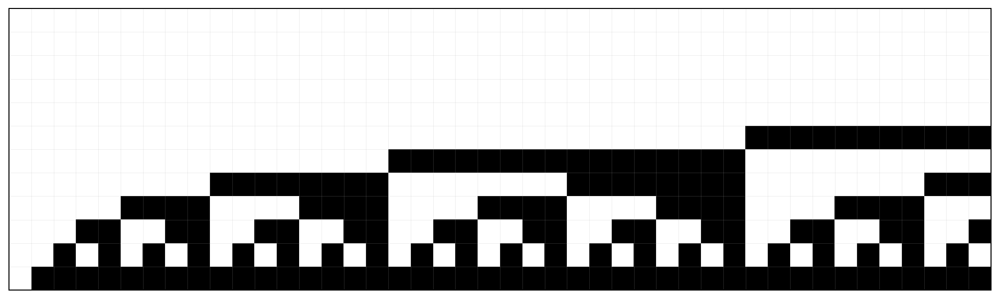

### Heatmap 2 — elements 45–88

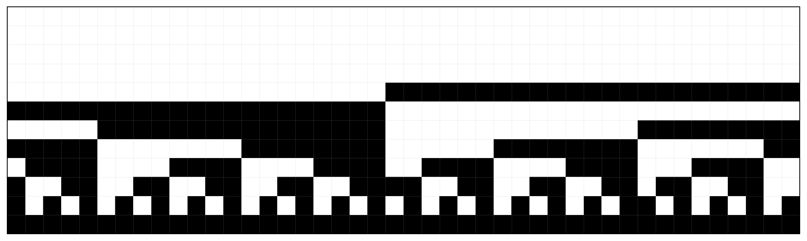

### Heatmap 3 — elements 89–132

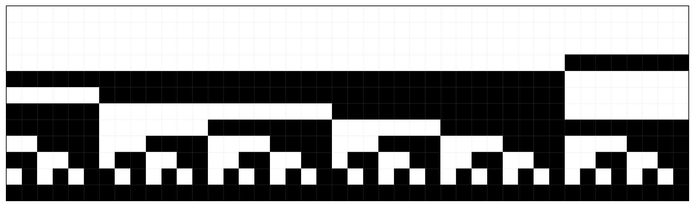

### Heatmap 4 — elements 133–176

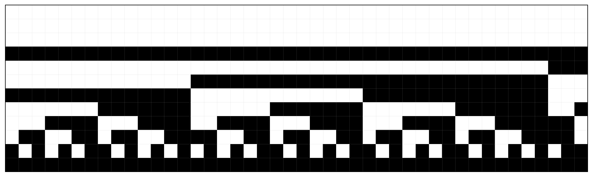

### Heatmap 5 — elements 177–220

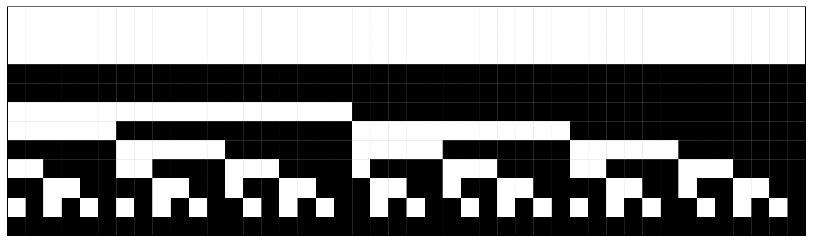

### Heatmap 6 — elements 221–264

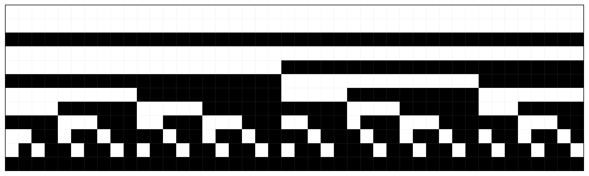

### Heatmap 7 — elements 265–308

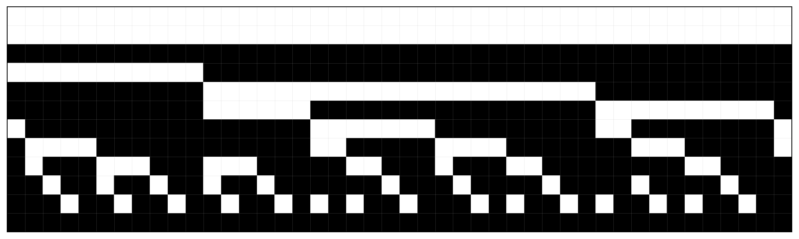

### Heatmap 8 — elements 309–352

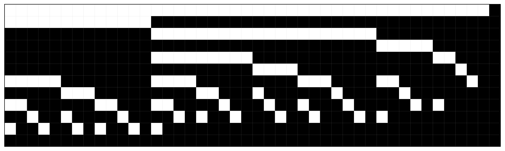

## Trend of `rough`

### Linear scale

`dataSet[[All,"rough"]] // ListPlot`

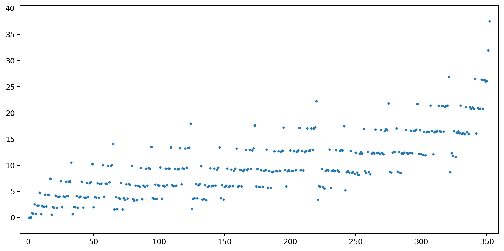

### Logarithmic y-axis

`dataSet[[All,"rough"]] // ListLogPlot`

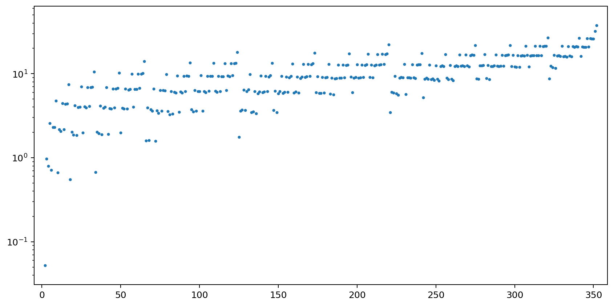

### Log-log scale

`dataSet[[All,"rough"]] // ListLogLogPlot`

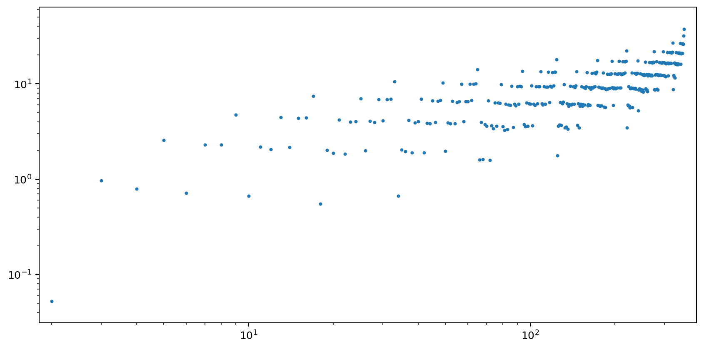

## Trend of `roughMedia`

### Linear scale

`dataSet[[All,"roughMedia"]] // ListPlot[#, PlotRange -> All] &`

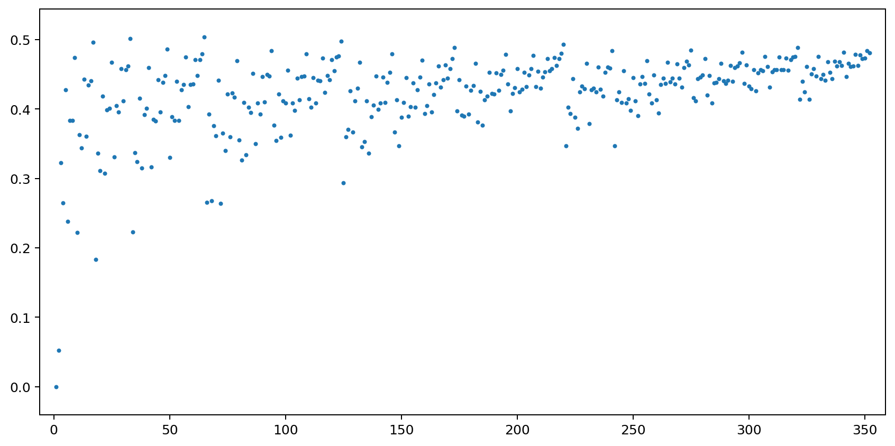

### Logarithmic y-axis

`dataSet[[All,"roughMedia"]] // ListLogPlot[#, PlotRange -> All] &`

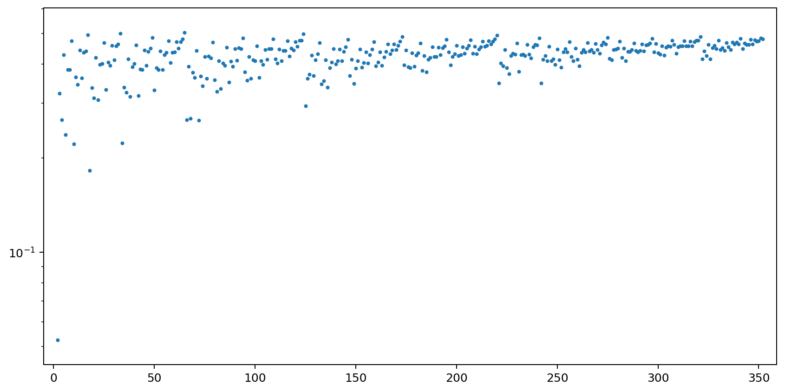

### Log-log scale

`dataSet[[All,"roughMedia"]] // ListLogLogPlot[#, PlotRange -> All] &`

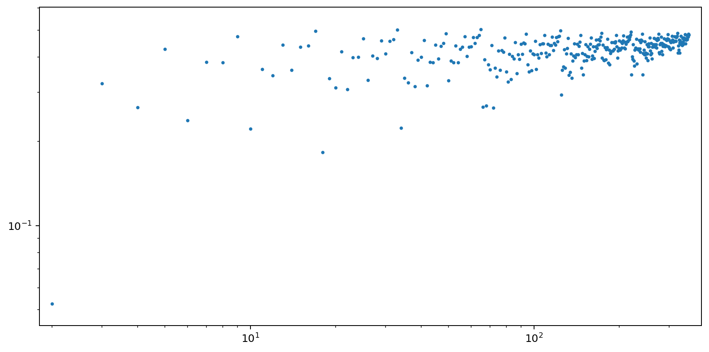

---

### Portability note

This document does not require Mathematica to be read or compiled. To display the figures correctly, keep the `images` folder in the same directory as the `.md` and `.tex` files.